# **Business Plan for SolvTerra Turning Intention into Action**

**A Practical Approach to create Digital Business Models** 

**Seminar Paper**

**Stefani Baron | 2364207**

**Salma Boularab | 2673749**

**Yiwen Cao | 2982689**

**Jiayi Guo | 2735920**

**Nicolas Medina Jerez | 2465232**

**Chaimae Qassar | 2575122**

**Chuong Vo | 2894816**

**Ron Wolniak | 2307329**

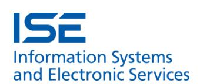

Department of Law and Economics

Research Group Business Information Systems - Information Systems & Electronic Services

Prof. Dr. Alexander Benlian

Supervisor: Armin Alizadeh

Business Plan on the topic:

SolvTerra: A Practical Approach to create Digital Business Models

*Turning Intention into Action*

### Authored by:

Stefani Baron |2364207|EIM

Salma Boularab|2673749|LSCM

Yiwen Cao|2982689|WINF

Jiayi Guo |2735920|WINF

Nicolas Medina Jerez |2465232|WINF

Chaimae Qassar |2575122|EIM

Chuong Vo |2894816|EIM

Ron Wolniak |2307329| WINF

Course of study: Digital business models (01-18-1M01-vl)

Submitted on: 2026-01-28

### **Formal Declaration**

### **Thesis Statement pursuant to § 22 paragraph 7 of APB TU Darmstadt**

We herewith formally declare that we have written the submitted thesis independently pursuant to §22 paragraph 7 of APB TU Darmstadt without any outside support and using only the quoted literature and other sources. We did not use any outside support except for the quoted literature and other sources mentioned in the paper. We have clearly marked and separately listed in the text the literature used literally or in terms of content and all other sources we used for the preparation of this academic work. This also applies to sources or aids from the Internet.

This thesis has not been handed in or published before in the same or similar form.

We are aware that in case of an attempt at deception based on plagiarism (§38 paragraph 2 APB), the thesis would be graded with 5,0 and counted as one failed examination attempt. The thesis may only be repeated once.

In the case of the submitted thesis, the written version and the electronic version submitted for archiving shall correspond in accordance with § 23 paragraph 7 of APB.

| Date:      | Signature:           |
|------------|----------------------|
| 28.01.2026 |                      |
|            | Stefani Baron        |
|            |                      |
|            | Salma Boularab       |
|            |                      |
|            | Yiwen Cao         |
|            | Jiayi Guo         |
|            | Nicolas Medina Jerez |
|            |                      |
|            | Chaimae Qassar       |
|            |  Chuong Vo        |
|            |                      |
|            | Ron Wolniak          |

### **Table of Contents**

| For  | mal C  | Declara | tion                                               | ii |
|------|--------|---------|----------------------------------------------------|----|
| List | of Fig | gures   |                                                    | ix |
| List | of Ta  | ables   |                                                    | х  |
| 1    | Exe    | cutive  | Summary                                            | 1  |
| 2    | Pro    | duct ar | nd Services                                        | 3  |
|      | 2.1    | Visio   | on                                                 | 3  |
|      | 2.2    | Conc    | cept: Micro-Volunteering Ecosystem                 | 3  |
|      | 2.3    | Use (   | Cases                                              | 4  |
|      |        | 2.3.1   | From Intention to Action in Minutes                | 4  |
|      |        | 2.3.2   | From Sponsorship to Real World Action              | 5  |
|      | 2.4    | Value   | e Proposition                                      | 5  |
| 3    | Ma     | rket an | nd Competition Analysis                            | 7  |
|      | 3.1    |         | ket Volume                                         |    |
|      | 3.2    | Mark    | ket Analysis and Trend                             | 7  |
|      | 3.3    | Targe   | et Market                                          | 8  |
|      |        | 3.3.1   | Customer Behavior                                  |    |
|      |        | 3.3.2   | Willingness to Pay / Identifying a Need            | g  |
|      |        | 3.3.3   | Demographics                                       |    |
|      | 3.4    | Indus   | stry and Macro-Environment Analysis                | 10 |
|      |        |         | Industry Structure Analysis (Porter's Five Forces) |    |
|      |        | 3.4.2   | PESTEL Analysis                                    | 11 |
|      | 3.5    | Com     | petitive Analysis                                  |    |
|      |        | 3.5.1   | Unique Selling Proposition (USP)                   |    |
|      |        | 3.5.2   | Top Competitors – Active Comparison                |    |
|      |        | 3.5.3   | Competition Landscape                              |    |
| 4    | Ma     | rketing | g and Sales                                        | 17 |
|      | 4.1    | Mark    | keting Strategy                                    | 17 |
|      |        | 4.1.1   | Marketing Goals                                    | 17 |
|      |        | 112     | Marketing Entry Strategy                           | 18 |

|   | 4.2                          | Marke     | eting Measures                               | 19   |
|---|------------------------------|-----------|----------------------------------------------|------|
|   |                              | 4.2.1     | Product Strategy                             | 19   |
|   |                              | 4.2.2     | Pricing Strategy                             | 20   |
|   |                              | 4.2.3     | Distribution Strategy                        | 22   |
|   |                              | 4.2.4     | Communication Strategy                       | 23   |
|   | 4.3                          | Concl     | usion Marketing and Sales                    | 24   |
| 5 | Bus                          | iness M   | odel                                         | . 25 |
|   | 5.1                          | Value     | Proposition                                  | 25   |
|   |                              | 5.1.1     | Value Proposition for Students               | 25   |
|   |                              | 5.1.2     | Value Proposition for NGOs and Organizations | 25   |
|   |                              | 5.1.3     | Value Proposition for Corporate Sponsors     | 26   |
|   | 5.2                          | Value     | Creation                                     | 27   |
|   |                              | 5.2.1     | Key Partners                                 | 27   |
|   |                              | 5.2.2     | Key Activities                               | 28   |
|   |                              | 5.2.3     | Key Resources                                | 28   |
|   | 5.3                          | Value     | Delivery                                     | 29   |
|   |                              | 5.3.1     | Customer Relationships                       | 29   |
|   |                              | 5.3.2     | Customer Segments and Distribution Channels  | 30   |
|   | 5.4                          | Value     | Capture                                      | 31   |
|   |                              | 5.4.1     | Cost Structure                               | 31   |
|   |                              | 5.4.2     | Revenue Logic                                | 31   |
|   |                              | 5.4.3     | Revenue Streams                              | 31   |
| 6 | Ma                           | nageme    | nt and Founding Team                         | . 33 |
|   | 6.1                          | Form      | of Organization                              | 33   |
|   | 6.2 Organizational Structure |           | izational Structure                          | 33   |
|   | 6.3 Foun                     |           | ling Team                                    | 33   |
|   |                              | 6.3.1     | Role Allocation                              | 34   |
|   |                              | 6.3.2     | Competency Matrix                            | 36   |
| 7 | Fina                         | ancial Pl | an                                           | . 37 |
|   | 7.1                          | Financ    | cial Objectives and Planning Assumptions     | 37   |
|   | 7.2                          | Cost S    | tructure Overview                            | 38   |
|   | 7.3                          | Fixed     | Costs                                        | 38   |

|    | 7.4  | Variable Costs                                                                       | 40 |
|----|------|--------------------------------------------------------------------------------------|----|
|    | 7.5  | Revenue and Profit Model                                                             | 40 |
|    | 7.6  | Financial Projections                                                                | 41 |
|    | 7.7  | Liquidity Planning                                                                   | 41 |
|    | 7.8  | Funding Possibilities                                                                | 42 |
| 8  | Real | alisation Plan                                                                       | 44 |
|    | 8.1  | Roadmap                                                                              | 44 |
|    | 8.2  | Research Phase                                                                       | 44 |
|    | 8.3  | Start-up Phase                                                                       | 45 |
|    | 8.4  | Entering the Market Phase                                                            | 46 |
|    | 8.5  | Expansion and Further Phase                                                          | 46 |
| 9  | Pilo | ot Phase                                                                             | 48 |
|    | 9.1  | Pilot Objectives and Hypotheses                                                      | 48 |
|    | 9.2  | Target Groups and Pilot Scope                                                        | 49 |
|    | 9.3  | The Minimal Viable Product                                                           | 50 |
|    | 9.4  | User Recruitment and Onboarding                                                      | 51 |
|    | 9.5  | Pilot Execution and Monitoring                                                       | 51 |
|    | 9.6  | Measurement and Feedback Collection                                                  | 52 |
|    | 9.7  | Evaluation and Next Step Decisions                                                   | 52 |
| 10 | Cha  | ances and Risks                                                                      | 54 |
|    | 10.1 | 1 Chances                                                                            | 54 |
|    |      | 10.1.1 Beachhead density in Darmstadt enables early network effects and formation    | •  |
|    |      | 10.1.2 Strong product—audience fit: micro-volunteering aligns with Gen Z const       |    |
|    |      | motivations                                                                          |    |
|    |      | 10.1.3 Corporate ESG/CSR pressure creates partnership opportunities                  | 54 |
|    |      | 10.1.4 Digital-first distribution supports scalability at low marginal cost once the |    |
|    | 10.2 | 2 Critical Risks                                                                     |    |
|    |      | 10.2.1 Cold-start and supply demand imbalance risk                                   | 55 |
|    |      | 10.2.2 Perception risk                                                               |    |
|    |      | 10.2.3 Verification and Operational Cost Risk                                        |    |
|    |      | 10.2.4 Revenue Conversion and Financial Sustainability Risk                          |    |
|    |      |                                                                                      |    |

|      | 10.2.5        | Competition and Fast Imitation Risk            | 56 |
|------|---------------|------------------------------------------------|----|
|      | 10.3 Overa    | ıll Assessment                                 | 56 |
| 11   | Prototype a   | and Technical Details                          | 58 |
|      | 11.1 Platfo   | rm Architecture and User Experience            | 58 |
|      | 11.1.1        | Mobile Application (Student Interface)         | 59 |
|      | 11.1.2        | Web Dashboard (NGO Command Center)             | 61 |
|      | 11.1.3        | Platform Administration Portal                 | 68 |
|      | 11.1.4        | Addressing Platform and Gamification Concerns  | 68 |
|      | 11.2 Techn    | nical Implementation (Development Milestone 1) | 68 |
|      | 11.2.1        | Technology Stack                               | 68 |
|      | 11.2.2        | Backend Infrastructure                         | 69 |
|      | 11.2.3        | Authentication & Security                      | 70 |
|      | 11.2.4        | Internationlization                            | 70 |
|      | 11.2.5        | Verification System                            | 71 |
|      | 11.2.6        | Core Feature Implementation                    | 71 |
|      | 11.2.7        | Incorporating Pilot Feedback                   | 73 |
|      | 11.3 Launc    | h of Web-Platform / App                        | 73 |
|      | 11.3.1        | Mobile Application Distribution                | 73 |
|      | 11.3.2        | Web Dashboard Deployment                       | 74 |
|      | 11.3.3        | From Current System to Production Scale        | 74 |
|      | 11.4 Furth    | er Milestones (Technical Roadmap)              | 75 |
|      | 11.4.1        | AI-Based Proof Verification                    | 75 |
|      | 11.4.2        | Backend Infrastructure & Scalability           | 75 |
|      | 11.4.3        | Advanced Platform Features                     | 76 |
|      | 11.4.4        | Timeline Alignment                             | 76 |
|      | 11.5 Techn    | nical Risk Mitigation                          | 77 |
|      | 11.6 Summ     | nary                                           | 77 |
| Lite | rature        |                                                | 79 |
| Арр  | endix A: Inte | erview with Member of Lions Club               | 82 |
| Арр  | endix B: Inte | erview Segelflugverein Riedelbach              | 86 |
| Арр  | endix C: Inte | erview Sport- und Kulturverein                 | 91 |

| Appendix D: Student Survey Results 96                 |  |
|-------------------------------------------------------|--|
| Appendix E: Company Survey Results105                 |  |
| Appendix F: Additional Screenshots NGO-Dashboard111   |  |
| Appendix G: Additional Screenshots Admin-Dashboard126 |  |
| Appendix G: Benchmarking Pricing Strategy Data129     |  |
| Declaration on the Use of Generative AI130            |  |

|  | List of Figures |
|--|-----------------|
|--|-----------------|

| Figure 1: Micro-Challenge End-to-End Workflow 4                                      |  |
|--------------------------------------------------------------------------------------|--|
| Figure 2: Competitive Landscape: SolveTerra vs. Key Competitors 16                   |  |
| Figure 3 Market Entry Phases 18                                                      |  |
| Figure 4: Corporate Pricing Positioning Matrix for SolvTerra 21                      |  |
| Figure 5: Projected Profit and Loss Statement for SolvTerra 38                       |  |
| Figure 6: Detailed Breakdown of Initial Capital Requirements and Foundation Costs 39 |  |
| Figure 7: Monthly Operational Performance and Break-Even Analysis (2026–2030) 42     |  |
| Figure 8: Roadmap 45                                                                 |  |
| Figure 9: SolvTerra System Architecture 58                                           |  |
| Figure 10: Mobile Application – Main Navigation Tabs 60                              |  |
| Figure 11: Challenge Acceptance & Submission Workflow 61                             |  |
| Figure 12: NGO Web Dashboard – Main Overview 63                                      |  |
| Figure 13: NGO Dashboard – Challenge Management 64                                   |  |
| Figure 14: NGO Dashboard – Submission Review Queue 65                                |  |
| Figure 15: NGO Dashboard – Community Management 66                                   |  |
| Figure 16: NGO Dashboard – Settings with Verification Status 67                      |  |
| Figure 17: Simplified Data Model 70                                                  |  |
| Figure 18: Level Progression System 72                                               |  |
| Figure 19: Achievement Badge Collection 72                                           |  |

| List of Tables                                            |    |
|-----------------------------------------------------------|----|
| Table 1: Key Comparison Metrics: SolvTerra vs Competitors |    |
| Table 2: Competency Matrix of SolvTerra's founding team   | 36 |
| Table 2: Technology Stack                                 | 69 |
| Table 3: Gamification Engine                              | 71 |
| Table 4: Timeline Alignment                               | 76 |
| Table 5: Technical Risk Mitigation                        | 77 |

### **1 Executive Summary**

Contributing to sustainability and engaging in activities that serve the community are highly relevant to today'sstudents. In reality, however, tightly packed and inflexible academic schedules rarely accommodate traditional volunteering, which typically requires long-term and recurring commitments. Survey results show that nearly 70% of students have refrained from volunteering due to excessive time requirements (see 2.3 Value Proposition), even though their general willingness to contribute remains high. As a result of this mismatch, a considerable amount of potential social engagement never translates into action.

At the same time, non-governmental organizations (NGOs) face increasing operational pressure. Germany has around 600,000 registered associations and nonprofit organizations (see 3.1 Market Volume), many of which depend heavily on volunteer support. However, limited budgets, low levels of digitalization, and declining access to younger generations make it difficult for these organizations to recruit, coordinate, and retain volunteers efficiently. Interviews with local NGOs reveal volunteer "noshow" rates of up to 10%, especially during peak event periods (see 3.3.2 Willingness to Pay / NGO Requirements). This creates additional workload and uncertainty, making it harder for organizations to plan activities and scale their impact.

From a corporate perspective, social responsibility and ESG commitments are increasingly treated as strategic priorities rather than symbolic gestures. 40% of companies state that building a positive public image is a key motivation for social engagement (see 2.3 Value Proposition). However, many companies struggle to identify participation formats that are low-threshold, credible, and easy to implement. Traditional corporate volunteering initiatives are often costly to organize, difficult to evaluate, and poorly aligned with participators' limited time availability, resulting in a gap between strategic intent and actual execution.

SolvTerra responds to this multi-sided mismatch through a micro-volunteering ecosystem that reduces friction in civic engagement. By breaking down NGOs' operational needs into micro-challenges that can be completed within 5 to 30 minutes (see 2.1 Concept: Micro-Volunteering Ecosystem), the platform allows students to contribute without being too time consuming. Research shows that 54% of students are more likely to stay engaged when their contributions are visibly rewarded, while 56% would volunteer more frequently if participation were social or collaborative (see 3.3 Value Proposition). SolvTerra addresses these preferences through gamified incentives, team-based challenges, and an individual "Impact Portfolio" that documents and accumulates verified contributions over time.

Operationally, SolvTerra functions as a multi-sided platform connecting NGOs, students, and socially responsible companies (see 2.1 Concept: Micro-Volunteering Ecosystem). NGOs use a web-based interface to publish tasks, monitor participation, and verify completed actions. Students interact with the platform via a mobile application that enables them to discover, complete, and document their impact. Corporate partners participate through a Sponsored Challenges model, funding real-world actions that support platform operations while generating measurable social value. Survey data indicates that 86% of students are open to such action-based brand partnerships (see 3.3 Value Proposition), suggesting that this approach offers companies a credible way to engage Generation Z.

SolvTerra initially focuses on the German market, where approximately 2.9 million university students form a digitally native and purpose-driven target group (see 3.1 Market Volume). At the same time, the large nonprofit sector shows a sustained demand for digital volunteer management solutions. Current spending on engagement and digital tools suggests a total market potential of €20 to €60 billion annually (see 3.1 Market Volume). Market entry will begin in regions with high student density and strong innovation ecosystems, starting with Darmstadt and the state of Hesse (see 3.1 Market Volume; 3.3 Target Market). The initial rollout targets 1,000 volunteer-dependent NGOs and 50,000 socially motivated students (see 3.1 Market Volume), creating a realistic basis for regional expansion.

SolvTerra translates existing willingness to engage into short, flexible, and verifiable actions that create value for students, NGOs, and corporate partners alike. By reducing participation barriers and aligning incentives across all sides, the platform unlocks currently unused engagement potential and establishes a scalable foundation for measurable social impact.

### **2 Product and Services**

### **2.1 Vision**

**"A world where every person can make a measurable contribution to society with just 5 minutes of their time."**

Contributing to sustainability and activities that serve the community good is of high importance to today's students. However, tight and inflexible students' schedules rarely leave room for traditional volunteering, which typically demands long-term commitment and significant coordination efforts. As a result, NGOs in need of support miss out on an entire demographic group that could otherwise become engaged members and a valuable workforce.

SolvTerra aims to fundamentally transform civic engagement by democratizing social impact and breaking it down into accessible, flexible micro-units. In a society where digital interaction is seamless, we believe doing good should be equally embedded into everyday life.

Our goal is to establish an ecosystem where engagement is fast, flexible, completely verifiable and deeply fulfilling, while simultaneously removing administrative friction for all stakeholders involved in. By adopting a "lower-your-admin" approach, SolvTerra aims to reduce coordination, documentation and reporting efforts for NGOs and corporate partners to nearly zero, allowing them to focus entirely on impact.

By disrupting the status quo and converting long-term commitments into micro-volunteering tasks, we lower entry barriers on both sides of the engagement equation: making volunteering as easy as scrolling through social media and managing impact as effortlessly as it is meaningful.

### **2.2 Concept: Micro-Volunteering Ecosystem**

SolvTerra operates as a specialized multi-sided ecosystem designed to bridge the gap between nonprofit organizations (NGOs), a mobile-first generation of students and socially conscious companies. The platform's core innovation lies in removing the friction from volunteering by transforming complex organizational needs into bite-sized "Micro-Challenges."

The ecosystem is driven by two synchronized interfaces that cover the distinct needs of its users. For organizations, we provide the NGO Command Center, a web-based dashboard that allows NGOs, associations, and foundations to break down their operational needs into specific, short-term tasks. This interface serves as a management hub where organizations can monitor volunteer statistics, manage active challenges, and engage with the platform community.

For volunteers, the student app serves as a mobile interface that presents a gamified feed of challenges filtered by interest, location, and time availability, specifically ranging from 5 to 30 minutes. More than just a task list, the app functions as an "Impact Portfolio," tracking contributions and rewarding progress to foster long-term retention.

For corporate partners which acts as the financial backbone of our model by integrating companies into the ecosystem via the "Sponsored Challenges" model. Rather than making passive donations, companies purchase sponsorship packages that fund real-world micro-volunteering challenges aligned with their values and sustainability goals.

The workflow on the platform follows a seamless cycle of creation, action, and verification. The process begins when an NGO posts a specific micro-challenge, such as "Translate this flyer", "Share this petition," or "Help us to clean the park". The platform's algorithm then matches this task to students based on their profile preferences and current location. Once a student accepts and completes the task within the designated timeframe, they submit proof directly through the app. This verification step is critical for maintaining trust within the ecosystem. Depending on the nature of the task, verification is achieved through geolocated photo uploads for on-site activities, digital link verification for online actions, or manual confirmation by the NGO for more complex tasks. Upon successful verification, the student is instantly rewarded with Experience Points (XP) and badges, climbing the "Impact Level" ladder and reinforcing positive engagement loops.

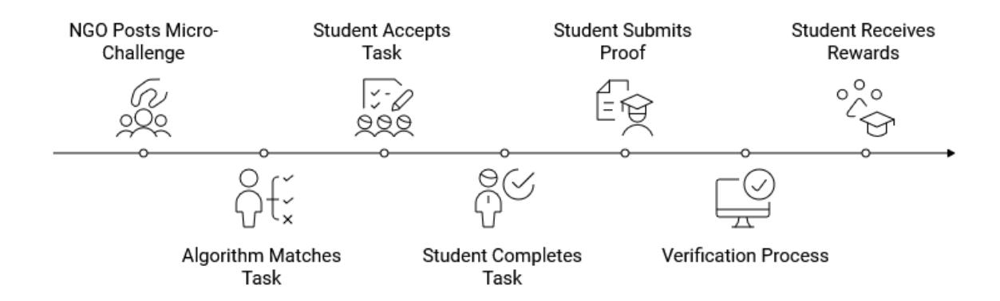

**Figure 1: Micro-Challenge End-to-End Workflow**

### **2.3 Use Cases**

### **2.3.1 From Intention to Action in Minutes**

To illustrate the platform's utility, consider Max, a 24-year-old master's student at TU Darmstadt. Like many students, his weekly schedule changes constantly. Seminars move, deadlines cluster, and each week looks entirely different from the last. While Max wants to contribute to his community, this unpredictability makes it impossible for him to commit to fixed weekly volunteering activities.

At the same time, a local NGO in Darmstadt is organizing a neighborhood cleanup but lacks both the budget for marketing and the manpower to distribute invitations.

Through SolvTerra, these needs converge instantly. While moving across campus, Max opens the app and discovers a nearby Flash Challenge requiring the distribution of 20 flyers for the GreenCity cleanup. Since the task fits seamlessly into his current route and time constraints, he accepts the challenge, picks up the flyers from the designated location, and distributes them along the way.

He validates his work by snapping a photo of the distributed flyers via the app's secure camera feature. The app verifies the geolocation and timestamp, instantly awarding Max 50 Impact XP and a "Neighborhood Hero" badge.

The result is mutually beneficial: the local NGO receives immediate marketing support without the administrative burden of managing shifts or volunteers and Max contributes meaningfully to his community without committing beyond what his constantly changing schedule allows.

### **2.3.2 From Sponsorship to Real World Action**

To illustrate collaboration within the SolvTerra ecosystem, consider CleanRivers Hessen, a regional environmental NGO, and RheinMove AG, a sustainability focused logistics company.

CleanRivers Hessen plans a river cleanup campaign but lacks the resources to recruit volunteers, coordinate schedules and document impact. RheinMove AG is looking for a credible way to support local environmental initiatives while gaining visible and verifiable social impact.

Through SolvTerra, RheinMove AG purchases a Sponsored Challenge package that funds a set of micro tasks related to the cleanup. Participants discover these tasks organically and complete them whenever it fits their personal schedules, validating their contributions directly in the app.

CleanRivers Hessen receives immediate on-site support without managing volunteers or administrative processes. RheinMove AG gains positive public visibility and access to transparent impact data tied directly to completed real world actions.

The result is a low effort and scalable collaboration that benefits the NGO, the corporate partner, and the local community alike.

### **2.4 Value Proposition**

SolvTerra creates a sustainable impact model by aligning the incentives of three distinct stakeholders: students, NGOs and corporate partners.

The student benefit lies in flexibility and recognition. Our market research indicates a significant latent demand for flexible volunteering, with 70% of students (see Appendix D) stating that time commitments have previously deterred them from volunteering. SolvTerra removes this barrier by enabling micro-commitments, allowing students to contribute meaningfully in 5 to 30-minute windows that fit into the gaps of their daily schedules.

To sustain motivation, the platform leverages gamification elements like badges and streaks, which appeal to the 54% of students (see Appendix D) who find rewards motivating. Furthermore, SolvTerra addresses the social aspect of volunteering, since 56% of students (see Appendix D) indicated they would volunteer more if they could do so with friends, we have integrated "Multi-Person Challenges" and a community feed to make impact a shared experience. Beyond the immediate gratification, every verified action builds a digital career portfolio of soft skills and social engagement, providing tangible value for future job applications.

The NGO benefit lies in resource efficiency and youth access. For the approximately 600,000 registered associations in Germany, digitalisation and recruiting young talents are existential challenges. SolvTerra addresses this by providing a "workforce on demand," which grants direct access to the entire demographic group of students with minimal administrative effort. Additionally, the platform acts as a donor pipeline. By engaging students early through low-threshold tasks, NGOs can cultivate the next generation of potential supporters and members. (add insights from NGO interviews)

The corporate benefit lies in measurable and authentic branding. For companies SolvTerra offers a distinct advantage through its "Sponsored Challenges" model. This model moves beyond passive advertising, allowing companies to sponsor real-world actions, such as a "Neighbourhood Cleanup Challenge" and therefore supporting companies in creating a positive public image. Survey data supports this approach, with 83% of the students (see Appendix D) surveyed stating they are comfortable with such brand partnerships and 40% of the companies surveyed stating their goal of creating a positive public image. This grants companies access to Generation Z, a demographic group that is typically hard to reach and highly value-driven.

### **3 Market and Competition Analysis**

Understanding SolvTerra's market and knowing how potential the market is essential before building our business model. We need to know: How big is the opportunity? Who are we competing against? And what makes us different?

Now, the upcoming sections will address these specific topics: market sizing, market trend, and competitive landscape.

### **3.1 Market Volume**

To seize SolvTerra's market, we started with the German non-profit and higher education sectors. Germany has roughly 600,000 active NGOs (TechReport.ngo., 2017) and 2.9 million university students that's our total addressable market (TAM). From what we have seen, most organizations in this space spend between €30,000 and €100,000 per year on digital tools and engagement initiatives (Federal Ministry for Family Affairs, Senior Citizens, Women and Youth, 2010). It can be observed that the revenue ranges between €20 to 60B .

Our serviceable market (SAM) zeros in on university-heavy regions like Dresden, Saxony, and Hessen about 50,000 NGOs and 500,000 students. We chose Darmstadt as our launch city for many reasons. Firstly, our team is based in Darmstadt, Hessen as a Master's group student. Secondly, this area has a large number of international students from universities and other educational organizations. Within that, our realistic near-term target (SOM) is even tighter: 1,000 NGOs that desperately need digital solutions and 50,000 students who are already civically engaged, which means the potential revenue would range from €1.6 to 8B.

Our survey indicated that nearly 70% of larger organizations in sectors like medicine and technology would pay between €2,000 and €10,000 annually for this kind of platform. That's not hypothetical that's based on direct conversations with potential customers. Corporate volunteering is increasingly integrated as a strategic component of companies' CSR strategies and sustainability goals in Germany, with platforms facilitating employee engagement seen as key enablers for fulfilling these mandates (Federal Ministry for Family Affairs, Senior Citizens, Women and Youth, 2020). To do the math, the SOM represents a realistic annual revenue potential of €1.33 to 6.66M, confirming that there is a significant professional management for digitizing volunteer management.

### **3.2 Market Analysis and Trend**

The business model strategy of SolvTerra leans on three major social, demographic and technological factors that shape the German market.

Digital transformation in the third Sector (NGOs and non-profits) has seen a rapid increase, due to the COVID-19 pandemic. Besides, many organizations were forced to accept digital tools to maintain their work when physical contact was restricted (Kiron NGO, 2020). Today, this shift has evolved from a short-term into a long-term expectation. There is a growing need for digital volunteer management tools that can handle remote coordination. Moreover, the students do not have a tendency to search for opportunities on physical boards; they prefer a seamless digital interaction that is as intuitive as the commercial apps they use daily.

There is a significant change in how individuals approach social commitment. Traditional "life-long" volunteering in a single club is being replaced by flexible, episodic engagement, often referred to as "micro-volunteering." Modern volunteers prefer to contribute their skills in short, clearly defined bursts rather than committing to weekly meetings for several years. This trend highlights a critical need for better documentation and impact measurement. Volunteers today want to see the immediate result of their work—tracked through data and digital badges—allowing them to build a "social portfolio" that reflects their contributions to society (Source: Group's personal interviews).

The Purpose-Driven Generation with an Engagement Gap Gen Z (the primary demographic in Darmstadt, Hessen). Their career and lifestyle choices are heavily influenced by a desire for a "visible impact" on global issues like climate change. However, a paradox exists: while their motivation is high, their formal volunteer rate in traditional German associations is currently among the lowest of all generations (Goethe-Institut & SUPERRR Lab, 2020). This is not due to a lack of interest, but rather a mismatch between their lifestyle and the outdated, analog systems of many NGOs. SolvTerra addresses this gap by offering short-term, purpose-driven challenges that fit into a student's busy schedule, making it easier for this generation to move from "passive concern" to "active participation."

### **3.3 Target Market**

To clearly define the target customer profile, the SolvTerra team conducted a thorough survey to uncover valuable insights from diverse user segments. This data is not just numbers; it forms the basis for understanding market behavior and expectations.

### **3.3.1 Customer Behavior**

The behavior of our target groups is analyzed based on their needs for sustainable work and digital efficiency:

- Customer (Students in Darmstadt): This group consists of environmental awareness of students in the Darmstadt, Hessen area. They look for "micro-jobs" or short-term tasks that allow them to contribute to environmental protection without long-term commitment. They prefer a mobile-first approach, expecting to find, complete, and track their impact through a userfriendly app (Source: Group's personal interviews).
- Company (Business): Companies focus on optimizing operational costs and meeting ESG (Environmental, Social, and Governance) goals. They seek digital platforms to quickly connect with skilled helpers for "green" projects, reducing administrative work and improving corporate social responsibility (Source: Group's personal interviews).

- NGO (Non-Governmental Organizations): Based on direct interviews with Segelflugverein Riedelbach (German gliding club/ NGO) and Sport- und Kulturverein (local sports and culture/ NGO), these organizations face a shortage of volunteers and high pressure during peak event seasons. Their behavior is characterized by a need for simplicity; they value tools that increase their visibility among young people and help manage non-technical tasks like marketing, event setup, or logistics *(Source: Group's personal interviews).*

### **3.3.2 Willingness to Pay / Identifying a Need**

Quantitative and qualitative data confirm a clear demand for the platform with specific budget expectations:

- Survey Data: Over 55.65% of respondents are willing to pay or invest less than 2,000 Euro for green energy/work solutions. Meanwhile, 22.3% stated they could spend between 22,000 and 30,000 Euro per year for larger-scale systems or services and 11.1% of them said that they are willing to pay from 2,000 to 10,000 Euro *(Source: Group's personal interviews).*
- NGO Requirements: Both interviewed NGOs preferred a Freemium model. They are open to paying for premium features but expect basic functions—such as posting tasks and defining volunteer numbers—to be free. Sport- und Kulturverein specifically identified a need for reliable help during event setups to reduce the 10% risk of "no-shows," which currently causes high stress and time pressure *(Source: Group's personal interviews).*

### **3.3.3 Demographics**

The target audience of SolvTerra is diverse, which ranges from students to businesses & NGOs. All connected by the shared goal of environmental sustainability and digital efficiency. To understand clearly, we divide them into three main segments:

- The students (The Academic Community in Darmstadt, Hessen) includes young users aged 18 to 28, currently enrolled in major institutions such as TU Darmstadt or Hochschule Darmstadt. These individuals are "digital natives" who are highly proficient with mobile technology and highly aware of the environment. From a socio-economic perspective, they often find flexibility. However, they are also deeply motivated by climate activism. This group does not just want a "job"; they want a "mission" that can be completed within their busy academic schedules. By focusing on Darmstadt, SolvTerra taps into a high density of tech-savvy talent ready to engage with a micro-volunteering app. (Source: Group's personal interviews).
- The medium to large organizations group includes corporations and local businesses within the Hessen region that meet ESG (Environmental, Social, and Governance) criteria. These organizations typically have 50 to 250+ employees and operate in sectors, for example technology, manufacturing, or services. Besides, their demographic profile is defined by a need for

professional "green" branding and a structured way to manage corporate social responsibility (CSR) activities. Moreover, they act as the "providers" in our model, offering resources or tasks that require a reliable and motivated workforce to execute environmental goals *(*Source: Group's personal interviews).

- The Non-Governmental Organizations (NGOs) and Community Clubs are represented by organizations (for example, Segelflugverein Riedelbach and Sport- und Kulturverein). They are often characterized by a traditional organizational structure with a loyal but aging member base which ranges from 60 to over 1,000 members. These NGOs are often based in rural areas of Hessen and act as the backbone of local culture and specialized activities. Therefore, SolvTerra serves as the bridge to connect these traditional pillars with the modern student demographic (Source: Group's personal interviews).

### **3.4 Industry and Macro-Environment Analysis**

### **3.4.1 Industry Structure Analysis (Porter's Five Forces)**

**Competitive rivalry** in the European corporate volunteering platform market is medium to high, driven by numerous established global and regional providers competing for corporate clients, employee engagement, and NGO partnerships(Business Research Insights, 2026; The Business Research Company, 2026). Regulatory pressure from CSRD/ESRS and rapid technological innovation further intensify competition by raising expectations for data-driven, auditable CSR solutions. While the market remains fragmented, ongoing consolidation through acquisitions and partnerships reduces differentiation based on basic functionality. For SolvTerra, sustainable advantage depends on clear differentiation through university-focused engagement, verified micro-volunteering, and measurable impact outcomes beyond traditional volunteering marketplaces.

**The threat of new entrants** in the European corporate volunteering platform market is moderate. While basic platforms can be built cheaply using cloud and SaaS tools, credible enterprise entry requires strong capabilities in CSRD/ESRS compliance, data security, and HR/ESG system integration, raising costs and complexity. Incumbents benefit from brand trust, established NGO–corporate networks, and proven impact reporting, creating entry barriers and two-sided platform challenges (Edinger-Schons & Alberg-Seberich, 2019). Nevertheless, niche entrants can still emerge quickly with differentiated MVPs, particularly via AI-enabled verification, gamified micro-volunteering, or university-linked models. For SolvTerra, defensibility relies on compliance readiness, durable university and NGO partnerships, and hard-to-replicate verification and behavioral datasets.

**Bargaining Power of Suppliers** in SolvTerra's ecosystem is medium, with NGOs, universities, and technology providers as the key suppliers. NGOs are the most critical, as they provide volunteering tasks and impact challenges; their bargaining power is moderate and rising due to alternative distribution channels and expectations for low-friction tools and measurable impact, though limited digital capacity tempers their leverage. Universities act as gatekeepers to student participation through curriculum

integration and institutional endorsement, while imposing education and GDPR compliance requirements. Technology suppliers also hold medium power, but high standardization and multiple vendor options limit long-term lock-in despite cost and policy influence from cloud and app-store providers.

**Buyer power** in SolvTerra's context is high, driven by enterprise procurement dynamics and the platform's two-sided structure. Large corporates exert strong bargaining power through competitive tenders, customization demands, and requirements for HR/ESG integration and CSRD/ESRS-aligned reporting, while SMEs, public bodies, and universities influence pricing and compliance through growing sustainability expectations and institutional partnerships (PwC, n.d.; Thoms et al., 2026). At the same time, students and NGOs hold buyer-like power due to low switching costs and alternative engagement channels. Across all groups, expectations converge on flexibility, verification, transparency, and integration, making SolvTerra''s pricing power and retention dependent on clear corporate ROI, strong reference cases, and platform stickiness built through verified youth engagement data, impact histories, and network effects.

**he threat of substitutes** in the corporate and micro-volunteering platform market is high, as social impact can be achieved through in-house volunteering programs, broader ESG/CSR platforms, or traditional approaches such as donations, one-off events, fundraising, and pro bono work (Corporate sustainability reporting, 2025). On both demand and supply sides, students and NGOs can also engage through direct channels outside the platform. While many substitutes lack systematic verification and impact tracking, they still compete for attention, time, and budgets. Consequently, SolvTerra must differentiate through verified micro-volunteering, high-retention engagement design, and measurable impact outputs that support corporate reporting and sustained youth participation.

### **3.4.2 PESTEL Analysis**

**Political:** Europe and Germany in particular is experiencing a strong regulatory push toward sustainability, transparency, and corporate accountability, driven by initiatives such as the European Green Deal, CSRD/ESRS, and CSDDD, which expand mandatory reporting, value-chain accountability, and anti-greenwashing enforcement (Jang et al., 2025). While some relief may apply to smaller firms, the overall trajectory is toward more standardized ESG governance. For SolvTerra, this creates structural opportunities as reporting pressure increases corporate demand for verifiable, auditable impact data, but also execution risks due to regulatory complexity. Accordingly, SolvTerra must prioritize regulatory agility, align closely with evolving EU requirements, and leverage public funding and innovation ecosystems.

**Economic:** The economic environment for SolvTerra is shaped by sustainability-driven investment trends, ESG-linked access to capital, and the digital transformation needs of NGOs and universities, while being constrained by inflation and macroeconomic uncertainty. EU frameworks such as the EU Taxonomy strengthen demand for credible social impact metrics, and compliance-related spending remains relatively resilient even in downturns (EU Taxonomy for sustainable activities, 2025; Why many nonprofits struggle with digital transformation, 2025). However, inflation increases pricing sensitivity and may reduce discretionary CSR budgets, while NGOs face limited capacity to invest in digital infrastructure and students' rising living costs increase the opportunity cost of unpaid volunteering.

**Social:** Social trends in Europe, especially among younger generations, strongly support micro-volunteering, digital engagement, and sustainability-focused participation. University students show rising motivation for social impact, reinforced by institutional initiatives and recognition, while volunteering preferences shift toward flexible, low-commitment, digital-first formats. In parallel, employees and NGOs increasingly value meaningful, personalized, and measurable engagement, driving companies to embed volunteering into ESG and employer branding strategies. Growing skepticism toward sustainability claims further elevates the importance of verifiable, transparent, action-based impact, strengthening SolvTerra's relevance (Ashton & Ragonnaud, 2024; European Commission, n.d.).

**Technology**: Technology is a core enabler and differentiator in the corporate volunteering and impact engagement market. AI and automation drive scalable matching, verification, and impact measurement, enabling more credible and auditable reporting, while buyers increasingly expect cloud-based, mobile-first platforms with real-time dashboards and API integration into HR/ESG and university systems. On the NGO side, uneven digital maturity increases demand for tools that reduce administrative burden, and emerging solutions such as verifiable credentials can strengthen trust. At the same time, SolvTerra must manage critical risks related to verification accuracy, GDPR-compliant data security, and dependence on external infrastructure.

**Environmental:** Environmental priorities are increasingly central to Europe's regulatory and market landscape, with growing pressure on companies around decarbonization, net-zero targets, the circular economy, and emerging biodiversity-related disclosures, reinforced by investor and consumer expectations for credible sustainability performance. For SolvTerra, this creates a strong thematic and partnership opportunity, as environmental micro-volunteering aligns well with student engagement and digital formats, while NGOs' rising need for measurable, verifiable impact data enhances the value of SolvTerra's documentation and verification approach.

Legal: The legal environment for SolvTerra in the EU, particularly Germany, is increasingly complex, directly shaping platform design, data governance, and trust. CSRD/ESRS drive strong demand for auditable, traceable impact data, while strict GDPR/DSGVO rules require robust consent management, data minimization, security, and deletion rights. Additional risks stem from managing the boundary between volunteering and employment, including labor, insurance, and safety liabilities, as well as digital governance and app store constraints. Tightening anti-greenwashing and consumer protection rules further make verifiable sustainability claims a legal and reputational necessity, underscoring the importance of strong validation mechanisms.

### **3.5 Competitive Analysis**

In a constantly evolving market, understanding your position relative to competitors is crucial for SolvTerra to differentiate itself. This section will delve into an analysis of the competitive ecosystem through three main pillars: Unique Selling Proposition, Top Competitors and Competition Landscape.

### **3.5.1 Unique Selling Proposition (USP)**

SolvTerra is not just another volunteering platform; it is a digital ecosystem designed to solve the specific "friction" between young volunteers and organizations. Based on our primary research with students in Darmstadt and NGOs, we have identified six core metrics that form our USP.

- Micro-Volunteering (5-30 Min): Our research shows that "lack of time" is the number one barrier for students. While traditional platforms offer roles that require months of commitment, SolvTerra focuses on tasks that can be finished in a short time.
- Gamification: To ensure long-term engagement, we integrated gamification graphics such as points, levels, and badges. For Gen Z, who have grown up with digital rewards, this turns environmental action into motivating and interesting challenges.
- Verification System: Trust is a major issue in the digital age. SolvTerra implements a robust verification system where volunteers must provide proof of completion (e.g., photo uploads or GPS check-ins). This ensures that every "green action" is real, providing peace of mind for NGOs and credible data for our users.
- Impact Dashboard: Both individuals and organizations need to see the results of their efforts. Our dashboard visualizes data—such as CO2 saved or hours contributed—in real-time. For students, this acts as a "Social CV" that they can show to future employers to prove their soft skills and values.
- Mobile-First App: Our target demographic in Hessen lives on their smartphones. By focusing on a high-quality mobile app rather than a complex desktop website, we ensure that volunteers can find and complete tasks under circumstances.
- Sponsored Challenges: This metric connects the corporate world with social good. Companies can sponsor specific environmental challenges, providing the financial resources that NGOs desperately need. This creates a sustainable business model where win-win relationships are established

### **3.5.2 Top Competitors – Active Comparison**

These five platforms—Betterplace, Vostel.de, Youvo.org, GoVolunteer, and our platform - SolvTerra were selected as key competitors because they represent the diverse landscape of the digital volunteering ecosystem, ranging from traditional project matching and skilled-based contribution to innovative micro-volunteering models

Betterplace operates primarily as a donation-based crowdfunding platform with a strong emphasis on financial transparency. While it offers a High level of impact-dashboards and mobile-first accessibility, its micro-volunteering and gamification features remain at a Medium level because the core focus is on monetary aid rather than small, granular tasks. Its verification system is Low for individuals, as it prioritizes the legal vetting of NGOs to ensure safe transactions. However, it excels in sponsored challenges, frequently partnering with corporations for CSR-driven fundraising campaigns.

Vostel.de positions itself as a bridge between socially conscious individuals and local impact projects, particularly in Germany. While they offer a "Little Volunteering Guide," their micro-volunteering capability is High since many roles still require physical presence and set schedules. The platform lacks significant gamification and impact-dashboards (Low), maintaining a functional, professional aesthetic over a competitive one. Despite a Low mobile-first app presence, they achieve a High rating in sponsored challenges due to their robust "Corporate Volunteering" programs that engage company employees in social work.

Youvo.org occupies a specialized niche known as "Skilled Volunteering," connecting creatives (designers, copywriters, developers) with social causes. Because these projects require high-level expertise and time, micro-volunteering is Low. However, it scores Low on impact-dashboards while gamification is Medium to maintain professional standards, the platform is High in mobile-first design and sponsored challenges, often hosting "Design Jams" or creative marathons funded by external partners to solve specific social problems.

GoVolunteer functions as a traditional social marketplace that prioritizes community integration and social cohesion. It ranks low in micro-volunteering and impact-tracking because its model is built around long-term commitment and face-to-face interaction rather than digital "micro-tasks" or datadriven dashboards. The gamification is low, limited mostly to help users navigate diverse categories, but the technical infrastructure for a mobile-first app or automated verification remains high. Unlike its competitors, it shows high engagement with sponsored challenges, focusing instead on grassroots NGO support.

| Metric               | SolvTerra | Betterplace | Vostel.de | GoVolunteer | Youvo.org |  |
|----------------------|-----------|-------------|-----------|-------------|-----------|--|
| Micro-Volunteering   | High      | Medium      | Medium    | Low         | Low       |  |
| Gamification         | High      | Medium      | Low       | Medium      | Low       |  |
| Verification system  | High      | Low         | Low       | Low         | Low       |  |
| Impact-dashboard     | High      | High        | Low       | Low         | High      |  |
| Mobile-first App     | High      | High        | Low       | Low         | High      |  |
| Sponsored Challenges | High      | High        | High      | Low         | High      |  |

**Table 1: Key Comparison Metrics: SolvTerra vs Competitors**

### **3.5.3 Competition Landscape**

The Competition Landscape map (Figure 2) visualizes the market based on two critical dimensions: Commitment Level (High vs. Low) and Verification/Impact Depth (High vs. Low).

Why SolvTerra is in the "High Verification/ Low Commitment" Quadrant: Currently, most competitors like Youvol or GoVolunteer fall into the "High Commitment" side. They require volunteers to sign up for long-term roles, which results in a high "drop-out" rate (as seen in our NGO interview with Sportund Kulturverein, where 10% of volunteers are no-shows).

SolvTerra sits uniquely in the top-left quadrant:

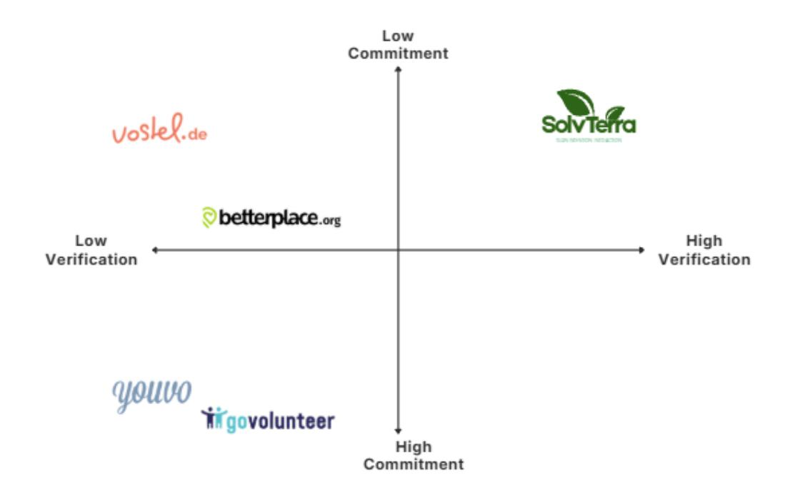

**Figure 2: Competitive Landscape: SolveTerra vs. Key Competitors**

With the observation of SolveTerra, we lower the barrier to entry by focusing on tasks that take only 5 to 30 minutes. This fits the "episodic" volunteering style of Gen Z. Despite the short duration of tasks, we maintain high standards. Through our Impact Dashboard and Verification System, we ensure that even a 10-minute task is documented and confirmed. We are the only platform that combines "fast" with "proven."

The Next Strategic Step: Being in this unique position is a great advantage, but it also means we must manage the "Low Brand Awareness" challenge. Since we are a new player in a market with established names like Betterplace, our strategy is to focus on Vertical Penetration in Darmstadt.

Instead of trying to be everywhere at once, we will become the "exclusive" platform for students in Hessen. By proving that our High Verification model works for local NGOs like Segelflugverein Riedelbach, we will create a "Trust Blueprint." Once we have a high density of users in one city, the "Network Effect" will make it easier to move into the "High Brand Awareness" category while staying firmly in our unique quadrant of verified micro-impact.

### **4 Marketing and Sales**

This chapter outlines the marketing and sales strategy of Solvterra, detailing the company's strategic marketing objectives, market entry approach, marketing mix, distribution channels, communication methods, customer support framework, and expected market performance. The purpose of this strategy is to ensure sustainable market penetration, build long-term stakeholder relationships, and support revenue growth while reinforcing Solvterra's positioning as an innovative digital platform for sustainability-driven engagement.

Solvterra operates within a multi-sided ecosystem connecting three distinct stakeholder groups: nongovernmental organizations (NGOs), students, and corporate sponsors. Each group has different motivations, decision-making processes, and constraints, requiring a differentiated but coordinated marketing and sales approach. The strategy presented in this section reflects this complexity and outlines how Solvterra aims to build a scalable, resilient, and impact-oriented market presence.

### **4.1 Marketing Strategy**

This section will clarify SolvTerra's main marketing goals and the chosen marketing entry strategy.

### **4.1.1 Marketing Goals**

The primary objective of Solvterra's marketing strategy is to establish the platform as a trusted and widely recognized solution for youth-driven sustainability action and verified impact. This objective is supported by linked strategic goals: brand development, ecosystem expansion, and enablement of revenue.

First, Solvterra seeks to build solid brand awareness and credibility within its target market, as mentioned in Chapter 3. Given that Solvterra operates in the social impact and sustainability fields, elements like trust, transparency, and legitimacy are critical factors that influence adoption. The platform, therefore, prioritizes clear communication of its missions, measurable impact reporting, and visible pilot success stories. With credibility, it is expected to lower perceived risk among NGOs, students, and corporate sponsors, thereby easing onboarding and long-term engagement.

Second, a core marketing goal is to expand Solvterra's user ecosystem. The platform aims to onboard NGOs by removing financial and administrative barriers through a freemium access model. This strategy is intended to accelerate the supply of volunteering missions and ensure diversity in available impact opportunities. Simultaneously, Solvterra focuses on attracting students by offering flexible, gamified micro-volunteering opportunities that align with young people's (Gen Zs) desire for purpose, recognition, and career development as seen in the results of the student survey presented in appendix D. Corporate sponsors are targeted through a value proposition emphasizing measurable environmental, social, and governance (ESG) impact, simplified corporate social responsibility (CSR) execution, and firmer employer branding.

### **4.1.2 Marketing Entry Strategy**

Solvterra pursues a phased approach to entering the market, aiming to minimize financial hazards by validating demand, optimizing product-market fit before scaling commercial activities, see Figure 3.

This structured approach enables the company to learn from early users, refine its offerings, and build credibility before committing to expansion with significant resources.

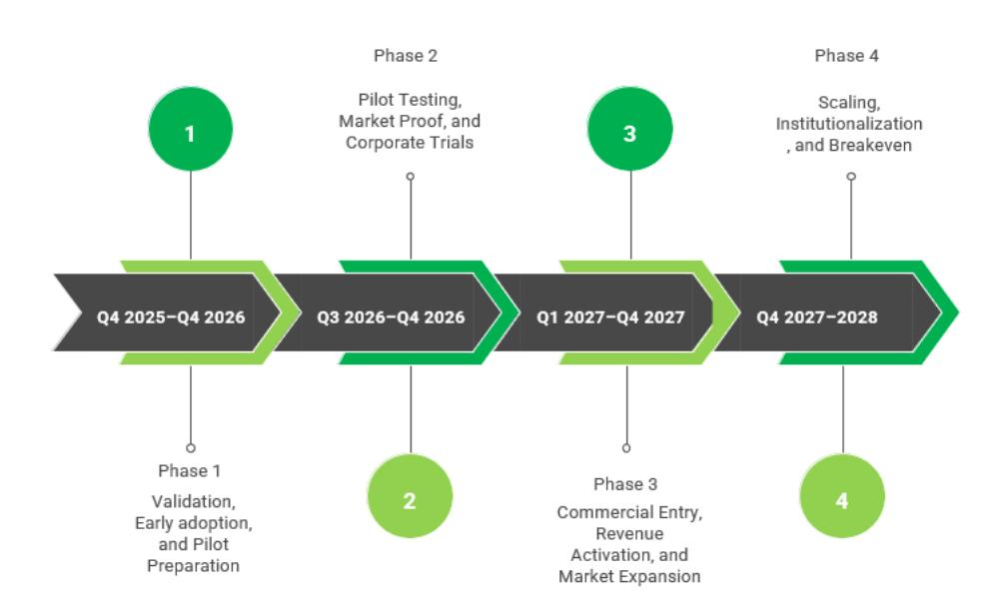

**Figure 3 Market Entry Phases**

The initial phase of SolvTerra's market entry focuses on validating demand and establishing early adoption among NGOs and student users. During this period, the platform is introduced to a limited group of nonprofit partners to test mission publishing, volunteer onboarding, and participation workflows under controlled conditions. Concurrently, SolvTerra initiates outreach to universities and student organizations in order to attract early users and evaluate engagement dynamics across target demographics. The primary objective of this phase is to confirm problem–solution fit, generate early traction, and build initial market credibility, rather than to pursue revenue generation or large-scale customer acquisition.

In the second phase, SolvTerra transitions into a pilot deployment and market validation stage, during which the platform is tested in real-world settings in collaboration with a selected group of NGO partners. These pilot organizations provide empirical use cases that allow SolvTerra to assess mission performance, volunteer retention, engagement quality, and impact verification processes. Student acquisition efforts expand through university partnerships, ambassador programs, and digital outreach, while engagement metrics and user feedback are systematically used to refine onboarding flows, communication strategies, and participation incentives.

Simultaneously, SolvTerra introduces early-stage corporate engagement mechanisms, including pilot donation flows and limited sponsored mission trials. These initiatives allow corporate partners to evaluate the platform's sponsorship value proposition while enabling SolvTerra to collect insights on corporate expectations, pricing sensitivity, and perceived ESG impact value. Pricing structures remain adaptive during this phase to support benchmarking analysis, sponsor feedback collection, and willingness-to-pay assessment. The strategic emphasis of this stage lies on market learning, credibility formation, and proof generation, rather than on short-term profitability.

The third phase marks SolvTerra's transition into formal commercial market entry, characterized by the structured rollout of its corporate donation interface and sponsored mission packages. During this stage, corporate sponsorship becomes a central component of the platform's market positioning, enabling companies to fund verified sustainability initiatives while receiving impact reporting, ESGaligned insights, and brand visibility. NGO onboarding expands through the freemium model, and student recruitment scales through coordinated digital marketing and on-campus outreach. Sales activities increasingly focus on converting pilot sponsors into recurring corporate partners and establishing long-term sponsorship relationships.

In the final phase, SolvTerra concentrates on scaling market reach and strengthening institutional presence. The company expands partnerships with municipalities, umbrella NGO organizations, and corporate CSR departments at regional and national levels. Strategic Impact Partner programs are introduced to support long-term corporate engagement, multi-mission sponsorship, and deeper ESG reporting integration. Marketing and stakeholder engagement efforts increasingly emphasize brand positioning, institutional legitimacy, and long-term corporate relationship management. As sponsor retention stabilizes and recurring revenue streams mature, SolvTerra aims to consolidate its market position and reach financial breakeven, supported by predictable corporate funding and a validated user ecosystem.

### **4.2 Marketing Measures**

### **4.2.1 Product Strategy**

SolvTerra positions its product as a comprehensive digital infrastructure for sustainability-driven impact activation. The platform is designed to address the needs of three primary user groups: students, NGOs, and corporate sponsors, each benefiting from tailored features and functionalities.

For students, SolvTerra provides access to short, mission-based volunteering opportunities that can be completed flexibly alongside academic or professional commitments. These micro-volunteering missions are designed to reduce participation barriers while maximizing engagement frequency. Students receive verified impact records that can be used for personal branding, résumé enhancement, and career signaling. By combining purpose-driven engagement with tangible recognition, SolvTerra increases the likelihood of sustained student participation.

For NGOs, SolvTerra serves as a volunteer management and outreach tool. Organizations can publish missions, recruit young volunteers, and track participation without incurring additional administrative burden. The freemium access model ensures that NGOs with limited financial resources can still benefit from the platform. A premium NGO Pro tier offers additional features such as advanced analytics, mission customization, and detailed reporting, catering to organizations with greater funding capacity and more complex needs.

For corporate sponsors, SolvTerra functions as a CSR activation and impact reporting platform. Sponsors can fund sustainability and community initiatives while receiving verified impact data, ESG-aligned reporting dashboards, and branded storytelling assets. The platform reduces the operational complexity of CSR initiatives by managing volunteer coordination and impact tracking on behalf of sponsors. This allows corporate partners to demonstrate tangible social and environmental contributions with minimal administrative effort.

Across all segments, SolvTerra differentiates itself through key features such as impact verification mechanisms, gamified engagement tools, zero-administration execution, and digital dashboards that support transparency and accountability. These elements reinforce the platform's positioning as both an engagement tool and a credible impact measurement solution.

### **4.2.2 Pricing Strategy**

SolvTerra applies a tiered and adaptive pricing strategy designed to balance accessibility, ecosystem growth, and long-term revenue sustainability. Rather than locking fixed price points across all offerings at an early stage, SolvTerra plans to determine and refine corporate pricing through benchmarking against comparable platforms, market competitors, and CSR service providers. This benchmarking process allows the company to align corporate pricing with industry standards while reflecting the unique value of verified impact and youth engagement.

NGOs are granted free access to a core platform tier in order to maximize adoption, ensure a steady supply of missions, and reduce financial barriers to participation. However, the free tier is intentionally designed with functional limitations, including a restricted number of registered users, a capped number of active challenges or missions, and access only to basic reporting and analytics features. These constraints allow SolvTerra to maintain platform sustainability while still delivering meaningful value to smaller or resource-constrained nonprofit organizations.

To accommodate NGOs with more advanced operational needs, SolvTerra offers a premium NGO subscription tier, which provides expanded user access, a higher volume of active missions, enhanced analytics, customizable reporting, and priority support. The price for this premium tier is set at €25 per month, a level that was validated through direct interviews with NGO representatives (see Appendix A). These interviews assessed budget constraints, perceived value, and willingness-to-pay, ensuring that the price point remains realistic, affordable, and aligned with nonprofit financial capacities.

This tiered structure enables SolvTerra to maximize mission supply and impact at the entry level while incentivizing upgrades among NGOs that require greater capacity, deeper insights, or more extensive engagement capabilities.

For corporate sponsors, SolvTerra applies a benchmarking-based pricing strategy aligned with European CSR platforms, corporate donation services, and event sponsorship market standards. This strategy is designed to ensure competitive market positioning while maintaining accessibility for small and medium-sized enterprises (SMEs) and delivering premium value to larger strategic partners, as illustrated in Figure 4.

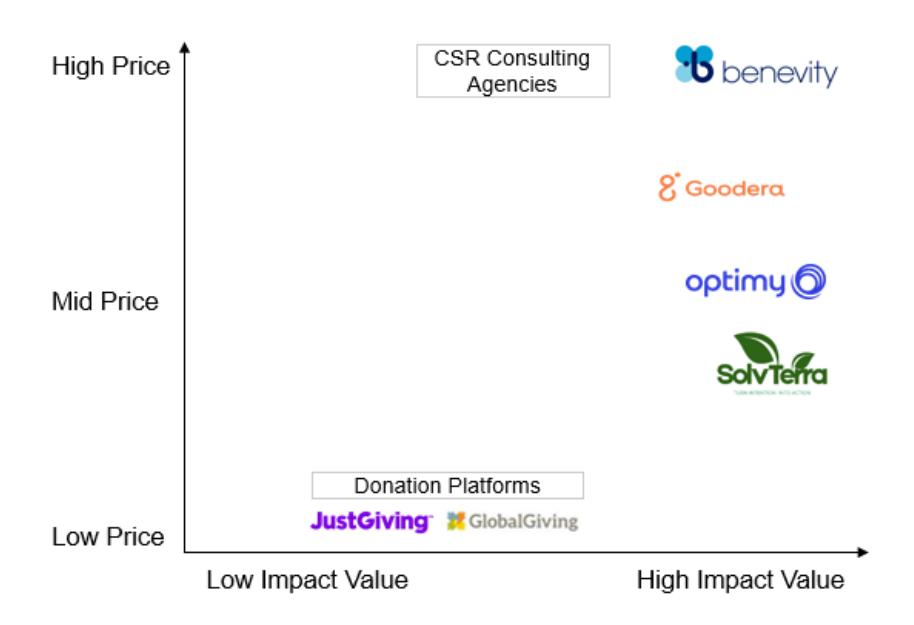

**Figure 4: Corporate Pricing Positioning Matrix for SolvTerra**

Benchmarking analysis indicates that enterprise CSR platforms and consulting providers typically operate at high subscription or retainer fee levels, often exceeding €10,000 to €35,000 per year, which limits accessibility for SMEs (Goodera, 2023; Optimy, 2025; Capterra, 2025). In contrast, donation-focused platforms commonly rely on transaction-based fees ranging between 5% and 12% per donation (GlobalGiving, 2025; JustGiving, 2024), while traditional event sponsorship packages typically fall within a price range of €1,000 to €30,000 per event (European Alliance for Innovation, 2022; European Semantic Web Conference, 2026), emphasizing brand exposure over verified impact delivery (see Appendix G for details).

Within this competitive landscape, SolvTerra positions itself as a mid-range, high-value CSR and sponsorship platform, offering pricing that is more affordable than enterprise CSR solutions while providing greater transparency, engagement depth, and impact verification than standard donation or sponsorship intermediaries.

Unlike many donation platforms, SolvTerra does not charge transaction-based fees on corporate donations. Instead, the platform acts as a neutral facilitation and verification interface, enabling corporations to transfer donations directly to NGOs. This model ensures full financial transparency, enhances donor trust, and allows 100% of donated funds to reach NGOs. Donation-related benchmarks are used solely for comparative market positioning rather than as a revenue source.

SolvTerra's primary corporate monetization mechanism is therefore centered on a corporate sponsor package, with an indicative price range of €1,500 to €3,000 per mission, benchmarked against European CSR campaign pricing and SME-focused event sponsorship models. Through these sponsored missions, corporate partners finance specific sustainability initiatives in exchange for brand visibility, storytelling assets, verified ESG impact reporting, and reputational value (see Appendix G for details).

By occupying a mid-market positioning that balances affordability, credibility, and impact depth, SolvTerra establishes a pricing structure that enables scalable corporate participation, supports longterm strategic partnerships, and ensures sustainable revenue generation without compromising transparency or social mission integrity.

In a later stage of platform maturity, SolvTerra plans to introduce a Strategic Impact Partner program targeted at loyal corporate sponsors seeking long-term, multi-year collaboration.

Rather than committing to fixed pricing at this stage, this tier will follow a quotation-based pricing model, with financial terms determined by partnership scope, mission volume, reporting depth, and branding integration. Pricing structures will be finalized only after SolvTerra has established a stable base of recurring sponsors and collected empirical insights into partner expectations and value perception.

This tier represents a strategic progression from transactional sponsorships to long-term institutional partnerships, strengthening financial sustainability and ecosystem stability.

### **4.2.3 Distribution Strategy**

SolvTerra follows a fully digital distribution model, enabling users to access the platform through both a web-based interface and a dedicated mobile application available on iOS and Android. This multichannel approach ensures convenient access for all stakeholder groups, allowing NGOs, students, and corporate partners to interact with the platform in ways that best suit their workflows and preferences.

Through the website, NGOs can create and manage missions, monitor volunteer participation, and access impact analytics and reporting dashboards. Corporate partners can use the web platform to manage donations, sponsor missions, review ESG-aligned impact reports, and download branded storytelling materials. The website also serves as the primary interface for onboarding new organizational partners and providing administrative oversight.

The mobile application is designed primarily for student engagement and real-time participation. Students can browse available missions, sign up for challenges, track their progress, receive notifications, and build verified impact profiles directly from their smartphones. The app also enables instant updates, gamification features, and social sharing, increasing engagement and participation frequency.

By integrating both a website and a mobile application, SolvTerra ensures seamless access, scalable user growth, and efficient platform management without requiring physical distribution infrastructure. This digital-first model supports geographic expansion, reduces operational costs, and allows SolvTerra to continuously improve the user experience through platform updates, new features, and data-driven optimization.

### **4.2.4 Communication Strategy**

SolvTerra's communication strategy is designed to build trust, convey impact credibility, and create emotional resonance with stakeholders. Communication efforts emphasize transparency, measurable outcomes, and the human stories behind sustainability and volunteering initiatives.

The platform's messaging balances rational arguments, such as verified impact data and CSR efficiency with emotional narratives that highlight real-world community benefits and student contributions. This dual approach strengthens both credibility and engagement across stakeholder groups.

### **4.2.4.1 Methods to Reach Target Markets**

Communication targeting students relies primarily on digital channels aligned with youth media consumption habits. Social media platforms where we will establish an official page across all platforms including Instagram, Tiktok, Facebook, etc, campus organizations focusing first on Darmstadt where Solvterra is based, ambassador programs, and peer referral systems serve as primary outreach channels. Messaging emphasizes purpose, recognition, flexibility, and career relevance.

Communication targeting NGOs focuses on demonstrating capacity relief, administrative efficiency, and access to youth volunteers. Outreach is conducted through umbrella organizations, volunteer networks, municipal partnerships, and targeted direct communication. Messaging highlights the platform's ability to reduce workload while increasing social impact.

Corporate-focused communication prioritizes professional credibility and measurable return on investment. Sponsors are approached through LinkedIn outreach, CSR networking events, pilot sponsorship opportunities, and case-study-based marketing. Messaging emphasizes verified impact, brand reputation benefits, and simplified CSR execution.

### **4.2.4.2 Customer Support Strategy**

Customer support plays a critical role in maintaining platform trust, encouraging long-term engagement, and maximizing customer lifetime value. SolvTerra provides structured support tailored to each stakeholder group.

Students receive in-app onboarding guidance, automated support tools, and community moderation,short videos will be used for this. Engagement feedback mechanisms and gamification features further enhance retention and motivation.

NGOs benefit from onboarding assistance, mission optimization support, and performance analytics. By offering guidance on best practices for volunteer engagement and mission design, SolvTerra strengthens NGO satisfaction and long-term platform usage.

Corporate sponsors receive structured campaign reporting, verified impact summaries, and communication-ready storytelling assets. Dedicated support ensures sponsors can easily access campaign results, demonstrate CSR performance, and justify continued investment.

By maintaining high-quality customer support, SolvTerra strengthens trust, reduces churn, and fosters long-term partnerships.

### **4.2.4.3 Goals & Expected Results**

SolvTerra defines a set of performance indicators to evaluate the effectiveness of its marketing and sales activities. These indicators include NGO onboarding rates, student engagement levels, sponsor acquisition and retention, brand awareness growth, and revenue stability.

During the first year of operation, SolvTerra expects to establish initial NGO partnerships, onboard an expanding base of student users, and launch pilot sponsorship campaigns. The second year focuses on scaling regional presence, strengthening sponsor relationships, and reaching financial breakeven. By the third year, SolvTerra aims to achieve national brand recognition, broaden institutional partnerships, and maintain a stable revenue base supported by recurring sponsorships and premium service offerings.

### **4.3 Conclusion Marketing and Sales**

SolvTerra's marketing and sales strategy is designed to balance innovation, scalability, and financial responsibility. Through a phased market entry approach, a tiered pricing model, digital-first distribution, and credibility-driven communication, the platform establishes a strong foundation for long-term growth.

By integrating NGOs, students, and corporate sponsors into a unified impact ecosystem, SolvTerra positions itself as a forward-looking solution within the sustainability and social innovation space. The strategy outlined in this chapter supports both commercial viability and measurable social impact, ensuring that SolvTerra's expansion remains sustainable, adaptive, and mission-driven.

### **5 Business Model**

The Business Model chapter is structured according to Osterwalder and Pigneur's Business Model Canvas, which provides a structured framework of value creation, delivery and capture for digital platforms (Osterwalder & Pigneur, 2010).

SolvTerra's business model can be classified as a digital platform with a multi-sided market approach and a business-to-business-to-customer logic. Within SolvTerra's ecosystem the value emerges through coordinated interaction between three different stakeholder groups. These consist firstly of students, as action executors and value co-creators, secondly of NGOs and similar organizations, as mission providers, and lastly corporate sponsors. With its platform, SolvTerra is the orchestrator of challenges, verification and reporting. By centralized coordination of challenges, SolvTerra lowers transaction and coordination effort for all stakeholders.

An advantage of a platform approach system is the ability to scale through digital infrastructure and the reusability aspect for challenges and reporting logic, once it has been set up. With a platform, certain network effects can be expected for students and NGOs, once SolvTerra has established itself in the market. These advantages are closely linked to more negative aspects, for instance the mutual dependency of all ecosystem participants and the need to balance challenges and student participation. The success of SolvTerra's platform is closely tied to the ability to maintain the equilibrium within the ecosystem. Principally it can be stated that a platform approach includes some risks but also many opportunities, which are discussed further in Chapter 10.

### **5.1 Value Proposition**

### **5.1.1 Value Proposition for Students**

SolvTerra provides students with easy access to challenge-based micro-volunteering. This is primarily done by giving students opportunities to volunteer with short and flexible activities of their choice without any long-term commitment, by lowering participation barriers for time-constrained students. At the same time, it allows for the discovery of meaningful activities in one centralized platform, stretching from sustainability-focused volunteering opportunities to civic engagement opportunities. All whilst reducing the search and coordination effort by showcasing all opportunities in one platform. Furthermore, the challenges themselves are embedded in a social and motivating environment. In combination with the gamification features and the community-based engagement, this would allow students to do challenges with their friends. Since their actions are verified and documented by SolvTerra, this would lead to verified and visible personal impact that they can track over time.

### **5.1.2 Value Proposition for NGOs and Organizations**

For NGOs and similar organizations one of the value propositions is the aspect that is centered around reducing the administrative and coordination workload related to volunteer management. Due to the time constraints (reference interviews) often faced by coordinators in NGOs, SolvTerra's platform offers them an opportunity to reduce their workload in this aspect and dedicate it to other topics. This is further supported by the standardized format used for challenges, as the activities are structured in standardized and repeatable formats which enable easier and quicker planning and creation of challenges. Another challenge that NGOs regularly face is the difficulty in finding volunteers and especially younger volunteers who want to contribute to their organization. SolvTerra's platform would provide them access to a motivated student base who are interested in volunteering. This is particularly valuable, as they do not have to engage in extensive outreach and recruitment efforts. The difficulty of finding volunteers (see Appendix B and C) is co-related with the lack of visibility, that many NGOs or smaller organizations face. Using SolvTerra's platform allows them to increase their visibility amongst young people, as well as for potential corporate sponsors.

Gaining exposure within a student-and youth-oriented digital platform allows them to further their visibility within the target group to increase awareness for their mission, engagement amongst a younger demographic, as well as get in touch with potential long-term supporters. Furthermore, they can tie their mission to concrete, challenge-based and interactive activities, thus translating their mission into specific challenges whilst remaining visible in the community they are active in.

With SolvTerra's impact documentation and reporting they have the opportunity to attract corporate sponsors to further their mission even more and to track their impact in a quantifiable manner that can support funding applications and grants.

The platform can be accessed with a freemium model with optional premium features. The basic platform is provided without any financial barriers to support the ecosystem growth by lowering the adoption threshold. Organizations with more advanced needs can opt for a premium version of the platform, which would include extended reporting, increased visibility, and enhanced program management capabilities.

### **5.1.3 Value Proposition for Corporate Sponsors**

SolvTerra offers corporate sponsors a way to support sustainability and civic engagement through concrete and visible impact. Sponsorships are linked to clearly defined challenges that result in real activities carried out by students. This allows corporate partners to associate their engagement with tangible and quantified outcomes.

A key aspect is the brand visibility in a purpose-driven context, that SolvTerra offers their corporate sponsors. Their brand is visibly connected to engagement initiatives and appears within a student-and youth-oriented digital platform. This element is relevant for reaching young people and sustainabilityoriented audiences. Engagement takes place through action-based formats, supporting employer branding as well as long-term purpose-driven brand positioning.

SolvTerra applies a Lower-Your-Admin approach to sponsored initiatives due to taking over the responsibility for coordination, execution and documentation of sponsored challenges. This reduces internal effort and coordination workload for corporate teams and enables the sponsor to participate in engagement initiatives without the need for extensive internal resources or operational involvement.

With the provided verified and communicable impact outputs, sponsored challenges are translated into structured documentation that can be used for credible CSR and sustainability communication. These impact outputs, that SolvTerra generates and provides, are suitable for external communication and internal reporting purposes and do not require a complex ESG or compliance system.

Further, SolvTerra clearly separates sponsorship and donation activities. Sponsorship payments are structured as service- and branding-related fees and can thus be treated as business expenses, which align with existing internal corporate approval processes and budgeting structures.

If wished, corporate partners can make direct donations to SolvTerra's NGO partners. The NGO partners can issue a donation receipt, something that SolvTerra will not do, to ensure legal clarity and compliance.

### **5.2 Value Creation**

### **5.2.1 Key Partners**

SolvTerra's value creation relies on strategic and operational as well as technology partners that support both access to target groups and the stable operation of the platform.

Strategic Partners enable reach, legitimacy and access to relevant civic and student networks. Universities and student organizations play an important role in providing access to the target group of students and in supporting engagement initiatives in an academic context. Furthermore, NGO umbrella organizations and civic networks facilitate connections to a broad range of non-profit organizations and civic actors. This enables SolvTerra to operate across different engagement fields and local contexts.

Operational and technology partners contribute to the reliable and scalable functioning of the platform. Hosting and cloud service providers ensure the platform availability and performance can operate securely and later on scale smoothly. AI verification technology providers enable the activity verification process that enables SolvTerra's workflows and contribute to the credibility and consistency of engagement outcomes.

These partnerships enable SolvTerra to combine ecosystem access with stable, secure and scalable platform operations.

### **5.2.2 Key Activities**

SolvTerra's key activities center around the design, coordination and execution of challenge-based engagement programs. This includes the definition and structuring of sustainability and civic challenges, as well as aligning these activities with corporate and NGO stakeholders. Moreover, this includes the coordination of missions, participants and partners in a centralized manner to reduce coordination and communication efforts for all parties involved. This centralized approach allows engagement initiatives to be executed efficiently.

Additionally, with SolvTerra's Lower-Your-Admin approach, the platform provides a service layer for organizations, both corporates and NGOs, that lowers the effort for operational, coordination and documentation activities related to the organisation and execution of engagement programs.

Another key activity is the verification and validation of activities completed by students. SolvTerra reviews and validates submitted pictures to ensure that recorded actions are credible, a central step to maintain trust in the platform and the impact data that is then provided. This impact data comprises of participation and activity data, which are then aggregated across challenges and structured in a way that enables comparability and reuse. This allows for engagement outcomes to be systematically analyzed and communicated.

Based on these data insights, SolvTerra generates reports for their NGO and corporate partners. These reports can be used to support communication, branding, funding applications or internal reporting, allowing both NGOs and corporate sponsors to assess the engagement outcome.

Selected impact information is made accessible to participating users, providing students with feedback in the contribution they made by engaging with challenges.

### **5.2.3 Key Resources**

SolvTerra's key resources consist of technological, human and intellectual resources that enable the coordination and execution of challenge-based engagement programs.

The technological foundation is formed by a web and mobile platform that serves as the central interface for students, NGOs and corporate sponsors. In the platform, engagement initiatives can be accessed, coordinated, and executed across different stakeholder groups. Backend systems and data pipelines enable the structured collection, aggregation and processing of participation data. These systems form the basis for impact documentation and generation of reporting insights that are provided to partners. Furthermore, SolvTerra relies on AI-supported verification components to support the validation of activities completed by students. This helps reduce manual review effort while maintaining the credibility of recorded activities. Together with the data infrastructure they ensure the engagement outcomes can be reliably documented and communicated.

Human resources represent a further central resource for SolvTerra. The founding team combines technical, operational, strategic and partnership-related competencies. This enables the effective coordination across platform development, program execution and stakeholder management.

SolvTerra's intellectual resources comprise of standardized and reusable challenge and engagement formats that provide a structured approach to sustainability and civic engagement. These formats support repeatability and scalability across different partners and use cases. Further, verification and reporting frameworks define how individual actions are translated into structured impact outputs. By establishing consistent documentation and data interpretation practices, SolvTerra's frameworks generate meaningful reporting insights for all users and partners of the platform.

### **5.3 Value Delivery**

### **5.3.1 Customer Relationships**

SolvTerra's relationship with students is designed as a low-threshold, self-service interaction based on voluntary participation. Students have direct access to the platform in a self-service approach, where they can independently choose in which challenge they want to participate without any sort of formal onboarding due to the intuitive interface of the platform.

Additionally, the relationship can also be characterized by a community-based interaction through engagement taking place through shared challenges and collective participation. This itself leads to a sense of community amongst the group participating in a challenge, as well as amongst users of the SolvTerra platform. The visibility of their participation in impact data and the peer activity contributes to the feeling of motivation and reinforces participation in challenges through social interaction.

The relationship between SolvTerra and students is continuous but non-contractual. Since there are no financial or legal frameworks, the relationship is of a voluntary nature. Students act as value cocreators by contributing their time and effort within the platform ecosystem.

The relationship between SolvTerra and NGOs is designed to be practical and easy to handle with a strong focus on reducing administrative effort for the NGO. The organization can use the platform in a self-service manner, allowing them to publish and manage challenges independently and with minimal coordination effort. This allows them to focus on their mission rather than operational overhead.

In the first stages of the cooperation, SolvTerra offers the NGO a guided onboarding (based on interview insights - see Appendix B). This includes setting up initial challenges and understanding the workflows of the platform. The goal is to ensure that the platform's features are understood and used correctly and that the organization does not need to invest a lot of time into understanding and using the platform.

The relationship continues throughout the program execution and is focused largely on coordination, reporting and following up on activities related to the challenges. The depth of the relationship depends on whether the platform is used frequently and what type of challenges the organization initiates.

SolvTerra follows a freemium model for NGOs, wherein the basic platform is available without financial commitment, lowering the entry barriers and allowing the organization to test the platform without any long-term commitment. If the requirements of the organizations increase over time they can switch to the premium version of the platform. An increase in the requirements could occur through recurring programs or higher reporting demands. For NGOs with the premium version of the platform, access to advanced reporting, increased visibility and extended program management features provide additional value.

The customer relationship with corporate sponsors is based on projects or campaigns. Interactions are predicated on either individual sponsored challenges or on clearly defined programs and are thus of a short-term nature. This allows corporate partners to engage with SolvTerra's platform in a targeted and timely manner.

During the onboarding, at the beginning of a sponsored initiative, the scope of the sponsorship, the branding elements and the reporting expectations are aligned to ensure a shared understanding before launch. After this alignment, SolvTerra takes over responsibility for the execution, coordination and documentation of the challenges whilst the sponsors are kept informed of the reception of the challenge amongst volunteers and the ongoing status of completion. This minimizes the workload for the corporate partner and allows them to participate in the challenges without allocating expansive resources.

The relationship is grounded in professional and service-based cooperation, where sponsorship opportunities are treated as a service and branding opportunity in a clear contractual framework.

### **5.3.2 Customer Segments and Distribution Channels**

More detailed insights about the customer segments can be found in Chapter 3. SolvTerra's customer segments can be split into two overarching categories: firstly, paying customers and non-paying users of the platform. NGOs or similar organizations that are using premium features, as well as corporate sponsors are counted in the category paying customers. Students, which are participating in SolvTerra's business model as active participants and value co-creators and NGOs or similar organizations which are using the freemium version of the platform.

The distribution channels for SolvTerra's digital platform are accessible both via web application, for NGOs and sponsors, as well as via mobile application as the primary access point for students. Partnerships work as multipliers for organizational adoption. To achieve this, direct and targeted communication activities with NGOs, universities, municipalities and corporate sponsors will take place. Further details about the distribution channels have been established in Chapter 4.

### **5.4 Value Capture**

### **5.4.1 Cost Structure**

SolvTerra's detailed cost structure is broken down in Chapter 7 - Financial Plan. But its operational costs comprise of the platform development and its continuous improvement, as well as costs associated with cloud hosting. Additionally costs for AI-related operational activities, especially those related to the verification process need to be considered. Personnel costs of the founders, coordination costs with key stakeholders, as well as marketing and communication expenses need to be taken into account.

### **5.4.2 Revenue Logic**

SolvTerra's revenue logic is based on a combination of project-based and recurring revenue streams. The business model prioritizes short sale cycles and low technical integration requirements, enabling efficient cooperation with NGOs, municipalities and corporate sponsors without the need for complex system integrations.

Payments made by corporate partners are structured as sponsorship or service fees and can therefore be classified as business expenses from the perspective of corporate partners. This aligns with existing CSR, marketing, branding and engagement budgets. At the same time, SolvTerra maintains a clear separation between platform-related revenues and potential donation flows, which are handled directly between corporate sponsors and NGO partners.

The revenue logic is deliberately differentiated from enterprise ESG and compliance-driven SaaS models. SolvTerra does not aim to provide audit-grade compliance solutions but instead focuses on activation, coordination and the generation of structured impact data. This allows for the platform to remain lightweight and scalable.

### **5.4.3 Revenue Streams**

SolvTerra's revenue streams consist of both market-based revenues and non-market-based funding sources in the early stage of development.

Market-based revenue streams form the core of the long-term business model and include contracts with NGOs and public-sector institutions for the execution of challenge-based engagement programs. Corporate partners contribute through sponsorship fees for challenges and programs, while NGOs can opt for premium subscriptions that provide access to advanced reporting, visibility and program management features.

In the early stages of SolvTerra's development, non-market-based funding complements these marketbased revenues. Public-sector and EU grants are planned for the support of the platform development and the initial pilot phase to reduce the financial risk and enable platform validation.

### **6 Management and Founding Team**

### **6.1 Form of Organization**

The founding team of SolvTerra consists of 8 interdisciplinary Master's students from the TU Darmstadt, combining not just different backgrounds in their fields of study, but also different nationalities and a broad variety of working experience in different functions and industries. The ownership is split evenly amongst all 8 founders.

For the initial phase of SolvTerra, the legal organizational form will be an "Unternehmergesellschaft" (UG), which allows for a low financial threshold suitable for a founder's team of students, whilst offering security in terms of liability. The formation of a UG involves comparatively low setup costs of approximately 400 € (Notar Durchlaub, 2026) , enabling SolvTerra to start operating, run pilot projects, and establish basic legal and insurance coverage without the need for significant upfront capital.

A transition to a "Gesellschaft mit beschränkter Haftung" (GmbH) is planned after the completion of the initial phase and after seed funding has been secured. The reasoning for this is that the foundation for a GmbH requires a minimum share capital of 25,000 € (Notar Durchlaub, 2026). This conversion supports the further scaling of SolvTerra and strengthens credibility toward NGOs and corporate sponsors. Furthermore, operating as a GmbH improves the eligibility for larger public funding programs and institutional partnerships, making it a fitting legal form for the subsequent growth phase.

### **6.2 Organizational Structure**

For the early development and establishment of the SolvTerra platform speed and agility are of utmost importance. To addressthis, the venture will be operated with a flat organizational structure with minimal hierarchy to enable fast coordination and deployment.

A function-based role, responsibility, and decision-making set-up ensure agility and speed, whilst considering accountability. Especially in regard to decision-making, the importance of cross-functional collaboration and close communication, as well as alignment needs to be taken into account. Cross-functional decisions are made in alignment with the disciplines involved and are ultimately decided in accordance with strategic implications.

Operational decisions are handled autonomously within each functional role to maintain ownership, speed, and agility.

### **6.3 Founding Team**

The interdisciplinary founding team has a broad range of experiences in software development, system architecture and AI, as well as marketing, partnership- and community management. Additionally, the team has experience in entrepreneurship and business development. The international background of the founding team, with members from all over the world, provides a distinct advantage when it comes to considerations of scalability due to the unique combination of cultural competencies.

These skills in combination with the broad range of cross-industry experience allow the team to address the challenges not just within the founding of a company but also address the complexity of launching and scaling a platform with distinctively different customer profiles.

### **6.3.1 Role Allocation**

Due to the expected complexity of the platform itself, the responsibility for the platform is shared, although the focus of each is slightly different.

Ron Wolniak is a Master's student in Business Information System with a focus on GenAI, software engineering and enterprise systems. His professional experience as a working student in a large IT and telecommunications environment provides him with valuable practical insights in regard to system architecture. His field of study enables background knowledge into how platform architecture should be designed and developed. Whilst the business aspect of his degree allows for economic and overall business implications of decisions made. His working experience also provides him with hands-on experience in project management and the inner-workings of how a platform architecture works in a large complex manner in IT and telecommunication corporations. His responsibility encompasses the overall platform and system architecture, as well as the definition of backend-to-frontend interaction.

Nicolas Medina Jerez is a Master's student in Business Information System with a focus on AI. His position as a working student in a startup implementing new technologies into work processes, provides hands-on insights into how a venture is scaled, as well as how to prioritize which features should be developed and implemented first. His experience in implementing new technologies into the work process is an advantage for SolvTerra, as he can rely on his previous experience and insights. His pursuit of a Master's degree with a focus on AI, gives him knowledge into the capabilities and limitations of AI and thus the feature feasibility for SolvTerra's platform. His responsibilities include the design and development of AI-supported verification logic and AI feature design, as well as the automation of manual platform workflows.

Yiwen Cao is pursuing her Master's degree in Business Information System with a focus on AI and GenAI with working experience from an internship in industrial AI solutions. Her academic focus and practical experience enable her to assess how AI outputs perform within operational workflows and how human oversight can be effectively integrated. This background allows Yiwen to contribute to the validation of AI-supported processes and to ensure that automation remains reliable during operational usage of the SolvTerra platform. Her responsibilities encompass the integration of AI modules into platform workflows, as well as the validation of AI outputs within operational processes, ensuring human-inthe-loop automation.

Jiayi Guo is a Business Information System master student with working experience in process optimization and data-driven solutions, as well as hands-on experience with SAP S/4HANA, Python, SQL and automation tools. This provides her with insights into backend processing logic and data management. Her academic and professional background provides her with the ability to design backend structures that are both efficient and scalable. In addition, her knowledge of data modeling and analytics logic enable structured preparation and analysis for impact tracking and reporting. Her responsibilities include backend process design to ensure system efficiency and scalability, as well as data management and structuring of impact data.

Salma Boularab is a master student pursuing a degree in Logistics and Supply Chain Management with a bachelor's degree in business administration and management and experience as a working student in project management. Her pursuit of a Master's degree provides a strong foundation in operational planning, coordination and process structuring. Combined with her Bachelor's degree, this enables her to design and manage operational workflows in a structured manner. Additionally, her experience in project management supports the coordination of various stakeholders and tasks. Her responsibilities entail the design and coordination of operational workflows within the platform. These include volunteer task flows, platform operations and the reliable execution of challenge-based programs.

Chaimae Qassar has an academic background in Marketing with working experience as a community manager. She is currently pursuing a Master's degree in Entrepreneurship and Innovation Management. Her background has enabled her to build expertise in branding, communication strategy and audience growth. This combination of skills supports the development of a strong platform identity and an engaged user community. Her responsibilities consist of the development of platform branding and messaging, community building and engagement strategies, as well as market research and the continuous monitoring of user behavior and sustainability trends.

Chuong Vo is a Master's student in Entrepreneurship and Innovation Management with professional working experience as a partnership and ESG coordinator. Through his experience he has developed competencies in stakeholder management, cross-organizational coordination and sustainability-related cooperation. His background allows for the establishment and maintenance of relationships with institutional partners and the coordination of joint projects across multiple stakeholder groups. His responsibilities include the acquisition and management of NGOs and organizations.

Stefani Baron is a Master student in Entrepreneurship and Innovation Management, building on a bachelor's degree in industrial engineering. With cross-industrial managerial experience in automotive R&D, as well as a founder's associate in SaaS startup. These experiences provide her with insights into product and business development in both a large corporate environment and an early-stage startup. The exposure to scaling processes and financing rounds in a startup context, have allowed her to develop an understanding of how strategic planning and financial steering interact. Her responsibilities encompass strategic and financial planning. This includes business development activities like the definition of a long-term roadmap, pitch development, investor communication and management.

### **6.3.2 Competency Matrix**

| Competency Area                          | Ron | Nico | Yiwen | Jiayi | ma Sal | mae Chai | Chuong | Steffi |
|------------------------------------------|-----|------|-------|-------|-----------|-------------|--------|--------|
| Platform & System Architecture           | ✓   | ✓    |       | ✓     |           |             |        |        |
| AI & Automation                          | ✓   | ✓    | ✓     |       |           |             |        |        |
| Data Management & Impact Reporting       |     |      | ✓     | ✓     |           |             |        |        |
| Operational Workflow & Program Execution |     |      |       | ✓     | ✓         |             | ✓      | ✓      |
| Marketing & Community Management         |     |      |       |       |           | ✓           |        |        |
| Partnerships & Stakeholder Management    |     |      |       |       | ✓         | ✓           | ✓      | ✓      |
| Strategy & Business Development          | ✓   | ✓    |       |       |           | ✓           | ✓      | ✓      |
| Financial Planning & Investor Relations  |     |      |       |       |           |             |        | ✓      |

**Table 2: Competency Matrix of SolvTerra's founding team**

As seen in Table 2 above, the SolvTerra founding team covers the critical functional areas required to design, launch and operate the business venture in its early phase. The skill overlap that can be seen showcases the strong and multi-functional background of its founders, as well as reduces dependencies, whilst allowing for decisions to be made after sparring sessions, in which the founders can use their varied industry-background to consider different perspectives. Additionally, it increases resilience in the team, allowing for emergencies and short-or-long-term downtimes of team members.

Functional Gaps in tax and legal matters have also been identified, these are going to be addressed with the help of external advisors to ensure informed decision making and adherence to regulations.

### **7 Financial Plan**

This chapter lays out SolvTerra's financial strategy, illustrating how the platform will achieve economic feasibility and sustainable growth. It details the financial objectives, key planning assumptions, and a comprehensive breakdown of both fixed and variable cost structures. Furthermore, this section highlights SolvTerra's revenue and profit model, which leverages corporate sponsorships and NGO Premium subscriptions, culminating in financial projections and a strategic liquidity plan designed to ensure long-term stability and impact in the micro-volunteering sector.

### **7.1 Financial Objectives and Planning Assumptions**

The primary financial objective of SolvTerra is to establish a self-sustaining micro-volunteering ecosystem that moves beyond initial grant dependency to achieve long-term market-based viability. This strategy is rooted in the "two sides of the same coin" principle, which suggests that a digital solution's sustainability depends as much on managing how funding is spent as on how it is generated, a concept relevant here as it dictates our lean initial cost structure.

Consequently, SolvTerra's financial planning is predicated on the assumption that early-stage operations must remain extremely lean to minimize the revenue threshold required for survival, which is a necessary precaution for a social enterprise balancing profit with impact. The planning model assumes a phased market entry starting in Q4 2025 with a research and validation phase in Darmstadt, followed by a formal launch and scaling phase in 2026. This timeline allows for the "market learning" period identified in our realisation plan, ensuring the product-market fit is established before significant capital is committed.

Key assumptions include a tiered engagement model where students provide value co-creation and NGOs serve as mission providers. This multi-sided market logic is relevant because it identifies that our revenue is not generated from those providing the volunteering (students), but from those benefiting from the impact data (corporates). The financial projections assume that 54% of students will stay engaged through rewarded contributions and 56% will increase frequency through social play. These percentages are relevant because they form the basis of our user retention rates, which in turn drive the volume of "Impact Portfolio" data we can sell to corporate sponsors. Furthermore, primary research suggests that organizations are willing to pay for digital tools to manage volunteer needs, with 55% of NGOs willing to pay up to €2,000 for such tools. This data confirms that our price points for the "NGO Premium Subscriptions" are well within the budget constraints of our target market. SolvTerra also assumes a 19% VAT rate on all taxable revenues (Firma.de, 2025), which is the standard rate in Germany, ensuring that all gross revenue figures in the financial plan are correctly adjusted for fiscal compliance.

Finally, the model assumes a target market of 2.9 million students in Germany (Statistisches Bundesamt - Destatis, 2025), a figure that defines the Total Addressable Market (TAM) and justifies our scaling projections from a local pilot to a national platform.

### **7.2 Cost Structure Overview**

SolvTerra's cost structure is designed to mirror the lean operating models of successful digital platforms while maintaining the transparency standards expected of a socially-oriented venture. This structure is categorized into three distinct development phases: the research phase, the start-up phase, and the expansion phase. In the initial period, the organization prioritizes minimizing "burn rate" by utilizing a founder-led labor model where the co-founders receive only symbolic compensation during the pilot stage. This approach drastically reduces the initial capital requirement. Total costs for the first year (2026) are projected to be manageable, but by 2029, the business model anticipates total annual costs rising to €1,919,020, as illustrated in Figure 5. This increase is relevant as it correlates with the transition from a founder-led startup to a professionalized organization with a full staff and a dedicated physical office.

| P&L                    | 2026       | 2027      | 2028       | 2029        | 2030        | 2031 |
|------------------------|------------|-----------|------------|-------------|-------------|------|
| Revenue                | - €        | 231.175 € | 1.177.650€ | 6.007.500 € | 8.209.750 € | - €  |
| Costs                  |            |           |            |             |             |      |
| Material               | - €        | 22.454 €  | 70.137 €   | 389.925 €   | 713.525 €   | - €  |
| Staff                  | 60.000 €   | 120.000 € | 120.000 €  | 1.452.500 € | 1.135.000 € | - €  |
| Rent, Office, Vehicles | 744 €      | 1.488 €   | 1.488 €    | 20.495 €    | 22.000 €    | - €  |
| Advertising            | - €        | 18.000 €  | 36.000 €   | 54.000 €    | 40.000 €    | - €  |
| Finance                | - €        | 2.100 €   | 2.100 €    | 2.100 €     | 1.400 €     | - €  |
| Other                  | - €        | - €       | - €        | - €         | - €         | - €  |
| Depreciation           | - €        | - €       | - €        | - €         | - €         | - €  |
| Foundation costs       | 1.760 €    |           |            |             |             |      |
| Total costs            | 62.504 €   | 164.042€  | 229.725 €  | 1.919.020 € | 1.911.925€  | - €  |
| Profit before tax      | - 62.504 € | 67.133 €  | 947.925 €  | 4.088.480 € | 6.297.825 € | - €  |
| Loss carried forward   | -          | 62.504 €  | - €        | - €         | - €         | - €  |
| Ø Taxes                | - €        | 1.389 €   | 284.378 €  | 1.226.544 € | 1.889.348 € | - €  |
| Profit after taxes     | - 62.504€  | 65.744 €  | 663.548 €  | 2.861.936 € | 4.408.478 € | - €  |

**Figure 5: Projected Profit and Loss Statement for SolvTerra**

The cost structure is also characterized by a high degree of scalability due to its digital nature. Unlike traditional volunteering organizations, SolvTerra does not need to invest in physical infrastructure for every new volunteer, as the "NGO Command Center" and student apps are centralized digital assets. This allows the company to maintain high gross margins, reaching up to 80% by 2029 as the fixed costs are spread over a much larger revenue base. To contextualize these figures, SolvTerra aims to keep its administrative and advertising ratios comparable to established digital service providers, ensuring that the majority of outgoing payments are directed toward platform enhancement and user acquisition. By the scaling phase, staff costs will represent a significant portion of the budget, which is relevant because the platform's long-term value depends on AI-supported verification components and backend data pipelines that require constant human monitoring and technical maintenance.

### **7.3 Fixed Costs**

Fixed costs represent the baseline financial obligation required to maintain SolvTerra's legal existence and technical infrastructure regardless of user activity. The most immediate fixed cost is the legal and organizational setup, which includes "Profit & Loss" eligible foundation costs of €1,760. These expenses represent the non-negotiable entry barrier for establishing a legally compliant structure in the German market. For a student-founded startup, these early costs are a critical component of the initial €29,396 required for "Capital for initial investments", as illustrated in Figure 6.

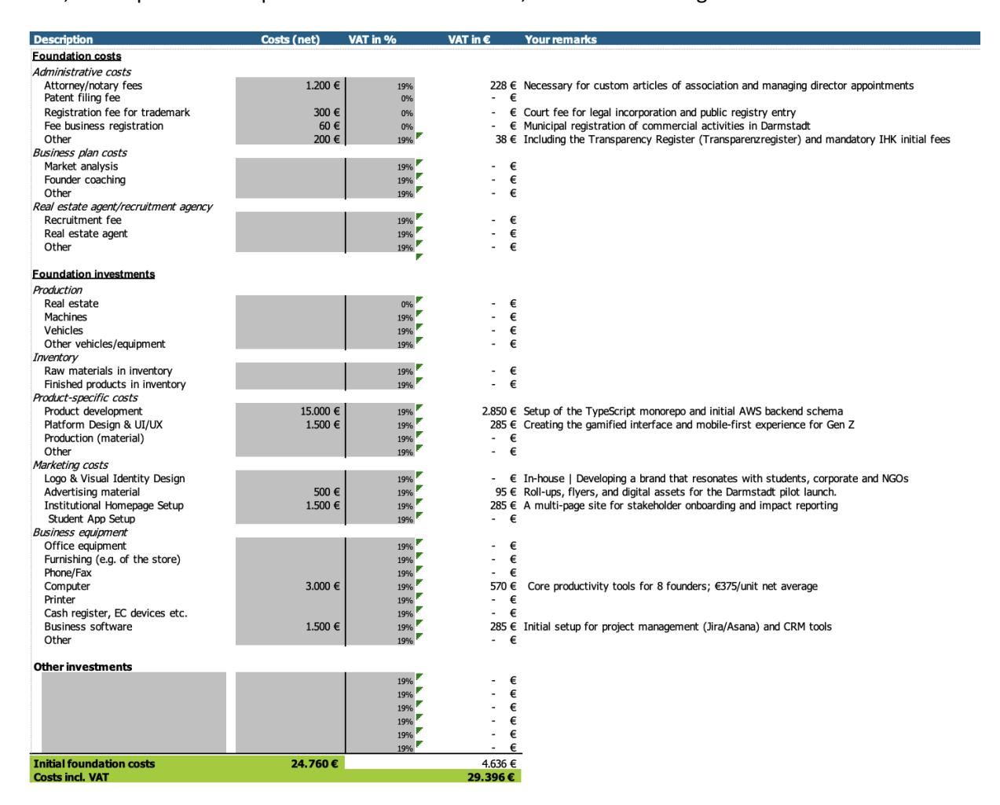

**Figure 6: Detailed Breakdown of Initial Capital Requirements and Foundation Costs**

Infrastructure and facility costs are kept intentionally low during the first two years of the roadmap. SolvTerra plans to utilize a domiciliated office and a fully remote/co-working setup initially, which is reflected in the modest rental projections of €99 per month in the early stages. Importantly, it prioritizes capital for "Capital for ongoing operations," which at €75,653, is the largest component of our initial funding needs.

However, as operations scale and professional staff are hired to manage the projected 1,000 NGO partners, these costs jump significantly. By 2029, the financial plan accounts for a physical headquarters and increased administrative overhead to support a national brand. Other recurring fixed costs include accounting services, and insurance, which are estimated at €175 per month in the initial planning phase. These costs are important because they ensure the platform meets the "compliance readiness" required to partner with large corporations and universities. Furthermore, the development of the "NGO Command Center" is treated as a fixed cost rather than a variable one, as the effort to build the dashboard does not increase with each new NGO that signs up for a subscription. This distinction

is relevant because it explains why our net profit grows exponentially rather than linearly as we acquire more customers.

### **7.4 Variable Costs**

Variable costs at SolvTerra are directly tied to the volume of users and the number of sponsorship packages sold, though they remain minimal due to the software-as-a-service (SaaS) nature of the platform. For the "NGO Premium Subscriptions," the physical material cost is €0 because providing advanced analytics and mission customization requires no raw materials or shipping. However, there are digital variable costs estimated at approximately €1 to €2 per monthly subscription. These costs primarily consist of payment processing fees from providers like Stripe or PayPal, which typically range from 1.5% to 3% plus a flat fee of €0.25 per transaction (Monily, 2026). This establishes a clear "Cost of Goods Sold" (COGS) for our SaaS product, allowing us to calculate a gross margin of 92% for this specific revenue stream.

For the "Corporate Sponsor Package," variable costs are higher, estimated at €225 per unit. These costs represent the direct resources required to execute a sponsored mission, such as marketing collateral, specific verification labor, or digital "storytelling assets" provided to the corporation for their ESG reporting. In the financial model, as sales of corporate packages increase, the associated material costs rise proportionally, peaking at €2,250 per month when 10 packages are sold. This "markup" logic is standard for service-based platforms where direct costs are incurred per client engagement to ensure the quality of the "verified impact". Additionally, SolvTerra must account for marginal hosting and cloud costs on AWS, though these are negligible at less than €0.01 per additional NGO profile. This low marginal cost is relevant as it supports the scalability of the freemium model, ensuring that hosting thousands of "free" NGOs does not bankrupt the company before they convert to the premium tier.

### **7.5 Revenue and Profit Model**

SolvTerra's revenue model is a multi-sided platform logic that captures value from its three-stakeholder ecosystem: students, NGOs, and corporate sponsors. The first revenue stream is the "NGO Premium Subscriptions," which targets organizations needing more than the basic freemium features. While the core platform is free for NGOs to ensure a steady supply of volunteering missions, the "NGO Pro" tier is priced at €25 per month. This price point was validated through direct interviews with NGO representatives who cited this as an affordable amount for advanced reporting and priority support. The second and more significant revenue stream is the "Corporate Sponsor Package," which is the primary driver of our long-term profitability. These packages are priced at €2,250 per mission, allowing companies to fund verified sustainability initiatives. This aligns with European CSR platform standards and event sponsorship market rates, positioning SolvTerra as a high-value mid-range alternative.

The profitability model shows a transition from an initial loss in 2026 to a positive net income shortly after the pilot phase. According to the financial tool, the company turns a profit by month 8 of operations, which is an important milestone as it proves the "short sale cycles" and "low technical integration requirements" of the business model. Total cumulative revenue is projected to reach €231,000 by the end of 2026, rising sharply to over €8.21 million by 2029. This growth demonstrates the "self-reinforcing ecosystem" where sponsor funding supports more NGO missions, which in turn attracts more students and generates more impact data. By focusing on "activation and coordination" rather than just "audit-grade compliance," SolvTerra avoids the high costs of legal SaaS models while still capturing high-value CSR budgets.

### **7.6 Financial Projections**

The financial projections for SolvTerra show a clear trajectory from a pilot-stage startup to a highimpact social enterprise with strong cash flows. For the first year (2026), the platform anticipates revenue starting slowly as it establishes its user base, with cumulative revenue projected at €231,000. This reflects the "Proof" and "Credibility" stages of the realization plan, where market learning is prioritized over short-term profit. However, by 2027, the revenue begins to scale as the "Corporate Sponsor Package" sales increase from 1 unit per month to higher volumes, and the number of NGO subscribers grows. Specifically, the model shows "Corporate Sponsor Package" revenue reaching €22,500 per month by October 2026, which is relevant as it validates the primary income source.

By year 4 (2029), the financial projections become significantly more aggressive, with an estimated year-end profit of €4.45 million. This indicates that the platform will have reached "national brand recognition" and stabilized its recurring revenue streams from corporate partners. The projections assume a steady growth in "NGO Premium Subscriptions," reaching 100 units by August 2027, which generates a reliable recurring monthly revenue of €2,500. Furthermore, the financial plan projects that the gross revenue (including 19% VAT) for August 2027 will be €29,750, a figure that is relevant for managing short-term cash flow and tax obligations. The long-term forecast suggests that SolvTerra will maintain gross margins between 29% and 80%, which is relevant as it provides a capital surplus for reinvesting into international expansion or new platform features.

### **7.7 Liquidity Planning**

Liquidity planning at SolvTerra is centered on navigating the 'valley of death', the critical period where operational outlays precede revenue. Our total capital requirement for the startup phase is €112,085. This figure is comprehensive: it covers initial investments (€29,396), ongoing operational costs (€75,653), and a built-in 'worst-case' safety buffer of €7,036.

To capitalize the venture, SolvTerra is pursuing a €150,000 grant. This non-dilutive funding not only covers our projected requirements but also provides an additional liquidity cushion of approximately €37,915. This 100% equity-based structure is a strategic choice; by eliminating the burden of interest payments and debt maturity, we protect our cash flow from the 'liquidity drain' that frequently causes early-stage social enterprises to fail.

The financial plan also tracks the "lowest theoretical account balance without financing," which is projected at -€105,049. This figure represents the actual "cash gap" that the €150,000 investment is designed to bridge. In a more realistic scenario, the lowest account balance is expected to be -€2,292, which is easily covered by capital injection. Furthermore, the liquidity plan accounts for "P&L eligible foundation costs" of €1,760 and "VAT" payments, which peak at €4,750 per month by late 2027. This ensures the company has enough "buffer" to manage the timing difference between when VAT is collected from customers and when it must be paid to the tax authorities. By maintaining a stable revenue base supported by "recurring sponsorships," SolvTerra aims to reach financial breakeven by year 2, as illustrated in Figure 7, ensuring that liquidity remains high enough to support the "national rollout" planned for year 3.

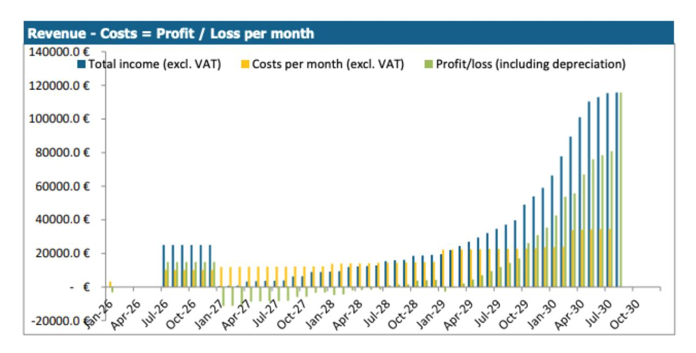

**Figure 7: Monthly Operational Performance and Break-Even Analysis (2026–2030)**

### **7.8 Funding Possibilities**

Public grants represent the strategic foundation of SolvTerra's early-stage financial architecture, serving as a non-dilutive engine that facilitates technical development without the premature pressure of commercial profit maximization. Because SolvTerra operates at the intersection of public interest tech, university innovation, and regional digitalization, it stands as a strong candidate for several prestigious German funding programs. The primary role of this funding is to "de-risk" the initial pilot phase in Darmstadt, providing the necessary runway to refine AI verification algorithms and gamification loops before the platform transitions into long-term corporate sponsorship contracts. This structured approach ensures that the expansion remains mission-driven while building the institutional legitimacy required to operate within the complex European ESG landscape.

A premier funding opportunity for the founding team is the EXIST-Gründerstipendium (EXIST — Programme: EXIST Gründerstipendium, 2025), a program by the Federal Ministry for Economic Affairs and Climate Action (BMWK) specifically designed for innovative, technology-oriented startups emerging from university environments. Given that SolvTerra is composed of eight interdisciplinary master students from TU Darmstadt, the venture is a perfect fit for this grant, which typically provides monthly stipends for founders, material expenses up to €30,000.00, and dedicated coaching for one year. This would allow the team to focus exclusively on the transition from the Darmstadt pilot to national scaling while maintaining a lean equity structure.

Furthermore, SolvTerra's focus on "Public Interest Tech" makes it a prime candidate for the Prototype Fund, a program by the Federal Ministry of Education and Research (BMBF) (Prototype Fund, (2025). The Prototype Fund specifically supports independent developers and small teams building software that provides social value, offering up to a monthly 95.000 over six months. SolvTerra's mission to democratize social impact through micro-volunteering aligns perfectly with the BMBF's focus on civic tech and data literacy, particularly as the platform seeks to build a verified impact dataset for the public good. By positioning its AI-driven photo verification system as a tool for transparent civic engagement, SolvTerra can leverage these funds to solidify its technical infrastructure.

Ultimately, these grants act as more than just a source of capital; they are strategic enablers that allow SolvTerra to build a differentiated asset, a verified behavioral and impact dataset, that serves as the foundation for its value proposition to corporate sponsors. By the time this grant funding concludes in late 2026, the platform will have established the network effects and social proof needed to transition into a self-sustaining commercial model supported by recurring sponsorship fees and premium NGO services. This phased funding strategy ensures that SolvTerra remains sustainable and adaptive, successfully bridging the gap between a student-led pilot and a national impact-intelligence leader.

### **8 Realisation Plan**

### **8.1 Roadmap**

The realisation of SolvTerra follows a phased and iterative roadmap as shown in Figure 8 covering a period from Q4 2025 to Q4 2027, with an outlook into 2028. The implementation is structured into four main phases: Research phase, Start-up, Entering the market, and Expansion & further development.

Rather than following a strictly linear sequence, several activities overlap across phases in order to shorten time-to-market, reduce risks early, and allow feedback-driven iterations. The roadmap reflects a realistic implementation logic for a resource-constrained platform, where validation, development, and growth-related activities are closely interlinked.

At the core of the roadmap lies a clearly identifiable critical path: concept validation, development of a functional MVP, execution of a pilot project, and the subsequent decision to scale the platform. The successful completion of these steps is essential for the continuation and expansion of SolvTerra.

### **8.2 Research Phase**

The research phase takes place in Q4 2025 and focuses on concept validation. During this phase, the fundamental assumptions of SolvTerra are defined and tested in order to reduce uncertainty before significant resources are committed.

Key activities include idea generation, market research, surveys, and in-depth user interviews with the target group. These activities aim to clarify the underlying problem statement, assess demand, and identify expectations from students, NGOs, and potential corporate partners.

Based on the insights gained, the initial set of minimum viable product (MVP) features is defined. This definition marks the transition from conceptual exploration to concrete implementation planning and forms the basis for the start of functional MVP development.

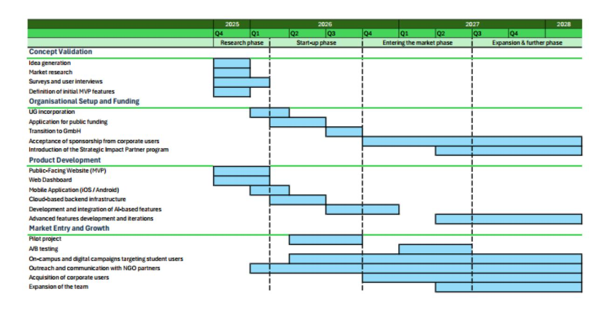

**Figure 8: Roadmap**

### **8.3 Start-up Phase**

The start-up phase spans from Q1 to Q4 2026 and focuses on organisational setup, initial funding, and the development of a MVP that enables real-world validation. During this phase, SolvTerra transitions from a validated concept into an operational initiative.

At the organisational level, SolvTerra is initially established as an *Unternehmergesellschaft* (UG) at the beginning of the start-up phase, enabling operations with low initial capital and providing the legal basis for the pilot project. In parallel, applications for public funding from public-sector and EU grants are submitted in order to secure the financial resources necessary for the early implementation stages. Towards the end of the start-up phase, a transition to a *Gesellschaft mit beschränkter Haftung* (GmbH) is planned. This transition strengthens credibility towards NGO partners and corporate sponsors and demonstrates that SolvTerra is able to operate in a legally compliant and financially viable manner before entering broader market-facing activities.

Product development during the start-up phase concentrates on building a robust and extensible technical foundation while enabling early validation. Development begins with a public-facing website that implements the core functionalities required to support collaboration between student users and NGOs. Further MVP components include a web dashboard for NGO partners. It allows NGOs to manage challenges and access relevant statistical data. Additionally, mobile applications for iOS and Android are developed to lower access barriers for student users and to support convenient and frequent participation in platform activities. Together, these components form the functional MVP and represent the key prerequisite for initiating the pilot project.

Building on the MVP, the technical system is continuously extended for future scaling. While the MVP is initially operated on existing server infrastructure, the backend is gradually migrated to a scalable cloud-based environment as storage and security requirements increase. This migration also enables the subsequent development and integration of advanced functionalities, including AI-based features, which are initiated during the later part of the start-up phase and further developed in subsequent phases.

Based on the availability of the functional MVP, a pilot project is conducted in Q3 and Q4 2026. The pilot exclusively involves NGOs and student users and aims to explore and validate participation models. Beyond technical validation, the pilot establishes a proven collaboration framework and generates concrete reference cases. These results form the foundation for the subsequent market entry and expansion phase, in which the validated model is presented to additional NGOs and potential corporate partners.

### **8.4 Entering the Market Phase**

The market entry phase starts in Q1 2027 and marks the transition from pilot operations to broader market engagement.

Building on the validated web-based MVP and the insights gained during the pilot project, further A/B testing is introduced as an ongoing optimisation mechanism to evaluate engagement flows, feature variants, and user interaction patterns; results are fed directly into iterative product improvements.

During this phase, market-facing activities are intensified. Student user acquisition efforts expand through on-campus and digital channel marketing activities, initially focusing on local initiatives before gradually broadening their scope. Partnerships with additional NGOs are established, allowing SolvTerra to offer a broader range of projects and opportunities. The acquisition and onboarding of corporate partners also begins in this phase, preparing the ground for a contribution-based corporate funding mechanism that becomes increasingly important in the subsequent expansion stage.

At the same time, SolvTerra aims to gradually reduce dependency on non-market-based funding sources and to increase its financial sustainability through market-based revenues. During this phase, SolvTerra begins to formally accept financial contributions from corporate partners, initially in the form of short-term sponsorship fees for challenges and programs. For the NGOs, SolvTerra also provides premium subscription options for advanced features. Strategic Impact Partner program will be introduced to corporate partners that have already participated in multiple projects on the platform and are willing to transition towards stable, long-term collaboration.

These activities are designed as ongoing processes rather than one-time events, with their intensity and focus evolving over time.

### **8.5 Expansion and Further Phase**

The expansion and further development phase spans from Q4 2027 into 2028 and focuses on scaling reach, operational capacity, and long-term sustainability. In this phase, further feature development and iterations become the dominant product stream, continuously informed by multiple inputs: A/B testing results, usage analytics across web and mobile, and qualitative feedback from NGOs, corporate partners, and student participants.

Market growth activities continue at scale. Student-focused marketing and the expansion of NGO partnerships remain ongoing, while engagement with corporate partners is strengthened. The sponsorbased funding mechanism is further scaled and stabilised to reduce dependency on public funding while staying aligned with SolvTerra's mission and its role as a bridge between corporate sponsors, NGO projects, and student participation.

As activity volume increases, team expansion becomes necessary to sustain operations and partner management. This includes capacity for user and partner support (e.g., dashboards for organisational users and processes for handling uploaded documentation), ensuring that growth does not degrade service quality or partner trust.

### **9 Pilot Phase**

### **9.1 Pilot Objectives and Hypotheses**

The pilot phase represents a controlled, small-scale launch of the SolvTerra platform, designed to validate the core concept and the end-to-end workflow under real-world conditions. Its primary purpose is to verify that the interactions between students, NGOs and corporate partners function as intended, generating actionable insights prior to scaling the platform.

To achieve this validation, the pilot is structured around testing five key hypotheses regarding user behavior, platform usability and the viability of the sponsored model:

- (H1) Student Adoption: We hypothesize that students are willing to complete verified microvolunteering tasks.
- (H2) Gamification Effectiveness: We anticipate that gamification elements will measurably increase student engagement.
- (H3) NGO Usability: We posit that NGOs can easily create, manage and verify micro-challenges using the platform tools.
- (H4) Workflow Integrity: We aim to confirm that the end-to-end workflow, spanning challenge creation, matching, execution, verification and reward distribution, functions smoothly.
- (H5) Corporate Viability: We hypothesize that sponsored challenges will be accepted by students without reducing platform engagement or trust.

### **Key Performance Indicators**

To objectively evaluate these hypotheses, specific metrics will be tracked:

- Student Engagement (H1, H2, H4): Success will be measured via activation rates, the average number of challenges completed per student, short-term retention and engagement with gamification features (specifically XP earned per user and badge acquisition rates).
- Operational Efficiency (H3, H4): NGO and workflow performance will be assessed through the number of challenges created per NGO, the verification success rate and qualitative NGO satisfaction feedback.
- Commercial Validation (H5): The viability of the corporate model will be determined by the participation and completion rates in sponsored challenges, alongside qualitative sentiment feedback from users.

### **9.2 Target Groups and Pilot Scope**

To minimize operational complexity and maintain a sharp focus on validating SolvTerra's core microvolunteering concept, the pilot scope is intentionally limited to a manageable participant base. This structured approach allows for rigorous testing while ensuring resources remain focused on critical validation points.

### **Participant Targets**

We have defined specific user acquisition targets to ensure statistical significance and operational manageability:

- Students (Minimum 70 Active Users): This threshold provides a sufficient sample size to reliably test engagement levels and challenge completion rates. Furthermore, it enables the observation of potential peer effects, which are expected to drive organic user growth during the pilot.
- NGOs (8–15 Organizations): This range strikes a balance between manageability during onboarding and the need for comparative data across different organizations.
- Corporate Partners (2–4 Companies): We will partner with companies exhibiting a strong focus on ESG, sustainability, or community engagement. Ideal candidates include consumer goods and retail brands with a local presence, as well as energy or environmental technology firms.

### **NGO Selection Strategy**

To ensure that the pilot insights can be generalized to a broader NGO market, participating organizations are selected based on three diversity criteria. This strategy mitigates the risk of overfitting the platform to a single use case:

- 1. Diversity in Social Cause (The "Why"): We will include organizations focused on varied sectors such as environmental protection, social inclusion, education, and community service. This tests the universal applicability of the micro-challenge concept, verifying that it functions independently of the specific social cause.
- 2. Diversity of Challenge Type (The "What"): The pilot will include both digital challenges and simple on-site activities that use different verification mechanisms. This diversity ensures that the full workflow can be tested for reliability across multiple engagement formats.
- 3. Diversity of Engagement (The "Frequency"): We will test recurring, flash and campaign-based challenges. This ensures that student engagement remains stable under varying supply dynamics.

### **Corporate Partnership Model**

Corporate partners are vital to validating the sponsored challenge ecosystem. The primary objective is to prove that sponsored content is accepted by students and that commercial involvement does not negatively impact platform trust or engagement. To remove barriers to entry and ensure immediate cooperation for this simulation, corporate partners will not be charged a sponsorship fee during the pilot phase.

### **9.3 The Minimal Viable Product**

Our Minimum Viable Product (MVP) is strictly tailored to support the objectives of the pilot phase and the validation of our core hypotheses. The development focus is on simplicity and functionality, ensuring the tool effectively tests the core concept, the end-to-end workflow (creation, execution, and verification) and the Proof of Concept (PoC) for sponsored challenges.

### **User Interfaces and Core Functionality**

NGO Interface: To assess NGO usability and the feasibility of translating activities into micro-tasks, we provide a streamlined interface for challenge creation. NGOs can publish challenges with minimal effort by entering only essential details: title, description, estimated duration, location and verification type.

Student Interface: Students access a challenge feed presented as a simple list view, offering a clear overview of active opportunities. From this feed, users can inspect details, accept challenges and mark them as complete via our verification process.

Verification Workflow: To build trust while minimizing friction, the verification flow is kept intentionally simple. We support photo uploads for on-site activities and text-based submissions for digital tasks. Both methods require a final manual confirmation by the NGO to ensure the task meets their standards. Challenges are tracked via a transparent status system: Pending, Approved, or Rejected.

### **Strategic Feature Implementation**

Sponsored Challenges (PoC): Integrating sponsored challenges is critical for SolvTerra's long-term strategy. To generate corporate-facing evidence without technical complexity, the MVP allows challenges to be tagged as "Sponsored," displaying the sponsor's logo and name. Crucially, the underlying task logic remains identical to non-sponsored challenges. This approach allows us to isolate and test student acceptance of corporate involvement.

Gamification (H2): To test the impact of gamification on engagement, the MVP incorporates basic game mechanics. These include an experience point (XP) system with a visible counter, level progression based on XP thresholds and a defined set of collectible badges displayed on user profiles.

### **Administration and Data Strategy**

Admin Control: To mitigate technical risks and ensure a smooth user experience, the MVP includes an admin panel with manual controls. This allows for immediate troubleshooting and rapid resolution of any issues that arise during the live pilot.

Data Collection & Analysis: Comprehensive data collection mechanisms are integrated directly into the MVP. This is essential to validate our core hypotheses, measure engagement and trust and transform raw pilot activity into a measurable proof of concept. The resulting data will provide the evidence needed to secure future partnerships and drive scalable growth.

### **9.4 User Recruitment and Onboarding**

### **User Recruitment Strategy**

To secure the defined target groups, we will execute a targeted direct outreach strategy focused on local NGOs, established student organizations and selected corporate partners. This approach prioritizes quality of engagement over quantity, ensuring we acquire users who are willing to provide detailed feedback.

### **Onboarding Approach**

We will utilize a high-touch, personal onboarding model to ensure smooth adoption and immediate activation. A central tenet of our communication strategy is transparency, we will clearly articulate that the platform is in a test phase. This manages user expectations and fosters a collaborative environment where users feel empowered to offer constructive critique.

### **NGO-Specific Support**

Recognizing that content supply is critical to the ecosystem, we will provide an elevated level of support to NGO partners. This includes:

- Guided Onboarding: Personal walkthroughs of the interface to ensure comfort with the challenge creation tools.
- Operational Analysis: We will work cooperatively with NGOs to analyze their internal operational logic. This consultative process assists them in identifying which existing activities can be effectively derived and translated into platform-ready micro-challenges.

### **9.5 Pilot Execution and Monitoring**

During the execution phase, the primary strategic focus is on observation and learning rather than immediate optimization. Continuous monitoring is employed to identify friction points in real-time, ensuring the pilot remains strictly aligned with it's validation objectives.

### **Operational Launch and Support**

SolvTerra will launch with a curated selection of micro-challenges, pre-elaborated in collaboration with our partner NGOs to ensure immediate relevance and quality. Throughout the pilot, we will actively monitor key workflow stages including challenge acceptance, completion, and verification, while providing ongoing responsive support to all user groups.

### **Issue Tracking and Analysis**

To facilitate future iterations, we will document technical issues, operational delays and unexpected user behaviors. This systematic logging serves as a foundation for data-driven improvements, allowing us to refine the platform based on actual usage patterns rather than assumptions.

### **9.6 Measurement and Feedback Collection**

To accurately assess pilot performance, we require a comprehensive understanding derived from both quantitative metrics and qualitative insights. Our measurement strategy strictly prioritizes indicators of user behavior, engagement depth and workflow efficiency, deliberately avoiding vanity growth metrics.

### **Quantitative Data Collection**

Quantitative measurement is executed directly through the data collection mechanism implemented in the MVP. This system allows us to track platform usage, observe in-app behavior and analyze user drop-off points to identify friction within the workflow.

### **Qualitative Data Collection**

To complement quantitative data with user sentiment, we will employ specific feedback loops:

- Surveys: We will administer short, targeted surveys to both students and NGOs to gauge satisfaction and usability.
- Structured Interviews: We will conduct in-depth interviews with selected pilot users to gather detailed insights into their experience.

### **9.7 Evaluation and Next Step Decisions**

The pilot concludes with a structured evaluation. Gained insights should directly be integrated in product iteration, strategic adjustments, scaling decisions and the go-to-market strategy for corporate sponsors.

### Platform Evaluation:

- Compare results against initial hypotheses.
- Identify strengths, weaknesses, and bottlenecks in the workflow.

- Decide whether to iterate, pivot, or scale the platform.

### Sponsored Challenges – Proof of Concept Evaluation:

- Assess whether sponsored challenges are accepted by students without reducing engagement or trust.
- Evaluate whether sponsored challenges deliver measurable and verifiable impact.
- Determine which challenge types and sponsorship formats perform best.

### Post-Pilot Decisions:

- Proceed with corporate sponsor acquisition using pilot data as evidence.
- Refine sponsorship design, communication, or pricing if required.
- Define criteria for scaling sponsored challenges to additional NGOs and regions.

### **10 Chances and Risks**

### **10.1 Chances**

### **10.1.1 Beachhead density in Darmstadt enables early network effects and credibility formation**

SolvTerra's initial focus on Darmstadt is a structurally sound go-to-market choice for a multi-sided platform, because concentrated rollout increases the probability of reaching local platform liquidity (i.e., enough NGOs publishing missions and enough students completing them to make the platform feel "alive"). In early-stage platforms, the main constraint is not "awareness" but matching quality: students must immediately see relevant missions, and NGOs must quickly experience successful volunteer engagement. A city-level beachhead improves both by reducing geographic fragmentation and allowing faster iteration cycles (mission formats, onboarding flows, communication patterns) before replicating the playbook to other university cities. This also accelerates credibility building: early pilot reference cases and visible local outcomes become proof points for subsequent partners and sponsors.

### **10.1.2 Strong product–audience fit: micro-volunteering aligns with Gen Z constraints and motivations**

SolvTerra's micro-volunteering model (5–30 minutes) directly targets a key behavioral barrier: students' time fragmentation and irregular schedules. By offering low-threshold, short-format tasks with visible outcomes and recognition (impact logs, certificates, skill signaling), SolvTerra can convert latent willingness into actual participation. This increases the probability of frequent engagement and repeat usage, crucial for building habit loops on the student side. Importantly, the combination of "purpose + recognition + flexibility" supports both adoption (first mission) and retention (repeat missions).

### **10.1.3 Corporate ESG/CSR pressure creates partnership opportunities**

Even when SolvTerra does not provide audit-grade compliance, it can still capture corporate demand for credible, reportable, and communication-ready impact evidence (verified participation data, mission outcomes, storytelling assets). Sponsors increasingly seek initiatives that demonstrate tangible, local impact and employee-/youth-engagement potential. SolvTerra's platform can serve as an "activation layer" that turns sustainability intent into structured programs with measurable outputs, particularly attractive for employer branding, CSR communications, and internal engagement.

### **10.1.4 Digital-first distribution supports scalability at low marginal cost once the playbook is validated**

A web + mobile distribution model allows SolvTerra to scale geographically without physical infrastructure. Once the Darmstadt model is stable, expansion can follow a modular replication logic: standardized onboarding packages for NGOs, campus ambassador playbooks for students, and sponsorready mission templates for corporates. This scalability is a major opportunity because it reduces marginal expansion cost relative to offline-only civic engagement programs.

### **10.2 Critical Risks**

### **10.2.1 Cold-start and supply demand imbalance risk**

As a multi-sided platform, SolvTerra is highly sensitive to imbalances between its core stakeholder groups. If student adoption outpaces the availability of missions, users may experience frustration, low perceived value, and rapid churn; conversely, if NGOs onboard without sufficient student activity, organizations may disengage and stop publishing missions. A lack of early sponsor participation further increases financial pressure and extends dependency on grants. Together, these dynamics can trigger negative feedback loops that inhibit the emergence of network effects, a risk that is particularly acute during the first weeks of launch when users form lasting impressions of the platform's "liveliness." To mitigate this risk, SolvTerra prioritizes supply-first onboarding with a minimum inventory of high-quality missions before scaling student acquisition, enforces mission quality standards, and applies density thresholds prior to geographic expansion. Early warning indicators include the number of missions per active student, average time-to-match, student activation rates (from signup to first mission), NGO repeat posting rates, and 30-day student retention.

### **10.2.2 Perception risk**

Social impact ecosystems are trust-sensitive. Without credible reference cases, stakeholders may suspect inflated impact claims, weak verification, or misaligned incentives. For corporates, weak credibility reduces willingness-to-pay; for NGOs, it reduces willingness to invest time in onboarding.

Mitigation logic: publish pilot results, standardized verification logic (risk-based), transparent reporting boundaries, and visible partner endorsements.

Early warning KPIs: sponsor conversion lag, NGO onboarding drop-off, support tickets on "how verification works," stakeholder satisfaction.

### **10.2.3 Verification and Operational Cost Risk**

Credible verification and impact reporting are central to SolvTerra's value proposition, but manual processes can increase operational complexity and costs. Rather than offering formal third-party certifications, SolvTerra relies on platform-based, risk-based verification, validating participation, task completion, and basic outcome indicators of micro-volunteering. Low-risk activities use automated checks and standardized self-reporting, while higher-risk or high-visibility activities trigger additional validation such as NGO confirmation, evidence review, or spot checks. By limiting verification to activity- and participation-level evidence, SolvTerra maintains credibility for ESG reporting and stakeholder communication while controlling costs and liability exposure.

### **10.2.4 Revenue Conversion and Financial Sustainability Risk**

Despite strong social value creation, revenue conversion from sponsors or institutional partners may remain limited in early stages, particularly if impact proof is insufficient or pricing barriers are too high. SolvTerra mitigates this risk through clear sponsor value propositions, modular low-entry pricing, frequent impact reporting, and diversified funding sources, including grants and partnerships.

### **10.2.5 Competition and Fast Imitation Risk**

A micro-volunteering platform with dashboards and gamification features is inherently technically reproducible, which exposes SolvTerra to fast imitation by established volunteering or CSR platforms that can replicate individual features or bundle similar functionality into broader service suites. Beyond direct feature-based competition, an additional risk arises from "budget substitution," whereby corporate partners may prioritize integrated ESG or CSR platforms, consulting offerings, or internal programs over standalone engagement solutions. As formal patent protection is not feasible, SolvTerra's defensibility must rely on structural and relational advantages rather than technology alone. Key mitigation mechanisms include exclusive or semi-exclusive partnerships with universities and NGOs, the development of mission formats and verification workflows that are operationally difficult to replicate quickly, and the creation of switching costs through accumulated impact histories, reporting templates, and sponsor-specific documentation. Early warning indicators for this risk include rising sponsor churn attributed to alternative solutions, increasing price pressure during negotiations, evidence of NGOs or sponsors engaging in multi-homing across competing platforms, and visible convergence of competitor feature sets.

### **10.3 Overall Assessment**

Overall, SolvTerra's marketing and sales strategy is coherent and structurally aligned with the realities of a multi-sided platform: a focused beachhead in Darmstadt, university-based distribution, and a product concept that matches Gen Z constraints (short, flexible micro-volunteering) provide a strong foundation for early adoption and credibility building. The approach increases the probability of achieving local platform density, often the decisive milestone that turns a platform from "promising" into "self-reinforcing."

However, the strategy's success is highly execution- and coordination-dependent. The main constraints are not awareness but (1) cold-start balance across stakeholder sides, (2) legitimacy and verification credibility, (3) corporate conversion speed and sales cycle realities, and (4) fast imitation risk once the concept is validated. These risks are manageable, but only if SolvTerra operates with disciplined phase-gating: enforcing density thresholds before expanding to new cities, maintaining consistent donation/sponsorship messaging to avoid trust erosion, and running KPI-based learning loops during the pilot phase (activation, retention, matching quality, and sponsor conversion).

If SolvTerra executes this disciplined approach, particularly supply-first onboarding, credibility-first pilot proof, and procurement-friendly corporate packaging, the marketing and sales strategy can reasonably transition from grant-supported early operations to sponsor-driven revenue sustainability, while maintaining mission integrity and stakeholder alignment.

### **11 Prototype and Technical Details**

This chapter presents the technical foundation of SolvTerra. It shows that the concept from Chapter 2 has become a working, production-ready system. The implementation addresses the requirements from market research (Chapter 3) and pilot interviews. It provides clear evidence that the platform can deliver on its promises.

### **11.1 Platform Architecture and User Experience**

SolvTerra has three user-facing components:

- 1. A mobile application for student volunteers
- 2. A web dashboard for NGO administrators
- 3. A public website for awareness and onboarding (planned for market entry)

The mobile application and web dashboard are fully built. They connect to a production backend that synchronizes data in real time. Each interface serves its specific audience. All components share the same data layer and design language.

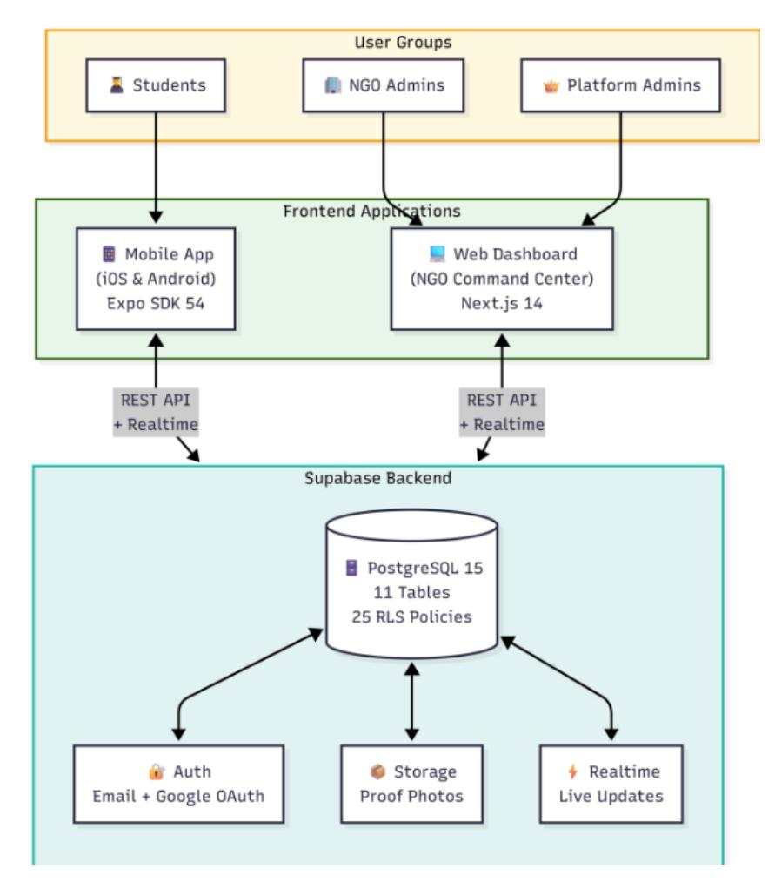

**Figure 9: SolvTerra System Architecture**

### **11.1.1 Mobile Application (Student Interface)**

The mobile application is the main entry point for student volunteers. It guides new users through a step-by-step onboarding flow:

- 1. A welcome screen shows the core benefits: quick micro-volunteering, XP rewards, and community support.
- 2. Users create an account using Google login or email registration.
- 3. Users select their interests from six categories: environment, social, education, health, animals, and culture.
- 4. Users complete an interactive tutorial.

The main application has four navigation tabs:

- **Discover**: This tab shows micro-volunteering opportunities. The data loads in real time from the database. Students can filter by duration (5, 10, 15, or 30 minutes), challenge type (digital or on-site), and interest category. Color codes show challenge duration at a glance. Short challenges (5–10 minutes) display lightning badges to encourage quick participation. This design addresses the time barrier found in our research: 70% of students said time commitment stops them from volunteering (see Chapter 2.3).
- **My Challenges**: This tab tracks active, pending, and completed challenges in separate views. Active challenges show countdown timers as deadlines approach. The app limits users to five active challenges at once. This prevents overcommitment and encourages completion. If an NGO rejects a submission, students see the feedback and can resubmit.
- **Community**: This tab shows a verified social feed. Posts include challenge completions, badge awards, level-ups, streaks, NGO promotions, and success stories. Unlike regular social media, the platform verifies all content. Each post links to an approved submission. Users can like, celebrate, and comment on posts. Like counts update in real time. Users can filter posts by type: all, organizations, stories, or activity.
- **Profile**: This tab shows the student's impact portfolio. It displays XP progress toward the next level with a visual bar. It also shows completed challenges, contributed hours, and earned badges. Users can view their timeline, edit their profile, and switch between German and English.

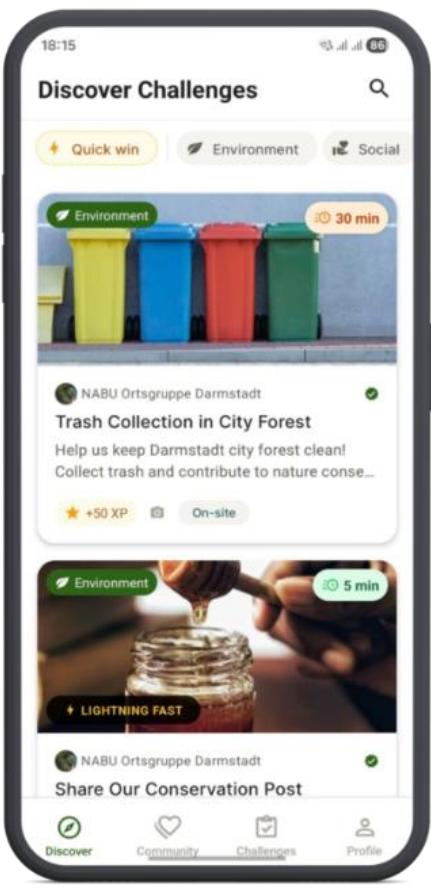

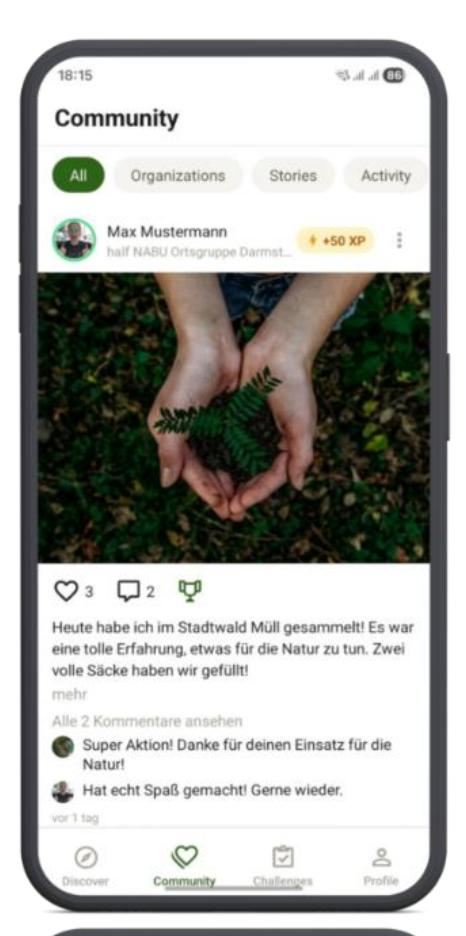

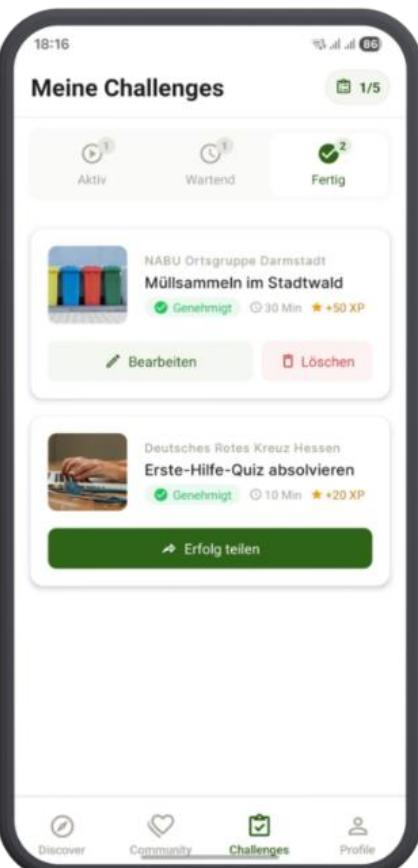

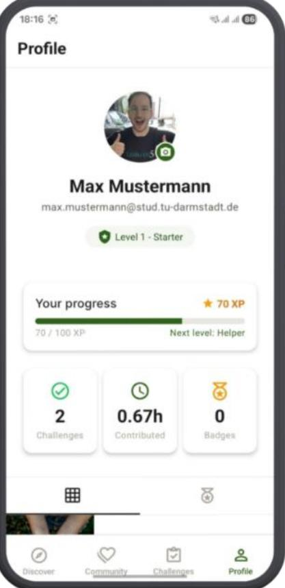

**Figure 10: Mobile Application – Main Navigation Tabs**

### **Challenge Detail & Submission Flow:**

The challenge detail view shows:

- Task instructions
- Location and schedule details
- Contact person information
- Team composition (for multi-person challenges)
- Verification requirements

Students submit proof of completion directly through the app. Depending on the challenge type, they can:

- Upload a photo (compressed to 0.7 quality to save bandwidth)
- Write a text description
- Receive manual confirmation from the NGO

After submission, students receive a notification when the NGO reviews their proof. Approved submissions trigger a celebration screen. Rejected submissions show feedback and allow the student to try again.

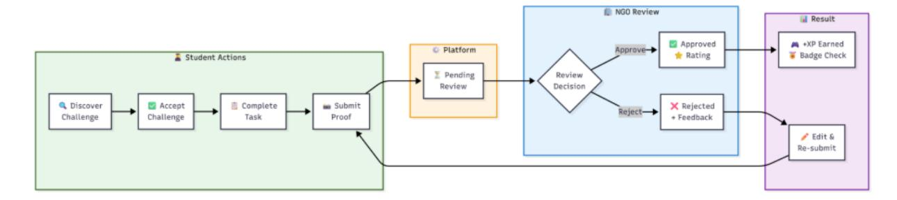

**Figure 11: Challenge Acceptance & Submission Workflow**

### **11.1.2 Web Dashboard (NGO Command Center)**

The web dashboard gives organizations a complete management interface. It has six main sections:

**Dashboard** – An overview panel shows key numbers: active challenges, total participants, pending reviews, and volunteer hours. It displays weekly activity charts and provides shortcuts to common tasks.

**Challenges** – This section manages the full challenge lifecycle. The creation workflow offers four templates for quick starts: social media post, research task, cleanup action, and team action. A detailed form covers:

- Basic information and categorization

- Duration and XP allocation (calculated automatically, see Section 10.2)
- Verification method
- Location and meeting point details
- Scheduling (flexible, fixed date, date range, or recurring)
- Contact person assignment
- Team settings with matchmaking options
- Custom tags

A live preview shows how students will see the challenge. Organizations can save drafts, publish immediately, or schedule publication.

**Submissions** – A review queue shows student proof submissions. NGOs can filter by status: pending, approved, or rejected. For each submission, NGOs can:

- View the proof image or text
- See the student profile and submission time
- Give a star rating (1–5)
- Write feedback
- Approve or reject

Rejections require a reason. This ensures students receive helpful feedback.

**Community** – Organizations manage their public posts here. They can create challenge promotions, share success stories, and post announcements. Posts can be pinned or highlighted for more visibility.

**Statistics** – An analytics dashboard shows participation trends, category distribution, approval rates, time patterns, and weekly activity through interactive charts.

**Settings** – Organizations can edit their profile, upload logos, update contact details, and set notification preferences.

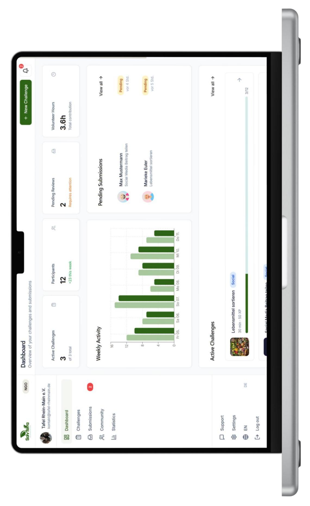

**Figure 12: NGO Web Dashboard – Main Overview**

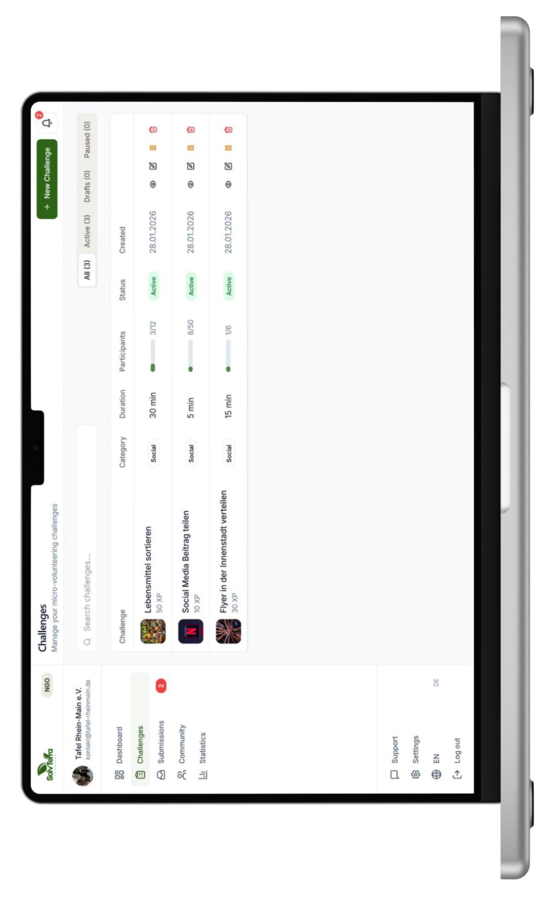

**Figure 13: NGO Dashboard – Challenge Management**

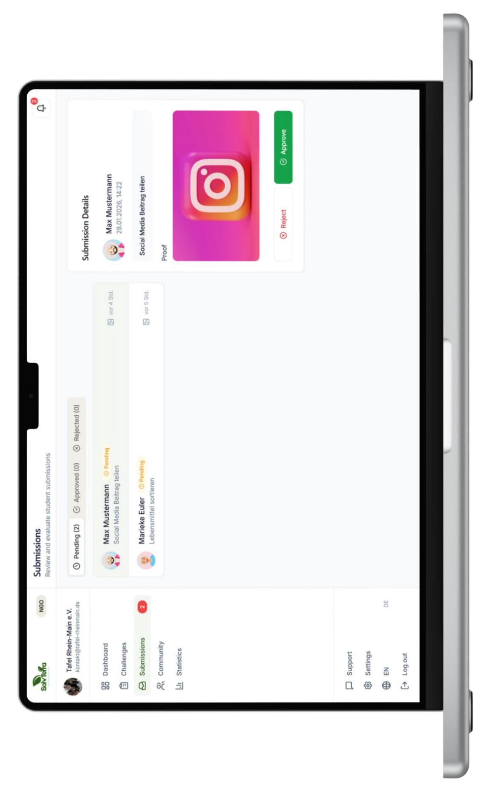

**Figure 14: NGO Dashboard – Submission Review Queue**

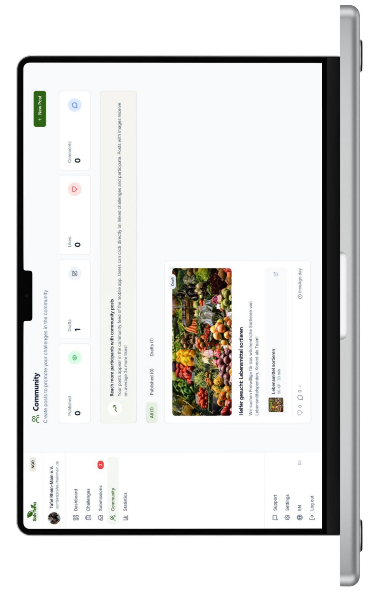

**Figure 15: NGO Dashboard – Community Management**

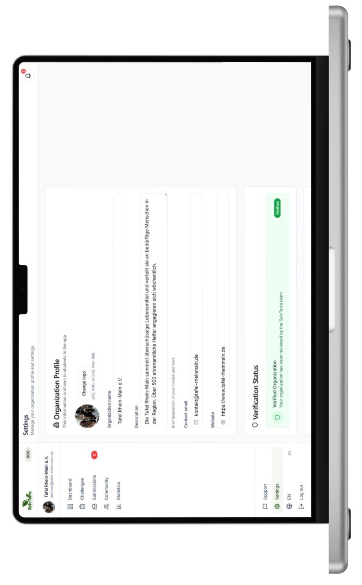

**Figure 16: NGO Dashboard – Settings with Verification Status**

### **11.1.3 Platform Administration Portal**

SolvTerra also includes an administration portal for platform operators. This portal has three functions:

**Organization Verification** – A queue shows pending organization registrations. SolvTerra administrators review each organization's details: name, description, mission, category, website, and contact email. Administrators can verify or reject each organization. Rejections require a reason. The system sends a notification to inform the organization.

**Support Ticket Management** – Organizations can submit support tickets for appeals, technical issues, or feedback. Platform administrators review tickets, respond with guidance, and track status through a workflow: open → in progress → resolved → closed.

**Platform Statistics** – Aggregate numbers across all organizations, challenges, users, and submissions give the SolvTerra team operational visibility.

### **11.1.4 Addressing Platform and Gamification Concerns**

Early pilot feedback raised two concerns. Both shaped our design decisions.

**Concern 1: iOS-only appearance** – Pilot partners thought the prototype only worked on iOS. In fact, the application uses Expo (SDK 54, [https://expo.dev\)](https://expo.dev/) and React Native. These frameworks build native apps for both iOS and Android from one codebase. The web dashboard uses Next.js 14 and runs on any modern browser. This cross-platform approach ensures everyone can use the platform. It addresses the pilot requirement that "the platform should be usable by everyone.

**Concern 2: Gamification relevance for NGOs** – Pilot partners questioned whether gamification matters to NGOs. The XP and badge system exists only in the student mobile app. It is an engagement tool grounded in behavioral research. Our market analysis shows that 54% of students find rewards motivating (see Chapter 2.3). Gamification turns small contributions into a visible impact portfolio. This sustains long-term participation. The NGO dashboard, by contrast, is a business tool. It shows only operational data relevant to organizational decisions. It has no gamification elements.

### **11.2 Technical Implementation (Development Milestone 1)**

### **11.2.1 Technology Stack**

The platform uses a TypeScript monorepo managed with pnpm workspaces. TypeScript enforces strict type safety across all packages. This approach enables code sharing between applications. The architecture has three frontend packages and one production backend:

| Component             | Technology                                                                                               | Purpose                                                      |
|-----------------------|----------------------------------------------------------------------------------------------------------|--------------------------------------------------------------|
| Mobile App            | Expo SDK 54, React Native 0.79, React 19, Re act Native Paper, Zustand 5, i18next                     | Cross-platform student application                           |
| Web Dashboard Next.js | 14 (App Router), React 19, shadcn/ui (Radix), Tailwind CSS, Re charts, Zustand 4 | NGO management interface and ad min portal                |
| Shared Package        | TypeScript (types, constants, utilities)                                                                 | Unified data models, business logic, and validation rules |
| Backend               | Supabase (PostgreSQL 15, Auth, Storage, Realtime)                                            | Database, authentication, file storage, real-time sync    |

**Table 3: Technology Stack**

This architecture provides type-safe data contracts between all applications. Both frontends use the same type definitions and constants. This ensures consistency while allowing independent deployment.

### **11.2.2 Backend Infrastructure**

The backend runs on Supabase [\(https://supabase.com\)](https://supabase.com/). Supabase provides a PostgreSQL database with built-in authentication, object storage, and real-time subscriptions. This choice balances development speed with production scalability. A simplified data model is shown in the following figure.

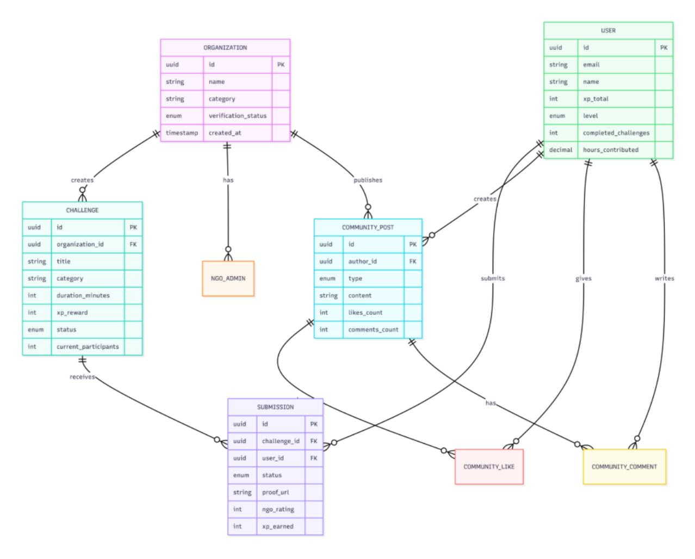

**Figure 17: Simplified Data Model**

### **11.2.3 Authentication & Security**

The platform supports multiple login methods to maximize conversion

- **Students**: Google login or email registration (addresses pilot feedback: "registration must be easy and fast")
- **NGOs**: Four-step registration wizard with organization verification
- **Administrators**: Separate secure access for platform operations

All data access is controlled through Row Level Security. Students see only their own submissions. NGOs see only their organization's data. This architecture ensures GDPR compliance by design.

### **11.2.4 Internationlization**

The platform supports German and English from day one:

- Application interface translations (buttons, navigation, messages)

- Content translations for challenges and posts (i18n)
- Automatic language detection with manual override

### **11.2.5 Verification System**

The verification system supports three proof methods. NGOs choose the method when creating each challenge:

Photo Upload: For on-site activities. Students capture or select an image. The app compresses it to 0.7 quality and uploads it to Supabase Storage. The system stores the public URL with the submission record.

Text Submission: For digital tasks. Students write a description of their completed work.

NGO Confirmation: For complex assignments. The NGO marks the submission as complete after direct confirmation.

This tiered approach balances automation with human oversight. It addresses the verification integrity requirements from Chapter 9.2.3.

### **11.2.6 Core Feature Implementation**

The current system implements the complete workflow from Chapter 2:

**Challenge Lifecycle** – Creation with templates, multi-section forms, publication, pause/resume, draft saving, and status changes (draft → active → completed → archived)

**Submission Workflow** – Accept → In Progress → Submitted → Approved/Rejected. Includes proof upload to cloud storage, star ratings, written feedback, and XP distribution on approval.

**Gamification Engine** – XP rewards based on challenge duration:

| Duration   | Base XP | Team Bonus (1.5x) |
|------------|---------|-------------------|
| 5 minutes  | 10 XP   | 15 XP             |
| 10 minutes | 20 XP   | 30 XP             |
| 15 minutes | 30 XP   | 45 XP             |
| 30 minutes | 50 XP   | 75 XP             |

**Table 4: Gamification Engine**

Five progression levels based on total XP, they are shown in the following figure.

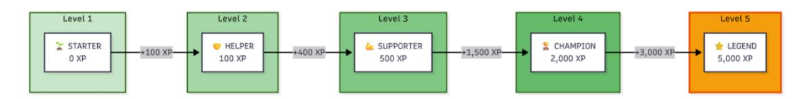

**Figure 18: Level Progression System**

Twelve achievement badges in four categories:

- Milestone (4): First Steps, Getting Started, On a Roll, Dedicated Helper
- Category (4): Eco Warrior, Social Butterfly, Knowledge Seeker, Health Hero
- Special (3): Early Bird, Night Owl, Five Star
- Streak (1): Week Warrior

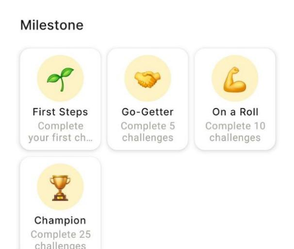

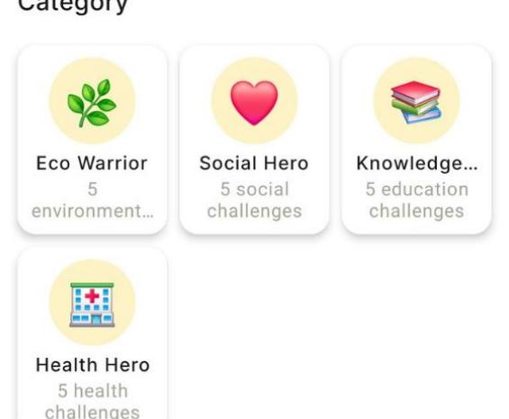

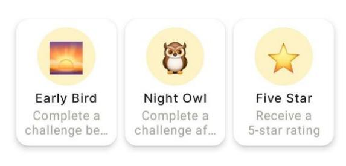

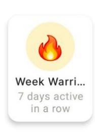

**Figure 19: Achievement Badge Collection**

**Multi-Person Challenges** – Team formation with configurable minimum and maximum sizes. Solo users can join teams through matchmaking. Teams have coordination features.

**Community Platform** – Six post types: success story, challenge completed, badge earned, level up, streak achieved, and NGO promotion. Users can like and unlike posts with real-time counts. Threaded commenting allows discussions. Posts can be pinned or highlighted. Author verification links posts to approved submissions.

**Bilingual Support** – Full German and English coverage. The system detects device language, allows manual override, and remembers the preference.

**Organization Verification** – A queue-based review process with verify and reject actions. Rejections require a reason. The system sends automatic notifications.

**Support System** – Ticket creation for appeals, support, feedback, or other topics. Status tracking shows progress. Administrators respond through a workflow. Users receive notifications when tickets are resolved.

### **11.2.7 Incorporating Pilot Feedback**

Based on NGO pilot interviews, we made these changes:

- Simplified onboarding: Google login removes the need for a new account. This addresses the feedback that "registration must be easy and fast."
- Platform clarity: The mobile app supports both iOS and Android through Expo. Web export provides a fallback option.
- Low-friction challenge creation: Templates reduce the effort to post a first challenge. The four templates (social media, research, cleanup, team action) address the requirement for "minimal effort from our side."
- Verification workflow: NGOs can review and rate submissions efficiently. The queue interface has tab filtering and batch processing.
- Functional MVP as proof of concept: The working platform with a real backend satisfies the pilot partner prerequisite: "a clearly defined concept, a working MVP, and proof of volunteer interest."

### **11.3 Launch of Web-Platform / App**

### **11.3.1 Mobile Application Distribution**

The mobile application uses Expo Application Services (EAS) for builds and submissions. The deployment strategy has three stages:

**Beta Testing** – We distribute test builds through TestFlight (iOS) and internal testing tracks (Google Play). Pilot NGO partners and initial students test the app. This allows controlled validation before public release.

**Production Release** – After successful pilot testing, we publish on the App Store and Google Play Store at the same time. One codebase produces optimized native builds for both platforms.

**Continuous Delivery** – Expo Updates allows over-the-air (OTA) updates. We can push changes without waiting for App Store review. This allows same-day bug fixes and feature improvements for non-native code changes.

### **11.3.2 Web Dashboard Deployment**

We deploy the Next.js dashboard through Vercel cloud hosting. The setup includes a custom domain, SSL encryption (secure connection), and CDN distribution (content delivery network for global speed). The rollout follows a staged access model:

- 1. Pilot NGOs receive early access during the start-up phase
- 2. Broader availability comes with market entry
- 3. Each organization goes through verification to maintain platform trust

### **11.3.3 From Current System to Production Scale**

The current system works with a production backend. Scaling to full operations requires four development tracks:

- 1. **Infrastructure Scaling** The current Supabase instance supports the pilot phase. Production scaling will add database connection pooling (managing multiple database connections efficiently), read replicas for analytics, and CDN optimization for media delivery.
- 2. **Enhanced Authentication** We will add Apple Sign-In for iOS users and expand OAuth options. This will improve conversion during onboarding.
- 3. **Monitoring & Observability** We will implement error tracking through Sentry, performance monitoring, and usage analytics. This helps us find issues before they affect users.
- 4. **Compliance Hardening** The current system is GDPR-compliant by design through RLS policies and data minimization. Production deployment will add a consent management interface, data export functionality, and automated right-to-erasure (the right for users to delete their data).

### **11.4 Further Milestones (Technical Roadmap)**

### **11.4.1 AI-Based Proof Verification**

A key planned feature is AI-powered image validation for photo proof. The system will use computer vision APIs to check submitted photos against challenge requirements. Examples:

- A cleanup action photo should show collected waste
- A flyer distribution photo should show distributed materials
- An event participation photo should show branded elements

This will reduce manual review work for NGOs while maintaining verification quality. The implementation has three phases:

- **Phase 1**: AI makes suggestions, NGO confirms (human-in-the-loop)
- **Phase 2:** AI approves high-confidence matches automatically, the NGO reviews edge cases
- **Phase 3**: Model improves continuously based on NGO feedback patterns

The financial plan projects this as a variable cost. It scales with platform usage at roughly €0.01–0.02 per validation call through cloud vision APIs. Manual NGO confirmation remains available for complex cases.

### **11.4.2 Backend Infrastructure & Scalability**

The infrastructure roadmap follows the cost structure from Chapter 7:

**Cloud Storage** – We currently use Supabase Storage. Future scaling may use AWS S3 for active media with 30-day hot storage. Older files would move to AWS Glacier for cheaper long-term storage. This optimizes cost based on access patterns.

**Data Transfer** – We plan for proof upload and download traffic. Image compression (0.7 quality) already reduces upload sizes by about 40%. Future improvements include progressive image loading and thumbnail generation.

**Monitoring & Security** – Production deployment will add automated data pipeline monitoring, security scanning, and incident response systems. Supabase provides built-in DDoS protection (defense against attack traffic) and SSL encryption.

**Real-Time Features** – The current Supabase Realtime setup supports pilot scale. Future improvements include push notifications through Expo Notifications. These will alert students when submissions are reviewed, when deadlines approach, and when team messages arrive.

### **11.4.3 Advanced Platform Features**

After validating the core workflow with pilot partners, we plan these capabilities:

**Matching Algorithm** – The system will match students to challenges based on interest profile, location (for on-site challenges), schedule, and completion history. This moves beyond manual browsing to proactive recommendations.

**A/B Testing Framework** – A systematic testing infrastructure will compare engagement flows, notification timing, reward structures, and design variants. Results will drive product improvements. This supports the data-driven approach from Chapter 8.4.

**Advanced Analytics** – Deeper organizational insights will include volunteer retention curves, optimal challenge duration analysis, category engagement trends, and predictive capacity planning. These analytics support the premium NGO tier from Chapter 5.4.

**Reward Partnerships** – A technical integration layer will enable partner companies to offer incentives (discounts, products, experiences) that students can redeem with XP. This supports the brand partnership stream from Chapter 5. It addresses the finding that 86% of students are comfortable with brand partnerships (see Chapter 2.3).

**Corporate Partner Dashboard** – A dedicated interface for sponsored challenge management. Corporate partners will be able to create branded challenges, monitor participation in real time, and download impact reports for ESG documentation.

### **11.4.4 Timeline Alignment**

The technical milestones map to the phases from Chapter 8 (see Roadmap Gantt Chart in Chapter 8):

| Phase        | Period     | Technical Focus                                                                                     |
|--------------|------------|-----------------------------------------------------------------------------------------------------|
| Start-up     | Q1–Q4 2026 | Production hardening, scaling infrastructure, enhanced monitoring, pilot support, Apple Sign-In  |
| Market Entry | Q1 2027    | Mobile app store launch, AI verification v1 (human-in-the-loop), push notifications, A/B testing |
| Expansion    | Q4         | 2027+Matching algorithm, advanced analytics, reward partnerships, corpo rate dashboard           |

**Table 5: Timeline Alignment**

Each phase builds on what we learn in the previous stage. This ensures technical investment follows proven demand rather than speculation. This aligns with the lean startup methodology from Chapter 8.1.

### **11.5 Technical Risk Mitigation**

The following technical measures address risks from Chapter 10:

| Risk (with chapter reference)    | Mitigation                                                                                                                                          |
|----------------------------------|-----------------------------------------------------------------------------------------------------------------------------------------------------|
| Platform activity risk (10.2.1)  | Real-time notifications keep users engaged. Gamification creates habit loops. Push notifications (planned) will re-engage inactive users.     |
| Supply-demand imbalance (10.2.2) | Dashboard analytics identify matching gaps. Challenge templates reduce NGO effort. Recommendation algorithm (planned) will improve discovery. |
| Verification cost risk (10.2.3)  | Tiered verification reduces manual effort. AI assistance (planned) will automate routine checks. Photo compression reduces stor age costs.    |
| Competition risk (10.2.5)        | TypeScript monorepo enables rapid iteration. Shared codebase speeds up feature development. Modular architecture allows piv oting.            |

**Table 6: Technical Risk Mitigation**

### **11.6 Summary**

The technical implementation shows that SolvTerra has progressed from concept to production-ready platform. Key achievements include:

- Functional backend with PostgreSQL database, real-time synchronization, and secure authentication
- Cross-platform mobile app supporting iOS and Android from a single codebase
- Comprehensive NGO dashboard for challenge management, submission review, and analytics
- Platform administration portal for organization verification and support
- Security-first architecture with 25 Row Level Security policies controlling data access
- Bilingual support enabling German and English users from day one
- Gamification system with XP rewards, five progression levels, and twelve achievement badges

| The implementation of the SolvTerra platform supports the pilot phase objectives from Chapter 9. It provides the technical foundation for the market entry strategy from Chapter 8. |
|----------------------------------------------------------------------------------------------------------------------------------------------------------------------------------------|
|                                                                                                                                                                                        |
|                                                                                                                                                                                        |
|                                                                                                                                                                                        |
|                                                                                                                                                                                        |
|                                                                                                                                                                                        |
|                                                                                                                                                                                        |
|                                                                                                                                                                                        |
|                                                                                                                                                                                        |
|                                                                                                                                                                                        |
|                                                                                                                                                                                        |
|                                                                                                                                                                                        |
|                                                                                                                                                                                        |
|                                                                                                                                                                                        |
|                                                                                                                                                                                        |
|                                                                                                                                                                                        |
|                                                                                                                                                                                        |
|                                                                                                                                                                                        |
|                                                                                                                                                                                        |
|                                                                                                                                                                                        |
|                                                                                                                                                                                        |
|                                                                                                                                                                                        |

### **Literature**

- Ashton, D., & Ragonnaud, G. (2024). 'Green claims' directive: Protecting consumers from greenwashing. European Parliament. [https://www.europarl.europa.eu/thinktank/en/docu](https://www.europarl.europa.eu/thinktank/en/document/EPRS_BRI%282023%29753958)[ment/EPRS\\_BRI%282023%29753958](https://www.europarl.europa.eu/thinktank/en/document/EPRS_BRI%282023%29753958) (last accessed: 26.01.2026)
- Betterplace.org. (nd). Germany's largest fundraising platform [.https://www.betterplace.org/en](https://www.betterplace.org/en)
- Business Research Insights. (2026). *Corporate volunteering platform market size, share, growth and industry analysis by type (cloud & on-premise), by application (SMEs & large enterprises), regional insights and forecast from 2026 to 2035*. [https://www.busi](https://www.businessresearchinsights.com/market-reports/corporate-volunteering-platform-market-110140?utm_source=chatgpt.com)[nessresearchinsights.com/market-reports/corporate-volunteering-platform-market-110140](https://www.businessresearchinsights.com/market-reports/corporate-volunteering-platform-market-110140?utm_source=chatgpt.com)  (last accessed: 26.01.2026)
- Capterra. (2025). *Optimy pricing, reviews, and alternatives*[. https://www.capterra.com/p/142236/Op](https://www.capterra.com/p/142236/Optimy/?utm_source=chatgpt.com)[timy/](https://www.capterra.com/p/142236/Optimy/?utm_source=chatgpt.com) (last accessed: 26.01.2026)
- Corporate sustainability reporting. (2025). European Commission, Finance. [https://finance.ec.eu](https://finance.ec.europa.eu/capital-markets-union-and-financial-markets/company-reporting-and-auditing/company-reporting/corporate-sustainability-reporting_en?utm_source=chatgpt.com)[ropa.eu/capital-markets-union-and-financial-markets/company-reporting-and-auditing/com](https://finance.ec.europa.eu/capital-markets-union-and-financial-markets/company-reporting-and-auditing/company-reporting/corporate-sustainability-reporting_en?utm_source=chatgpt.com)[pany-reporting/corporate-sustainability-reporting\\_en](https://finance.ec.europa.eu/capital-markets-union-and-financial-markets/company-reporting-and-auditing/company-reporting/corporate-sustainability-reporting_en?utm_source=chatgpt.com) (last accessed: 26.01.2026)
- Edinger-Schons, L. M., & Alberg-Seberich, M. (2019). Choosing the right set-up for corporate volunteering – Insights from the DAX30 (Report). University of Mannheim, Chair of Corporate Social Responsibility. [https://www.bwl.uni-mannheim.de/me](https://www.bwl.uni-mannheim.de/media/Lehrstuehle/bwl/Schons/News/Choosing_the_right_set-up_for_corporate_volunteering.pdf?utm_source=chatgpt.com)[dia/Lehrstuehle/bwl/Schons/News/Choosing\\_the\\_right\\_set-up\\_for\\_corporate\\_volunteer](https://www.bwl.uni-mannheim.de/media/Lehrstuehle/bwl/Schons/News/Choosing_the_right_set-up_for_corporate_volunteering.pdf?utm_source=chatgpt.com)[ing.pdf](https://www.bwl.uni-mannheim.de/media/Lehrstuehle/bwl/Schons/News/Choosing_the_right_set-up_for_corporate_volunteering.pdf?utm_source=chatgpt.com) (last accessed: 26.01.2026)
- EU Taxonomy for sustainable activities. (2025). European Commission, Finance. [https://finance.ec.eu](https://finance.ec.europa.eu/sustainable-finance/tools-and-standards/eu-taxonomy-sustainable-activities_en?utm_source=chatgpt.com)[ropa.eu/sustainable-finance/tools-and-standards/eu-taxonomy-sustainable-activities\\_en](https://finance.ec.europa.eu/sustainable-finance/tools-and-standards/eu-taxonomy-sustainable-activities_en?utm_source=chatgpt.com) (last accessed: 26.01.2026)
- European Alliance for Innovation. (2022). *EAI events sponsorship packages* [PDF]. [https://help.eai.eu/wp-content/uploads/sites/438/2022/04/EAI\\_Events\\_Sponsorship\\_Pack](https://help.eai.eu/wp-content/uploads/sites/438/2022/04/EAI_Events_Sponsorship_Packages.pdf)[ages.pdf](https://help.eai.eu/wp-content/uploads/sites/438/2022/04/EAI_Events_Sponsorship_Packages.pdf) (Last accessed: 26.01.2026)
- European Semantic Web Conference. (2026). Sponsorship packages. [https://2026.eswc-confer](https://2026.eswc-conferences.org/sponsors-supporters/packages/)[ences.org/sponsors-supporters/packages/](https://2026.eswc-conferences.org/sponsors-supporters/packages/) (Last accessed: 26.01.2026)
- EXIST. (2025). EXIST Programme: EXIST Gründerstipendium. [https://exist.de/en/programm/exist](https://exist.de/en/programm/exist-gruendungsstipendium/)[gruendungsstipendium/](https://exist.de/en/programm/exist-gruendungsstipendium/) (last accessed 26 Jan 2026)
- Federal Ministry for Family Affairs, Senior Citizens, Women and Youth. (2010). *Monitor voluntary activities – Issue No. 1: National and international status of voluntary activities research* (36 pp.). [https://www.bmbfsfj.bund.de/re](https://www.bmbfsfj.bund.de/resource/blob/94364/88b0ba765757bc1d898d07c38f5a7489/monitor-engagement-engl-data.pdf)[source/blob/94364/88b0ba765757bc1d898d07c38f5a7489/monitor-engagement](https://www.bmbfsfj.bund.de/resource/blob/94364/88b0ba765757bc1d898d07c38f5a7489/monitor-engagement-engl-data.pdf)[engl-data.pdf](https://www.bmbfsfj.bund.de/resource/blob/94364/88b0ba765757bc1d898d07c38f5a7489/monitor-engagement-engl-data.pdf)
- firma.de. (2025). Umsatzsteuer: Everything you need to know about VAT in Germany. [https://www.firma.de/en/accountancy/umsatzsteuer-everything-you-need-to-know-about](https://www.firma.de/en/accountancy/umsatzsteuer-everything-you-need-to-know-about-vat-in-germany/)[vat-in-germany/](https://www.firma.de/en/accountancy/umsatzsteuer-everything-you-need-to-know-about-vat-in-germany/) (Last accessed 26 Jan 2026)

- GlobalGiving. (2025). *GlobalGiving's fee = More funding for your cause!* [https://www.globalgiv](https://www.globalgiving.org/aboutus/fee/)[ing.org/aboutus/fee/](https://www.globalgiving.org/aboutus/fee/) (Last accessed: 26.01.2026)
- Goethe-Institut & SUPERRR Lab. (2020). The Goethe-Institut and digital civil society: Mapping the status quo and future opportunities (J. Binder & W. Iro, Eds.; C. Sommer & E. Watts, Trans.). Goethe-Institut e.V. [https://www.goethe.de/resources/files/pdf264/gi-mapping-dt-zivilgesell](https://www.goethe.de/resources/files/pdf264/gi-mapping-dt-zivilgesellschaft_en.pdf)[schaft\\_en.pdf](https://www.goethe.de/resources/files/pdf264/gi-mapping-dt-zivilgesellschaft_en.pdf)
- Goethe-Institut & SUPERRR Lab. (2020). The Goethe-Institut and digital civil society: Mapping the status quo and future opportunities (J. Binder & W. Iro, Eds.; C. Sommer & E. Watts, Trans.). Goethe-Institut e.V. [https://www.goethe.de/resources/files/pdf264/gi-mapping-dt-zivilgesell](https://www.goethe.de/resources/files/pdf264/gi-mapping-dt-zivilgesellschaft_en.pdf)[schaft\\_en.pdf](https://www.goethe.de/resources/files/pdf264/gi-mapping-dt-zivilgesellschaft_en.pdf)
- Goodera. (2023). Lattice partnership page.<https://www.goodera.com/partners/lattice> (last accessed: 26.01.2026)
- GoVolunteer. (nd). Social projects to get involved [.https://govolunteer.com/](https://govolunteer.com/)
- Jang et al. (2025) Germany Moves Forward with CSRD Transposition and Eases Supply Chain Due Diligence Obligations. Debevoise. [https://www.debevoise.com/insights/publica](https://www.debevoise.com/insights/publications/2025/09/germany-moves-forward-with-csrd-transposition)[tions/2025/09/germany-moves-forward-with-csrd-transposition](https://www.debevoise.com/insights/publications/2025/09/germany-moves-forward-with-csrd-transposition) (last accessed: 26.01.2026)
- JustGiving. (2024, August 16). *How can I donate and what fee do you take?* [https://help.justgiv](https://help.justgiving.com/hc/en-us/articles/200670421-How-can-I-donate-and-what-fee-do-you-take)[ing.com/hc/en-us/articles/200670421-How-can-I-donate-and-what-fee-do-you-take](https://help.justgiving.com/hc/en-us/articles/200670421-How-can-I-donate-and-what-fee-do-you-take) (Last accessed: 26.01.2026)
- Kiron NGO. (2020, March). Why NGOs should embrace digital transformation. <https://www.kiron.ngo/post/why-ngos-should-embrace-digital-transformation>
- Monily. (2026). Stripe vs PayPal[. https://monily.com/blog/stripe-vs-paypal](https://monily.com/blog/stripe-vs-paypal) (last accessed 26 Jan 2026)
- Notar Durchlaub. (2026). Kosten der GmbH-Gründung. <https://notar-durchlaub.de/kosten-gmbh-gruendung> (Last accessed: 28.01.2026)
- Optimy. (2025). *Flexible pricing plans for CSR and sponsorship management*. [https://www.op](https://www.optimy.com/contact/pricing)[timy.com/contact/pricing](https://www.optimy.com/contact/pricing) (last accessed: 26.01.2026)
- Optimy. (2025, October 31). Best Benevity alternatives for CSR and corporate foundations. <https://www.optimy.com/blog-optimy/best-benevity-alternatives> (last accessed: 26.01.2026)
- Osterwalder, A., & Pigneur, Y. (2010). Business model generation: A handbook for visionaries, game changers, and challengers. John Wiley & Sons.
- Prototype Fund. (2025).<https://www.prototypefund.de/en/application> (last accessed 26 Jan 2026)
- PwC. (n.d.). The Corporate Sustainability Reporting Directive (CSRD). PwC. Retrieved January 28, 2026, from [https://www.pwc.com/lv/en/about/services/sustainability-services/the-corporate-sus](https://www.pwc.com/lv/en/about/services/sustainability-services/the-corporate-sustainability-reporting-directive-CSRD.html?utm_source=chatgpt.com)[tainability-reporting-directive-CSRD.html](https://www.pwc.com/lv/en/about/services/sustainability-services/the-corporate-sustainability-reporting-directive-CSRD.html?utm_source=chatgpt.com) (last accessed: 26.01.2026)
- PwC. (n.d.). The Corporate Sustainability Reporting Directive (CSRD). PwC. [https://www.pwc.com/lv/en/about/services/sustainability-services/the-corporate-sustaina](https://www.pwc.com/lv/en/about/services/sustainability-services/the-corporate-sustainability-reporting-directive-CSRD.html?utm_source=chatgpt.com)[bility-reporting-directive-CSRD.html](https://www.pwc.com/lv/en/about/services/sustainability-services/the-corporate-sustainability-reporting-directive-CSRD.html?utm_source=chatgpt.com) (last accessed: 26.01.2026)

- Statistisches Bundesamt (Destatis). (2025). Pressemitteilung Nr. PD25 426 21. [https://www.desta](https://www.destatis.de/DE/Presse/Pressemitteilungen/2025/11/PD25_426_21)[tis.de/DE/Presse/Pressemitteilungen/2025/11/PD25\\_426\\_21](https://www.destatis.de/DE/Presse/Pressemitteilungen/2025/11/PD25_426_21) (Last accessed 26 Jan 2026)
- TechReport.ngo. (2017, n.d.). 25 facts and stats about NGOs worldwide[. https://techreport.ngo/previ](https://techreport.ngo/previous/2017/facts-and-stats-about-ngos-worldwide.html)[ous/2017/facts-and-stats-about-ngos-worldwide.html](https://techreport.ngo/previous/2017/facts-and-stats-about-ngos-worldwide.html)
- The Business Research Company. (2026). Volunteer management platforms global market report 2025. [https://www.thebusinessresearchcompany.com/report/volunteer-management-platforms](https://www.thebusinessresearchcompany.com/report/volunteer-management-platforms-global-market-report?utm_source=chatgpt.com)[global-market-report](https://www.thebusinessresearchcompany.com/report/volunteer-management-platforms-global-market-report?utm_source=chatgpt.com) (last accessed: 26.01.2026)
- Thoms, A., Herwig, A., & Reiser, L. B. (2026). ESG 2025 Germany. Chambers and Partners. [https://practiceguides.chambers.com/practice-guides/esg-2025/germany/trends-and-devel](https://practiceguides.chambers.com/practice-guides/esg-2025/germany/trends-and-developments)[opments](https://practiceguides.chambers.com/practice-guides/esg-2025/germany/trends-and-developments) (last accessed: 26.01.2026)
- Vostel.de. (nd). The little volunteering guide [.https://vostel.de/blog/en/little-volunteering-guide/](https://vostel.de/blog/en/little-volunteering-guide/)
- Why many nonprofits struggle with digital transformation. (2025). FundsForNGOs. [https://us.fundsforngos.org/articles/why-many-nonprofits-struggle-with-digital-transfor](https://us.fundsforngos.org/articles/why-many-nonprofits-struggle-with-digital-transformation/?utm_source=chatgpt.com)[mation/](https://us.fundsforngos.org/articles/why-many-nonprofits-struggle-with-digital-transformation/?utm_source=chatgpt.com) (last accessed: 26.01.2026)
- Youvo.work. (nd). Design for good Creative volunteering [.https://youvo.work/](https://youvo.work/)

### **Appendix A: Interview with Member of Lions Club**

### Interview - Lions Club

**Organization: Lions Clubs** 

Interviewee Role: District Governor

**Key Insights:** the idea of micro-volunteering is promising since they struggle to contact the younger generation and also to find volunteers and new members. In terms of possible challenges, it really depends on the event they are planning but there are definitely some tasks that could be done in 30 minutes or less. Regarding a pricing it depends on the clubs budget but 25€ could be feasible

## **Opening and Framing**

### Q1: Can you briefly describe your NGO and current volunteer activities?

**Answer:** In Germany the Lions Club has 1.595 independent clubs. There are two types, the Lions and the Leo which differ in their activities. The Lions mostly focus on fundraising events and the average member is 65 years old. The Leos is the younger club with members from 16 to 30 years old and they focus on hands on activities, for example helping out in retirement homes and children's home

### Q2: Roughly how many volunteers do you work with in a typical month?

Answer: no answer

## 1. Current Reality: How Volunteering Works Today

## Q3: Are you currently struggling to find volunteers?

**Answer:** Yes. Especially for the Lions it is difficult to find volunteers or members to help set up the fundraising events with manual work. The Lions are starting to create a social media presence to reach the younger generation but also here I can imagine that this could be done through your platform, since the younger people are very familiar with social media

## Q4: Are you satisfied with the number of volunteers you have?

Answer: no answer

Q5: What kind of volunteer tasks do you typically offer?

**Answer:** So in general for the Lions there is the organisation and setting up of the fundraiser events and at the Leo we have the hands-on activities which

Q6: Do you currently have tasks that can be completed in under one hour?

Answer: Yes, for example setting up a social media account for the Lions club and maybe after that a onboarding on how to use social media

Q7: Do you struggle to modularize your volunteer work?

Answer: no answer

Q8: How much time does volunteer coordination take in a normal week from the position of the Werkstattleiter?

Answer: no answer

## 2. Micro-Volunteering: Pain Points and Friction

Q9: When you need volunteers quickly, what usually goes wrong?

Answer: no answer

Q10: How often do people sign up and then don't show up, and what are your solutions?

**Answer:** The problem is not that they do not show up. The Lions for example need help to build the event at the location, so manual work, but here the age is the problem and too little members are willing to do the manual work

Q11: What is the impact in terms of time, stress, money, service, or quality?

Answer: no answer

Q12: Have you tried using any platforms or tools before? What didn't work well?

Answer: no answer

## 3. SolveTerror - Concept Reaction

Q13: Which benefits of the concept would be most valuable for you?

Answer: The possibility to find volunteers

Q14: What part of this sounds useful, if any?

Answer: no answer

Q15: What sounds unnecessary or risky?

Answer: no answer

Q16: In which situations would you realistically use something like this?

Answer: no answer

Q17: What would stop you from using it?

Answer: no answer

## 4. Pilot Willingness

Q18: Would you be open to posting one to three real tasks and trying this with students in a pilot?

Answer: Yes

Q19: What would you need to feel comfortable participating?

Answer: Yes

### Q20: What kind of task would be most realistic for a pilot?

Answer: no answer

# 5. Pricing Sensitivity

### Q21: Would a monthly subscription be realistic?

Answer: It depends on the club, there are some Lions clubs with a higher budget than others

### Q22: What range feels reasonable?

**Answer:** I think starting at 25€ per month should be feasible

### Interview 1 - Segelflugverein

Organization: Segelflugverein Riedelbach (German gliding club / NGO)

Interviewee Role: Werkstattleiter (Head of Technical Maintenance), member of the

extended board

Key Insights: The NGO is currently dissatisfied with its volunteer capacity, but volunteer coordination effort is relatively low and volunteers are generally reliable. Most volunteer tasks are highly specialized, safety-critical, and require prior knowledge, which limits their suitability for micro-volunteering. While short and modular tasks exist, operational and technical activities are constrained by insurance and qualification requirements. Digital tools are not currently used for volunteer recruitment, as volunteers typically join through intrinsic interest rather than platforms. The strongest perceived value of a micro-volunteering platform lies in increased visibility and youth engagement, not in solving operational staffing issues. Realistic use cases are limited to non-operational tasks such as marketing and event organization. The NGO is open to piloting the concept under low-risk conditions and expects a freemium model with essential features available at no cost.

## **Opening and Framing**

### Q1: Can you briefly describe your NGO and current volunteer activities?

#### Answer:

Segelflugverein Riedelbach is a gliding club organized as a non-profit association. Volunteer work is essential to its operation. I am acting as a *Werkstattleiter*, which includes coordinating all technical aspects of the gliders. This involves maintenance planning, ordering spare parts, and communicating with external workshops for repairs. In this role, I am also part of the extended board of the organization.

### Q2: Roughly how many volunteers do you work with in a typical month?

### Answer:

Across the year, the NGO has around 60 active volunteers in total.

## 1. Current Reality: How Volunteering Works Today

Q3: Are you currently struggling to find volunteers?

#### Answer:

Yes

# Q4: Are you satisfied with the number of volunteers you have? Answer: Nο Q5: What kind of volunteer tasks do you typically offer? Answer: Volunteer roles include: Board positions (Vorstand) Flight instructors (Fluglehrer) Winch operators (Windenfahrer) Flight coordinators (Flugleiter) Airfield maintenance (Platzfahrt) Technical and maintenance-related tasks (Technik) Q6: Do you currently have tasks that can be completed in under one hour? Answer: Yes Q7: Do you struggle to modularize your volunteer work? Answer: No. Q8: How much time does volunteer coordination take in a normal week from the position of the Werkstattleiter? Answer: On average, around two hours per month. This is a seasonal activity, so the time investment varies significantly throughout the year and this figure represents an annual average.

## 2. Micro-Volunteering: Pain Points and Friction

### Q9: When you need volunteers quickly, what usually goes wrong?

### Answer:

In some cases, it is difficult to find volunteers because people may not like the task, lack the required equipment, or do not have the necessary skill set.

# Q10: How often do people sign up and then don't show up, and what are vour solutions?

### Answer:

This does not happen.

# Q11: What is the impact in terms of time, stress, money, service, or quality?

Not applicable in this interview.

# Q12: Have you tried using any platforms or tools before? What didn't work well?

#### Answer:

No platforms or digital tools have been used to find volunteers. Volunteers typically join because they are already interested in gliding and then become members of the organization.

## 3. SolveTerror - Concept Reaction

### Q13: Which benefits of the concept would be most valuable for you?

### Answer:

Increased visibility and better youth engagement.

### Q14: What part of this sounds useful, if any?

#### Answer:

Not specifically applicable beyond visibility and engagement aspects.

### Q15: What sounds unnecessary or risky?

### Answer:

Tasks related to gliders themselves are considered risky due to insurance constraints and the need for prior technical knowledge. These activities are not suitable for external or short-term volunteers.

### Q16: In which situations would you realistically use something like this?

### Answer

Primarily for organizing events or supporting marketing-related activities.

### Q17: What would stop you from using it?

### Answer:

The effort required to use the platform and the lack of suitability for core operational or technical activities.

## 4. Pilot Willingness

Q18: Would you be open to posting one to three real tasks and trying this with students in a pilot?

#### Answer:

Yes.

Q19: What would you need to feel comfortable participating?

### Answer:

A functional platform and clear onboarding to understand how to use it effectively.

Q20: What kind of task would be most realistic for a pilot?

#### Answer:

Marketing-related activities.

### 5. Pricing Sensitivity

Q21: Would you be open to using SolveTerror in a freemium model?

#### Answer:

Yes.

Q22: Which features would you expect to stay free?

### Answer:

The ability to post challenges, define timing, specify the type of challenge, and indicate how many volunteers are needed.

## 7. Feedback MVP

Overall feedback on the MVP is positive. The interface is perceived as very pleasant and visually appealing, while remaining clear and not overly complicated.

### Interview 2 - Sport- und Kultureverein

Organization: Sport- und Kulturverein (local sports and culture NGO)

Interviewee Role: Board Member - Schriftführer (Secretary of the Association)

Key Insights: The NGO is currently dissatisfied with its volunteer capacity and struggles not only to recruit helping volunteers but also board members. Volunteer coordination requires ongoing administrative effort, and volunteer reliability is a challenge, with occasional lateness and no-shows leading to increased time pressure and stress. Volunteer work is primarily event-based and seasonal, with tasks typically requiring several hours rather than very short micro-tasks. Digital platforms are not currently used for volunteer recruitment or coordination. The strongest perceived value of a micro-volunteering platform lies in faster and easier access to volunteers for time-sensitive, event-related activities rather than long-term volunteer management. Realistic use cases include event setup tasks such as building stages, setting up market stalls, and forming event teams. The NGO is open to piloting the concept, provided that task creation and registration are extremely easy, time-efficient, and supported by a functional MVP with visible volunteer interest.

## **Opening and Framing**

### Q1: Can you briefly describe your NGO and current volunteer activities?

#### Answer:

We are a small Sport- und Kulturverein with five active members. Our main activities focus on organizing community events, such as the annual Christmas market. Volunteer work is primarily related to planning and executing these events.

### Q2: Roughly how many volunteers do you work with in a typical month?

### Answer:

We mainly collaborate with other organizations and NGOs. Across the year, we work with around eight to nine partner organizations. These partners provide both resources and volunteers, as they often have between 100 and up to 1,000 members.

## 1. Current Reality – How Volunteering Works Today

### Q3: Are you currently struggling to find volunteers?

### Answer:

Yes, we are struggling to find volunteers, not only for helping with activities but also for board positions.

### Q4: Are you satisfied with the number of volunteers you have?

### Answer:

No

### Q5: What kind of volunteer activities do you typically offer?

#### Answer:

Our volunteer activities mainly involve planning and organizing sporting events and community markets.

# Q6: Do you currently have tasks that can be completed in under one hour, or do you struggle to modularize your volunteer work?

#### Answer:

Our work is seasonal. Tasks are usually not very short; they typically require two to three hours per month rather than under one hour.

### Q7: How much does volunteer coordination take in a normal week?

#### Answer:

On a weekly basis, volunteer coordination mainly consists of administrative work and takes around 30 minutes to one hour per week.

## 2. Micro-Volunteering - Pain Points and Friction

### Q8: When you need volunteers quickly, what usually goes wrong?

#### Answer:

Volunteers are sometimes late, there is a lack of consistency, and occasionally there is a mismatch between the volunteers' skills and the task requirements.

# Q9: How often do people sign up but then don't show up, and what are your solutions?

### Answer:

This happens in roughly 10% of cases. When it does, the tasks are redistributed among the remaining volunteers, which means the work takes longer.

# Q10: What is the impact in terms of time, stress, money, service, or quality?

### Answer:

The main impact is increased time pressure and stress for the people involved.

# Q11: Have you tried using any platforms or tools before? What didn't work well?

### Answer:

No, we have not used any digital platforms or tools for volunteer coordination so far.

## 3. SolveTerra - Concept Reaction

### Q12: Which benefits of the concept would be most valuable for you?

#### Answer

Greater visibility and easier access to volunteers.

### Q13: What part of this sounds useful, if any?

#### Answer:

Access to volunteers who can help with time-sensitive activities, such as setting up market stalls or stages shortly before an event.

### Q14: What sounds unnecessary or risky?

#### Answer:

There are no specific risks, but it is very important that registration is easy and fast. Ideally, volunteers should not need to create a new account, but be able to sign up using an existing tool such as a Google Form or their Google account.

### Q15: In which situations would you realistically use something like this?

#### Answer:

Primarily for event-based activities, especially event setup tasks such as building stages or preparing infrastructure.

### Q16: What would stop you from using it?

### Answer:

A long or complicated setup process and the need to invest too much time in learning or managing the tool.

## 4. Pilot Willingness

# Q17: Would you be open to posting one to three real tasks and trying this with students in a pilot?

### Answer:

Yes.

### Q18: What would you need to feel comfortable participating?

### Answer:

The platform needs to be very easy and quick to set up, with minimal effort required from our side.

### Q19: What kind of task would be most realistic for a pilot?

#### Answer:

Event setup tasks such as building stages, forming event teams, or administrative checks to ensure that setups comply with plans and regulations.

### 5. Pricing Sensitivity

Q20: Would you be open to using SolveTerra Premium?

### Answer:

Yes

### Q21: Which features would you expect to stay free?

#### Answer:

Basic task creation must remain free and seamless, including defining when the activity takes place, what the task or challenge is, and how many volunteers are needed.

### 6. Letter of Intent

### Q22: What would be needed for you to sign up for a pilot?

### Answer

A clearly defined concept, a working MVP, and proof of volunteer interest, as well as an initial proof of concept.

### 7. Feedback MVP

The MVP relies heavily on an iOS-style interface. This assumes iOS usage across users, which may not be realistic, particularly in NGO or professional contexts where

### **Appendix D: Student Survey Results**

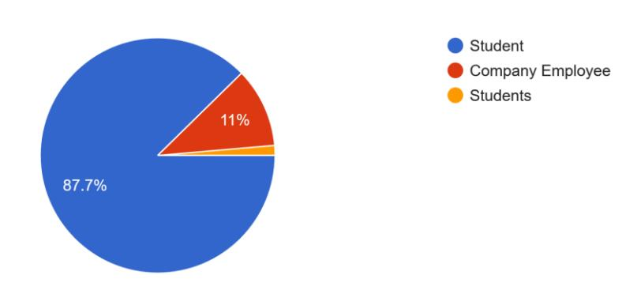

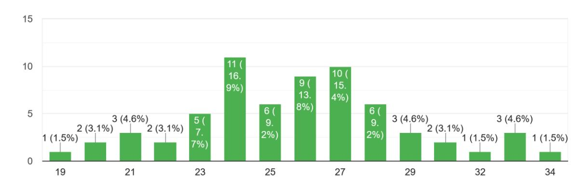

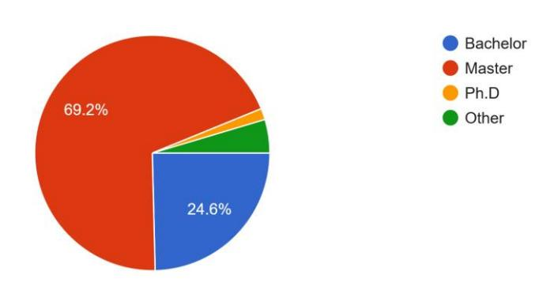

# Which institution are you currently studying at? 65 responses

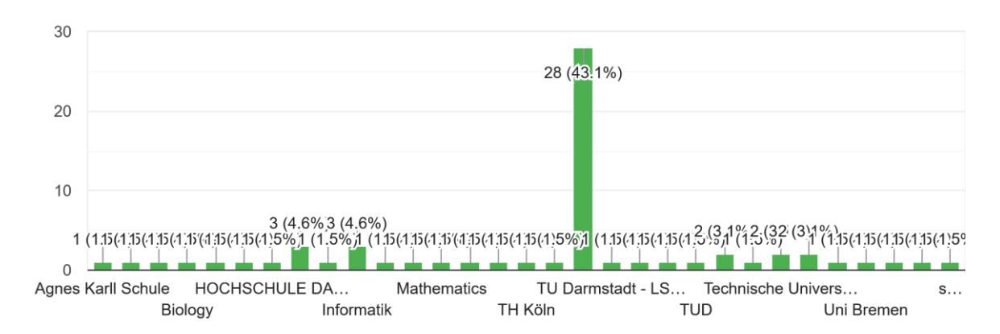

How many hours per month do you spend on extracurricular, social impact, or volunteering activities?

65 responses

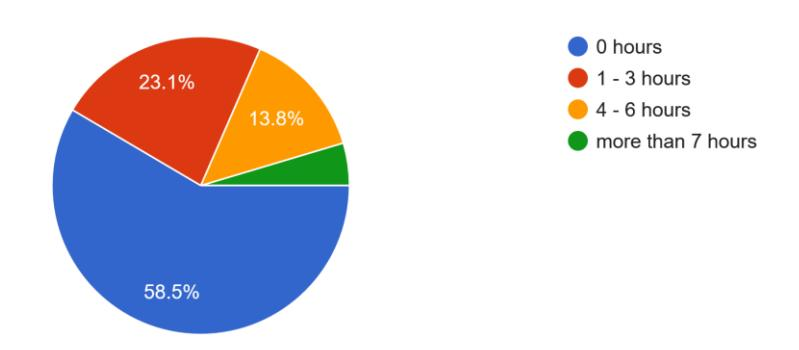

You selected 0 hours. Which of the following is the main reason you do not currently spend time on these types of activities?

38 responses

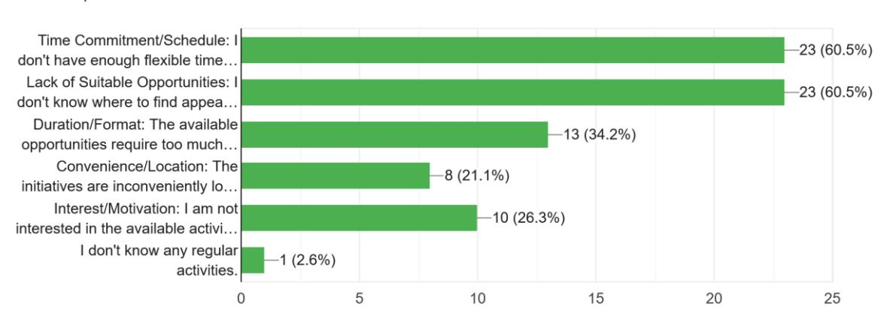

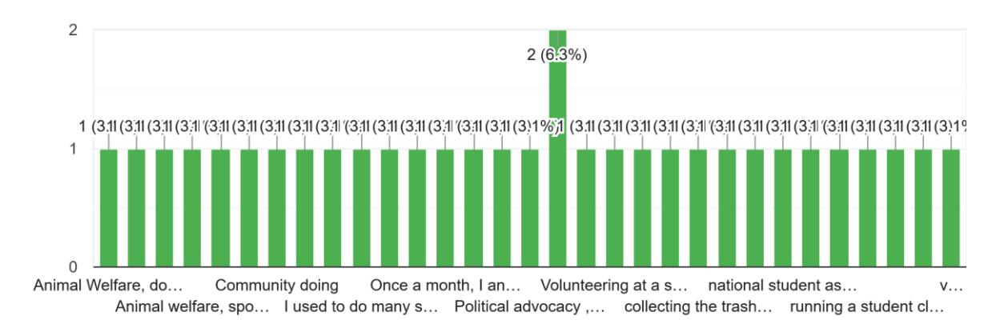

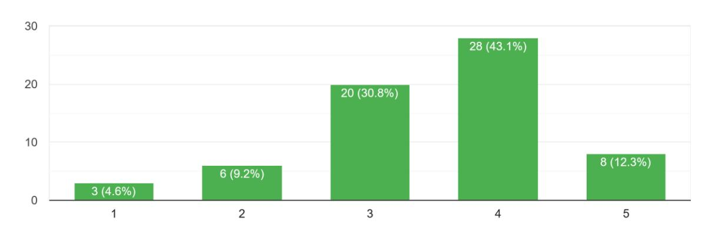

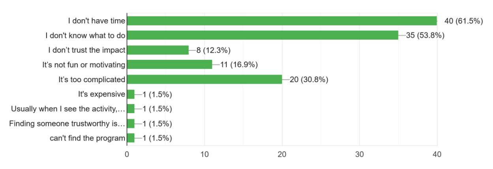

How often do you want to contribute but end up not doing anything because it feels too time-consuming?

65 responses

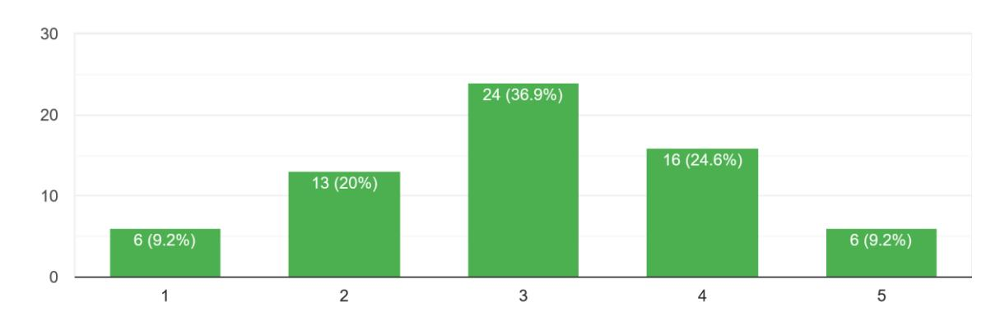

Has the time commitment (duration or long-term) ever stopped you from volunteering or joining a sustainability initiative?

65 responses

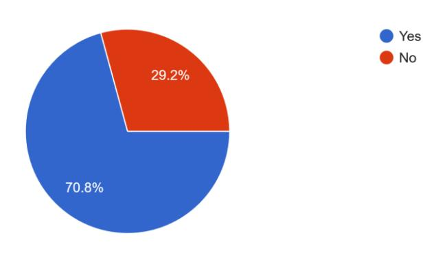

What best describes your relationship with current sustainability apps or volunteering platforms? 65 responses

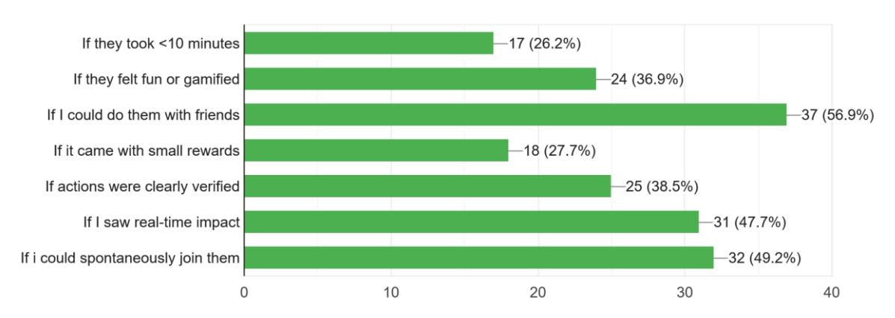

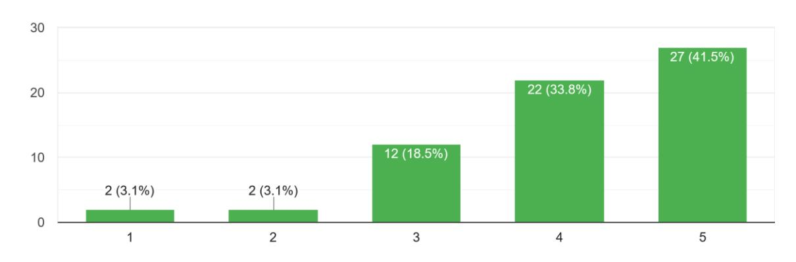

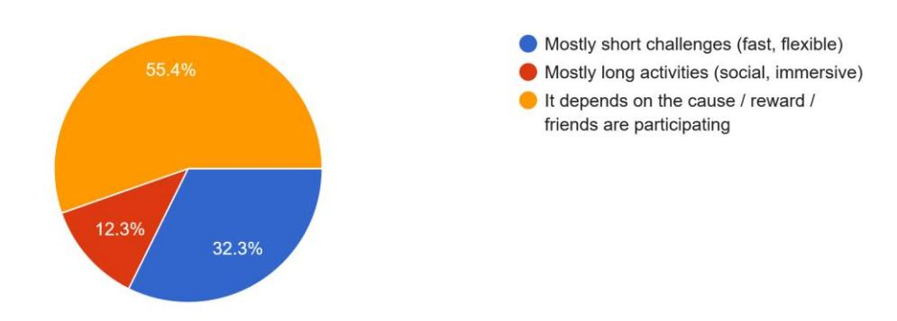

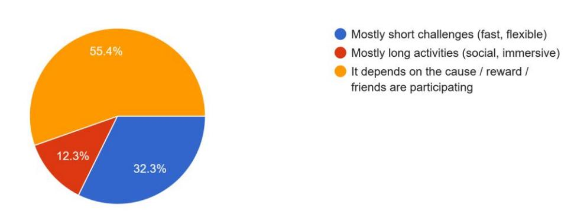

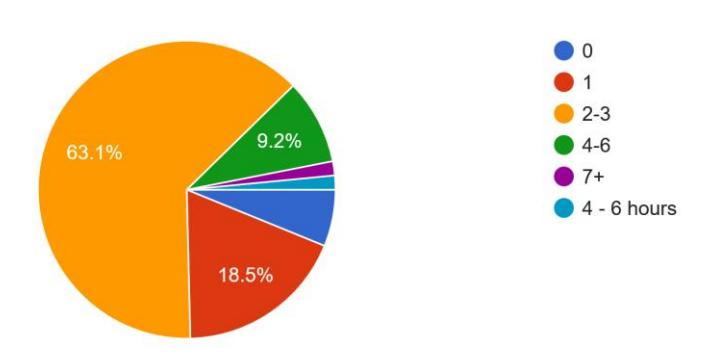

How motivating would the following be for you?

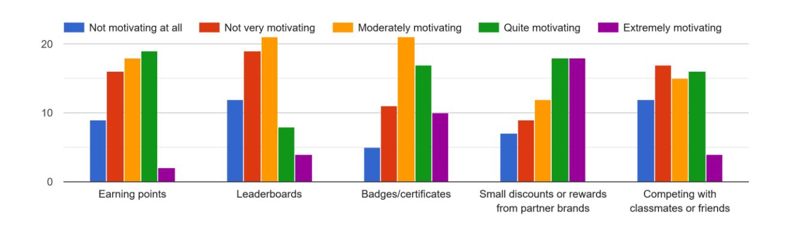

Would you participate more if your actions contributed to a public leaderboard for your university or city?

65 responses

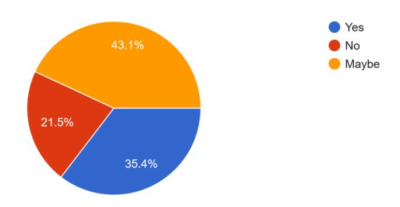

If there were an app that let you complete quick, fun sustainability actions and instantly verify your impact, would you use it?

65 responses

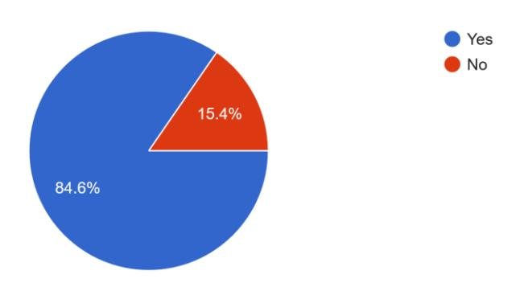

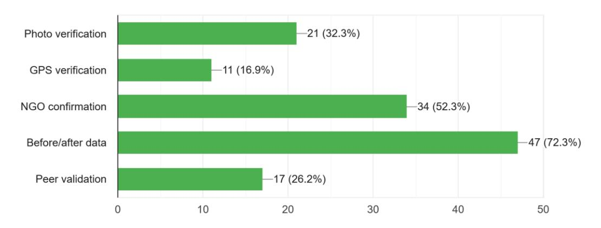

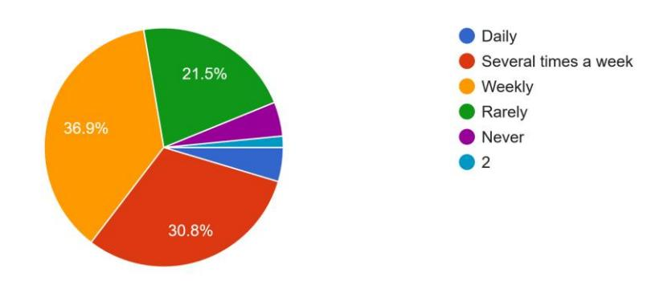

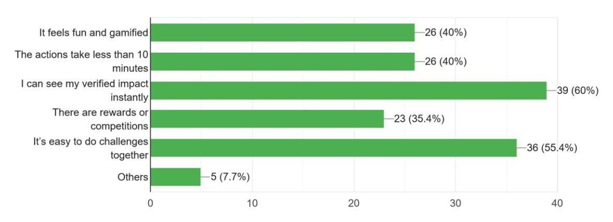

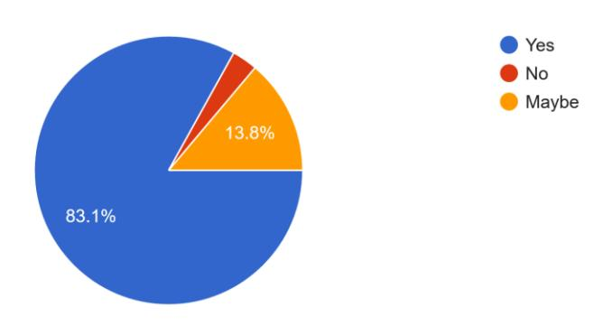

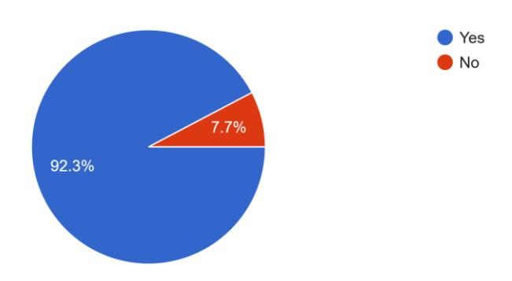

### **Appendix E: Company Survey Results**

### Your department

9 responses

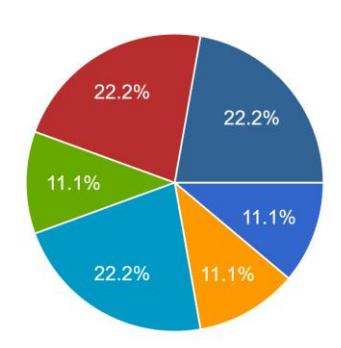

Executive / General Management

Sustainability / ESG / CSR

Finance / Accounting

HR / People Operations

R&D / Innovation

Sales / Business Development

Marketing / Communications

Ompliance / Legal

▲ 1/2 ▼

### Your company's size

9 responses


SME (Less than 50 employees)

Mid-size (50 to 249 employees)

Large (250 or more employees)

### Your company's field

9 responses


Technology / Software / IT

Industrial / Manufacturing / Production

Medicine / Healthcare / Pharma

Financial Services / Banking / Insurance

Onsulting / Professional Services

Oconsumer Goods / Retail / E-commerce

Energy / Utilities / Mining

Transportation / Logistics

▲ 1/2 ▼

Does your company currently engage in any of the following? 9 responses


Which groups does your company try to reach or engage when doing community / CSR activities?  $_{5\, \rm responses}$ 


How interested would your company be in sponsoring short, online micro-volunteering challenges aimed at university students?

5 responses


What benefits would matter most to your company when sponsoring such a challenge? 5 responses


What kind of visibility would your company prefers when sponsoring a challenge? 5 responses


Has your company spent budget in the last 12 months on any CSR / student-engagement / sponsorship / volunteering initiatives?

5 responses


What was the approximate annual budget range on CSR activities of your company? 4 responses


What budget range would feel reasonable for such a platform?

9 responses


Would your company consider paying to sponsor micro-volunteering challenges on our platform? 9 responses


**Appendix F: Additional Screenshots NGO-Dashboard**


Login-page of the NGO-dashboard.


Registration-page of the NGO-dashboard (part 1).


Registration-page of the NGO-dashboard (part 2).


Registration-page of the NGO-dashboard (part 3).


Registration-page of the NGO-dashboard (part 4).

NGO-dashboard: view of creating a new community-post


NGO-dashboard: creating a new challenge (part 1).


NGO-dashboard: creating a new challenge (part 2).


NGO-dashboard: creating a new challenge (part 3).


NGO-dashboard: creating a new challenge (part 4).


NGO-dashboard: creating a new challenge (part 5).


NGO-dashboard: view of a single challenge (part 1).


NGO-dashboard: view of a single challenge (part 2).

NGO-dashboard: view of the own support tickets

NGO-dashboard: create a new support ticket

**Appendix G: Additional Screenshots Admin-Dashboard**

Admin-dashboard: main view

Admin-dashboard: view of pending NGO verification

Admin-dashboard: view of open support-tickets

### **Appendix G: Benchmarking Pricing Strategy Data**

| Provider / Platform                                 | Target Customer            | Core Offering                                | Pricing Model                  | Estimated Price Range (€)                      | Key Features                                            |
|-----------------------------------------------------|-------------------------------|----------------------------------------------|--------------------------------|------------------------------------------------|---------------------------------------------------------|
| Benevity                                            | Large Corporations         | Corporate giving & volunteering platform     | Annual enterprise subscription | €35,000+/year                                  | Employee volunteering, donation matching, ESG reporting |
| Goodera                                             | Corporations                  | CSR & volunteering campaigns                 | Campaign / Package based       | €20–€40 / Employee - €2,500–€15,000/package | Managed CSR events, employee engagement                 |
| Optimy                                              | Corporates & Foundations      | Grant & impact management software        | SaaS subscription              | €450+ / Month                                  | Impact reporting, application tracking                  |
| Just Giving                                         | Corporations & Fundraisers | Corporate donation & fundraising platform    | Donation-based                 | 5% platform fee + 2% processing                | Large donor network, charity campaigns                  |
| GlobalGiving                                        | Corporations                  | Donation matching & CSR campaigns            | Donation-based                 | 5%~12% per donation                            | Large donor network, charity campaigns                  |
| Event Sponsorship Packages                       | SMEs                          | Community & sustainability event sponsorship | Eventt-based                   | €1,000–€30,000 / event                         | Brand visibility at events                              |
| CSR Consulting Agencies                          | Enterprises                   | CSR strategy & execution                     | Retainer / consulting          | €10,000–€50,000+/year                          | Strategy, reporting, implementation                     |
| SolvTerra Donation (Planned)                        | SMEs/ Corporations         | Corporate Donations                          | Platform fee                   | €0                                             | Impact reporting and youth-driven mission delivery      |
| SolvTerra corporate sponsor package (Planned) | SMEs/ Corporations         | Sponsored impact Events/Missions          | Event/Mission-based            | €1,500 - €3,000/ Mission                       | Verified ESG impact, storytelling, branding             |

### **Declaration on the Use of Generative AI**

For this work, the generative AI tools ChatGPT, Microsoft Copilot, Google Gemini, and Claude were used to support the research and writing process.

ChatGPT was employed to rephrase selected text sections to improve readability and clarity. Microsoft Copilot assisted in refining document structure and enhancing coding or technical components where applicable. Google Gemini and Claude were used to summarize research materials, generate concise insights from interviews, and support brainstorming during the ideation phase.

All AI-generated outputs were carefully reviewed and edited to ensure accuracy and prevent the inclusion of unverified information. Generative AI was used exclusively as a supportive tool to aid in research, writing, and editing, not to produce unchecked final content.

# **Contribution List for Group Work**

**Course: Digital Business Models**

Hereby, we confirm that our group work has been conducted as following:

| Chapter/Sub-chapter                 | Matriculation Number | Name                 |
|-------------------------------------|----------------------|----------------------|
| 1- Executive Summary                | 2982689              | Yiwen Cao            |
| 2- Product and Services             | 2465232              | Nicolas Medina Jerez |
| 3- Market and Competition Analysis  |                      |                      |
| 3.1 Market Volume                   | 2894816              | Chuong Vo            |
| 3.2 Market Analysis and Trend       |                      |                      |
| 3.3 Target Market                   |                      |                      |
| 3.4 Industry and Macro-Environ      | 2735920              | Jiayi Guo            |
| mental Analysis                     |                      |                      |
| 3.5 Competitive Landscape           | 2894816              | Chuong Vo            |
| 4- Marketing and Sales              | 2673749              | Salma Boularab       |
| 5- Business Model                   | 2364207              | Stefani Baron        |
| 6- Management and Founding          | 2364207              | Stefani Baron        |
| Team                                |                      |                      |
| 7- Financial Plan                   | 2575122              | Chaimae Qassar       |
| 8- Realization Plan                 | 2982689              | Yiwen Cao            |
| 9- Pilot Phase                      | 2465232              | Nicolas Medina Jerez |
| 10- Chances and Risks               | 2735920              | Jiayi Guo            |
| 11- Prototype and Technical Details | 2307329              | Ron Wolniak          |

Darmstadt, 28.01.2026