# Chapter 10 – Diagram Code (Mermaid)

This file contains Mermaid diagram code for Chapter 10 figures.

**How to use:**
1. Copy the code block for each diagram
2. Paste into [Mermaid Live Editor](https://mermaid.live)
3. Customize colors/styling as needed
4. Export as PNG (high resolution) or SVG
5. Insert into the business plan document

**Brand Colors for Reference:**
- Forest Green (Primary): `#2e6417`
- Teal (Secondary): `#14b8a6`
- Gold (Accent): `#f59e0b`
- Cream (Background): `#eeebe3`

---

## Figure 10.1: System Architecture Diagram

```mermaid
flowchart TB
    subgraph Frontend["Frontend Applications"]
        direction LR
        MA["📱 Mobile App<br/>(iOS & Android)<br/>Expo SDK 54"]
        WD["💻 Web Dashboard<br/>(NGO Command Center)<br/>Next.js 14"]
    end

    subgraph Backend["Supabase Backend"]
        direction TB
        DB[("🗄️ PostgreSQL 15<br/>11 Tables<br/>25 RLS Policies")]
        AUTH["🔐 Auth<br/>Email + Google OAuth"]
        STORAGE["📦 Storage<br/>Proof Photos"]
        RT["⚡ Realtime<br/>Live Updates"]
    end

    subgraph Users["User Groups"]
        direction LR
        STU["👨‍🎓 Students"]
        NGO["🏢 NGO Admins"]
        ADM["👑 Platform Admins"]
    end

    STU --> MA
    NGO --> WD
    ADM --> WD

    MA <--> |"REST API<br/>+ Realtime"| Backend
    WD <--> |"REST API<br/>+ Realtime"| Backend

    DB <--> AUTH
    DB <--> STORAGE
    DB <--> RT

    style Frontend fill:#e8f5e9,stroke:#2e6417,stroke-width:2px
    style Backend fill:#e0f2f1,stroke:#14b8a6,stroke-width:2px
    style Users fill:#fff8e1,stroke:#f59e0b,stroke-width:2px
```



---

## Figure 10.2: Mobile App Screenshots

**⚠️ This requires actual screenshots from the app.**

**Instructions:**
1. Open the SolvTerra mobile app (use Expo Go or build)
2. Take screenshots of:
   - Discover tab (with challenges visible)
   - My Challenges tab (show active/pending/completed tabs)
   - Community tab (with posts and reactions)
   - Profile tab (show XP progress bar and badges)
3. Arrange in a 2×2 grid using Figma, Canva, or PowerPoint
4. Add subtle device frames if desired
5. Export as PNG at 300 DPI

---

## Figure 10.3: Challenge Acceptance & Submission Workflow


---

## Figure 10.4, 10.5, 10.6: NGO Dashboard Screenshots

**⚠️ These require actual screenshots from the web dashboard.**

**Instructions:**
1. Open the SolvTerra web dashboard (localhost:3000 or deployed URL)
2. Log in with an NGO account that has demo data
3. Take screenshots of:
   - **10.4**: Main dashboard showing KPI cards and weekly chart
   - **10.5**: Challenges page showing list with status badges
   - **10.6**: Submissions page with detail panel open
4. Ensure demo data looks realistic (not lorem ipsum)
5. Export at 1920×1080 or higher resolution

---

## Figure 10.7: Simplified Data Model (ERD)


---

## Figure 10.8: Level Progression System

```mermaid
flowchart LR
    subgraph L1["Level 1"]
        S["🌱 STARTER<br/>0 XP"]
    end

    subgraph L2["Level 2"]
        H["🤝 HELPER<br/>100 XP"]
    end

    subgraph L3["Level 3"]
        SU["💪 SUPPORTER<br/>500 XP"]
    end

    subgraph L4["Level 4"]
        C["🏆 CHAMPION<br/>2,000 XP"]
    end

    subgraph L5["Level 5"]
        LE["⭐ LEGEND<br/>5,000 XP"]
    end

    S -->|"+100 XP"| H
    H -->|"+400 XP"| SU
    SU -->|"+1,500 XP"| C
    C -->|"+3,000 XP"| LE

    style L1 fill:#c8e6c9,stroke:#2e6417,stroke-width:2px
    style L2 fill:#a5d6a7,stroke:#2e6417,stroke-width:2px
    style L3 fill:#81c784,stroke:#2e6417,stroke-width:2px
    style L4 fill:#66bb6a,stroke:#2e6417,stroke-width:2px
    style L5 fill:#f59e0b,stroke:#e65100,stroke-width:3px
```



**Alternative version (vertical):**

```mermaid
flowchart TB
    LE["⭐ LEGEND<br/>5,000+ XP"]
    C["🏆 CHAMPION<br/>2,000 - 4,999 XP"]
    SU["💪 SUPPORTER<br/>500 - 1,999 XP"]
    H["🤝 HELPER<br/>100 - 499 XP"]
    S["🌱 STARTER<br/>0 - 99 XP"]

    S --> H --> SU --> C --> LE

    style LE fill:#ffd700,stroke:#e65100,stroke-width:3px
    style C fill:#66bb6a,stroke:#2e6417,stroke-width:2px
    style SU fill:#81c784,stroke:#2e6417,stroke-width:2px
    style H fill:#a5d6a7,stroke:#2e6417,stroke-width:2px
    style S fill:#c8e6c9,stroke:#2e6417,stroke-width:2px
```



---

## Figure 10.9: Achievement Badge Collection

**Note:** Mermaid is not ideal for badge grids. Consider using Canva or Figma for this.

**Alternative: Use a table in the document with badge icons:**

| Milestone Badges | Category Badges | Special Badges | Streak |
|:---:|:---:|:---:|:---:|
| 🚀 **First Steps** | 🌿 **Eco Warrior** | 🌅 **Early Bird** | 🔥 **Week Warrior** |
| +10 XP | +30 XP | +15 XP | +50 XP |
| 📈 **Getting Started** | 💕 **Social Butterfly** | 🌙 **Night Owl** | |
| +25 XP | +30 XP | +15 XP | |
| ⚡ **On a Roll** | 📚 **Knowledge Seeker** | ⭐ **Five Star** | |
| +50 XP | +30 XP | +20 XP | |
| 🏅 **Dedicated Helper** | ❤️ **Health Hero** | | |
| +100 XP | +30 XP | | |

**For a visual badge grid, create in Canva/Figma:**
1. Create 12 circular badge icons (64×64 px)
2. Use icons from Lucide, Feather, or similar
3. Add badge name below each
4. Show XP bonus as small tag
5. Arrange in 4-column grid

---

## Export Settings

When exporting from [mermaid.live](https://mermaid.live):

1. **Theme**: Choose "default" or "forest" for green tones
2. **Background**: Set to transparent or white
3. **Scale**: Set to 2x or 3x for high resolution
4. **Format**: PNG for documents, SVG for scalability

**Recommended dimensions:**
- Full-width diagrams: 1200×800 px minimum
- Half-width diagrams: 600×400 px minimum
- Badge grids: 800×600 px

---

## Color Customization

To match SolvTerra brand colors, add this to the beginning of any Mermaid diagram:

```
%%{init: {'theme': 'base', 'themeVariables': { 'primaryColor': '#2e6417', 'primaryTextColor': '#fff', 'primaryBorderColor': '#1b4d0f', 'lineColor': '#14b8a6', 'secondaryColor': '#14b8a6', 'tertiaryColor': '#eeebe3'}}}%%
```

---

*Diagram code generated by Claude Code | January 2026*
